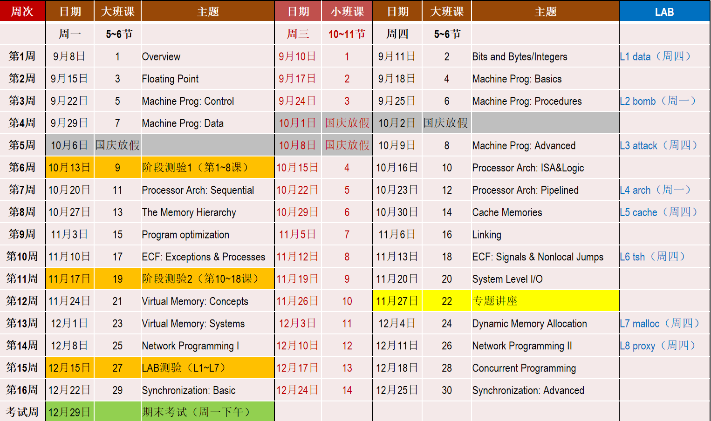
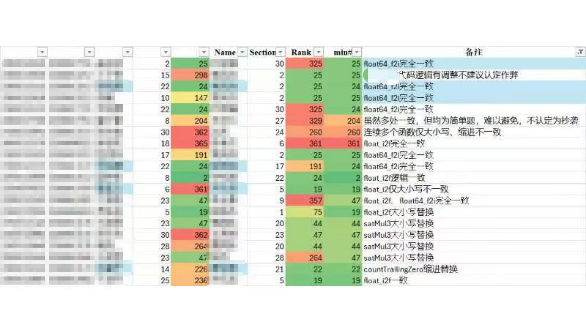
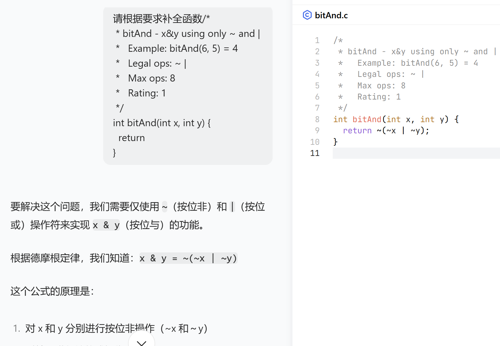
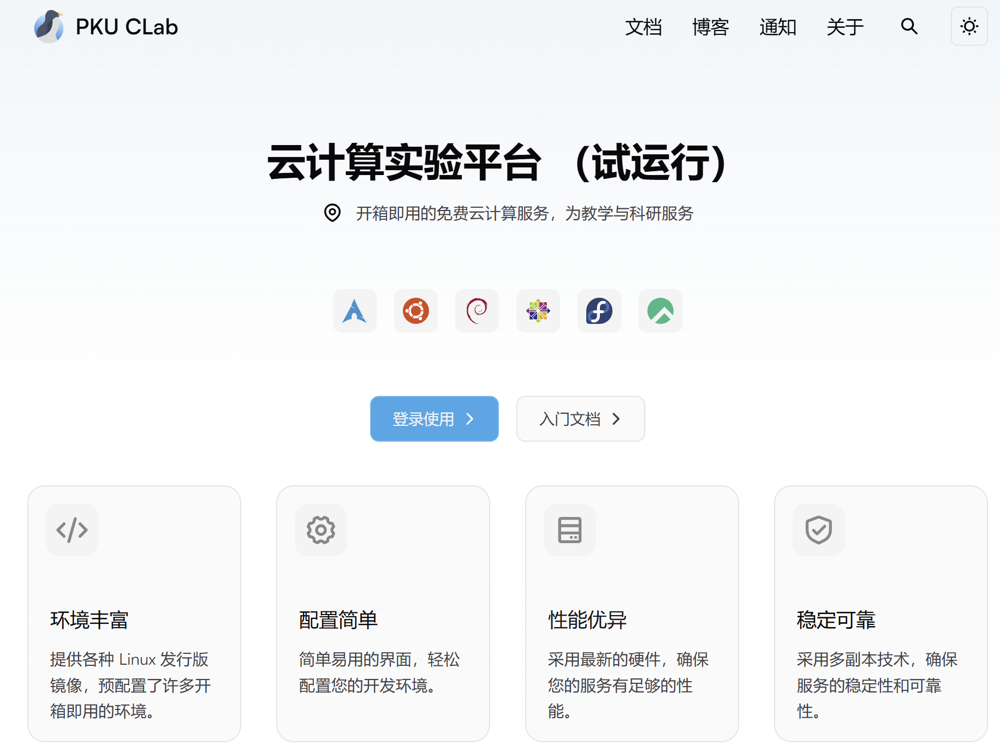
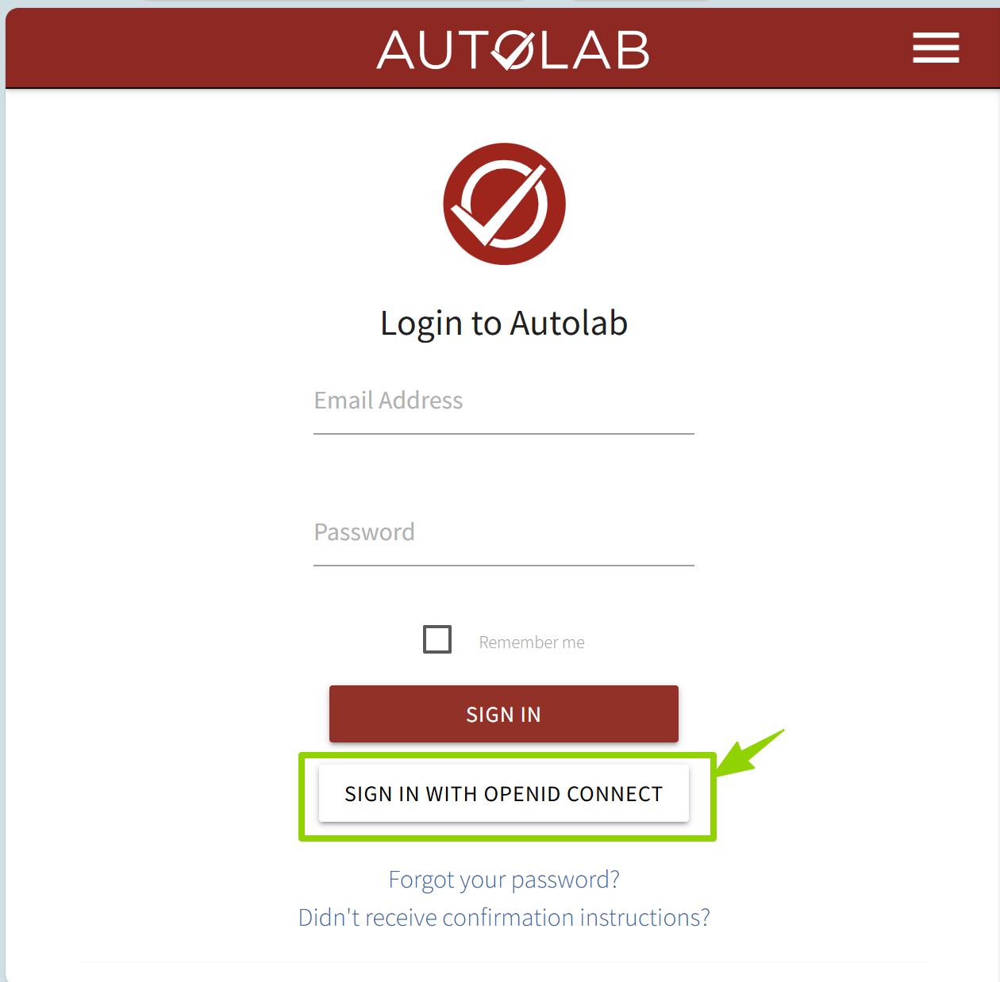

---
# You can also start simply with 'default'
theme: academic
# random image from a curated Unsplash collection by Anthony
# like them? see https://unsplash.com/collections/94734566/slidev
# background: https://cover.sli.dev
colorSchema: light
highlighter: shiki
# some information about your slides (markdown enabled)
title: Wecome to ICS
info: |
  ICS 2025 Fall Slides
  Presented by Wangenbo
titleTemplate: '%s'
# apply unocss classes to the current slide
class: text-center
drawings:
  persist: false
# slide transition: https://sli.dev/guide/animations.html#slide-transitions
transition: fade-out
mdc: true
# download: true
# hideInToc: true
layout: cover
coverBackgroundUrl: ./newres/image/w1/cover.jpg
---

# Wecome to ICS

   元培数科 王恩博

<!--  -->

  
    Let's get started <carbon:arrow-right class="inline"/>
  

  <button @click="$slidev.nav.openInEditor()" title="Open in Editor" class="text-xl slidev-icon-btn opacity-50 !border-none !hover:text-white">
    <carbon:edit />
  </button>
  <a href="https://github.com/WEB-05/WEB-ICS-TA-Slides2025
  " target="_blank" alt="GitHub" title="Open in GitHub"
    class="text-xl slidev-icon-btn opacity-50 !border-none !hover:text-white">
    <carbon-logo-github />
  </a>

---
layout: image-right

image: ./newres/image/w1/book.jpg

backgroundSize: 20em 80%

hideInToc: true

---

# 目录

<Toc columns="2" minDepth="1"></Toc>

---
layout: two-cols
hideInToc: true
---

 

::right::
    

   <b>关注教学网！</b>
    
<b>关注学号邮箱！</b>

---

# 助教介绍
 

## 王恩博
 

- 院系：元培学院
- 专业：数据科学与大数据技术
- 年级：大三
- 邮箱：`webrun@stu.pku.edu.cn`
- 微信：`13269431217`
- 喜欢旅行、听音乐、 <s> ICS</s>
- 有任何问题欢迎发邮件/微信
- 很期待和大家一起学习！

---
layout: two-cols-header
---

# 自我介绍

::left::
 

- 姓名、专业、年级
- 兴趣爱好
- 对 ICS 这门课的了解
- 如果不是专业必修为什么选了 ICS 这门课
- anything else
- 建议 1min 左右

::right::

|        |        |
| :----: | :----: |
| 龚鹤宁 | 陈泽羽 |
| 孔令珊 | 刘筱 |
| 张哲涵 | 黎祖含 |
| 陈俊宇 | 胡勋炀 |
| 黎宣萱 | 李凖珩 |
| 陈俊言 | 胡思成 |
| 王欣语 |    曾若天    |

---
layout: two-cols-header
---

# 老师介绍
 

## 王亚沙
 

- 北京大学博雅特聘教授，软件工程国家工程研究中心主任，教育部长江学者，中国计算机学会杰出会员，全国数据标准化技术委员会数据技术标准工作组组长。长期从事人工智能、数据挖掘及医信交叉研究。担任国家重点研发计划项目负责人，并承担国家多项自然科学基金、国家863计划、“核高基”重大科技专项课题。研究成果获国家科技进步二等奖、国家教育部科技进步奖一等奖。
  

- [王亚沙-北大学者主页 (scholar.pku.edu.cn)](http://scholar.pku.edu.cn/wangyasha/)

---

# 小班安排

---

# 小班安排

---
layout: two-cols-header
---

# 小班安排
::left::
 

- 研讨题按照上表进行，每人每次一道大班研讨题
- 暂定一人负责一题，后续可能根据实际情况调整
- 每人展示时长 6-10 min,原则上不超过 15 min
- 非负责同学也要积极提前思考准备
- 展示后其他同学可以进行提问并进行讨论
- 展示的质量和研讨的积极度会作为小班评分依据（之一）
- 另外根据进度和时间情况可能进行习题练习、LAB 介绍、LAB 复习、知识复习、考试习题讲解等内容

::right::

- **研讨题**
  - *题目例子*：暂时不能给你明确的答复

- **研讨形式**
  - 如果使用PPT（不必须）周三中午12：00前发送至班级微信群、[北大网盘](https://disk.pku.edu.cn/link/AA0B5C164896C74249BE08422B8D180073)中
    - PPT命名方式：`W2-Float-Q1-王恩博.pptx`
    - 若有额外补充材料，可同步发送在微信群中
  - 展示完成后同学互评（问卷星）+老师助教评分
    - `0-10`分打分，低于`6`分需解释原因
---

# 分数评定

考勤要求（如需请假需提前说明）

研讨质量

小班参与

<Transform :scale="10">
   &nbsp&nbsp&nbsp&nbsp     暂
</Transform>

---

# Lab 安排

|                |                      |
| :------------: | :------------------: |
|   程序与数据   |       Data Lab       |
|  汇编语言  | Bomb Lab/ Attack Lab |
|    处理器体系结构/程序性能    |       Arch Lab       |
|  分级存储体系  |      Cache Lab       |
|    虚拟内存    |      Malloc Lab      |
|   异常控制流   |      Shell Lab       |
|   网络、并发   |      Proxy Lab       |

---

# Lab 要求

- 本学期共设置 8 个 lab，原则上每个 lab 持续 14 天
- lab 的发布、评分均在autolab平台： http://162.105.31.232/ 
- **尽早开始**
  - 避免最后突击，出现各种 bug 但 de 不出来逾期
  - **今年没有grace day！**
- **仔细阅读要求**
  - 注意代码风格
  - 从 Arch Lab 开始，可能有助教手动评分的部分
  - 避免 magic number ，文件/函数需要注释
- **认真、独立完成**
  - 有查重机制，严禁抄袭（网络、往年代码）,可以参考课本代码
  - 建议使用 git、github 进行版本管理
  - 但不要把自己的代码放到 public 的仓库里

---

# Lab 要求

---

# Lab 要求

---

# Lab 目标

 

- Data Lab：掌握整型与浮点型的存储方式与特性，熟悉部分位运算技巧
- Bomb Lab：掌握阅读二进制可执行程序与汇编代码的方法
- Attack Lab：了解栈溢出的原理，利用该原理攻击风险程序
- Arch Lab: 了解 HCL 语言，掌握流水线冒险机制，并以此优化Y86 指令实现以及流水线结构
- Cache Lab: 掌握缓存机制，以此优化内存访问顺序
- Shell Lab: 掌握文件系统和 I/O，熟悉异常处理，实现简易 shell 终端
- Malloc Lab: 掌握内存分配机制，实现一个动态内存分配器
- Proxy Lab: 了解网络通信，熟悉并发方法，实现简易的网络代理

 

> 根据往年经验，Arch Lab、Shell Lab、Malloc Lab 三个任务较为困难，请留出充分的时间完成

---
layout: two-cols-header
---

# 环境说明
Clab

> -  Lab环境配置与说明：[PKU Clab](https://clab.pku.edu.cn/)、[Clab 快速开始](https://clab.pku.edu.cn/docs/getting-started/introduction)、<a href="./newres/Clab&ics.pdf" target="_blank">Clab&ICS</a>、[VScode-SSH](https://code.visualstudio.com/docs/remote/ssh)

::left::

::right::
 

- `pku-new`：直接访问网络
- `sudo apt update &&sudo apt upgrade`:记得时常更新
- `sudo systemctl status lcpud`：超过30min，90%cpu占用，直接kill掉
- `clabcli connect`：连接网关
- `clabcli disconnect`：断开网关

---
layout: two-cols-header
---

# 环境说明
Autolab

直接访问地址：(http://162.105.31.232/)，课程码 `LAM3V1`

::left::

::right::
 

- 根据网站管理的要求，Autolab后续需要同学们自行设置域名解析以访问。
- 同学们需要编辑使用设备（笔记本、CLab虚拟机等）的hosts文件并添加如下内容：

`162.105.31.232 autolab.pku.edu.cn`

- 修改hosts文件可参考下面的说明：
[Windows](https://answers.microsoft.com/zh-hans/windows/forum/all/win10%E4%B8%93%E4%B8%9A%E7%89%88%E4%BF%AE%E6%94%B9/f04ce283-2173-41da-bd4b-0d6acb0440a8)、
[Linux（CLab）](https://blog.csdn.net/wzy_1988/article/details/43719373)、
[Mac](https://juejin.cn/post/7093331183756869662)

---

# 可用资源

或许你会更想了解一些可能有用的链接……

|                                                                                                     |                                                             |
| :-------------------------------------------------------------------------------------------------: | :---------------------------------------------------------: |
| [北大网盘](https://disk.pku.edu.cn/link/AA0B5C164896C74249BE08422B8D180073) |                    一些课程资料                     |
|    [2023Fall-PKU](https://github.com/zhuozhiyongde/Introduction-To-Computer-System-2023Fall-PKU)    | 北京大学 2023 年秋计算机系统导论课程（ICS）作业、笔记、经验 |
|                       [Tag: ics • Arthals' ink](https://arthals.ink/tags/ics)                       |                 更适合北大宝宝体质的Lab讲解                 |
|                                [ICS Memos](https://ics.huh.moe/)                                 |                  答疑平台                  |
|                      [LCPU Getting Started](https://missing.lcpu.dev/)                      |            Linux 俱乐部维护的新手教程            |
|                                    [csdiy](https://csdiy.wiki/)                                     |                  CS自学指南：大学纯靠自学                   |
|      [CSAPP Errata](https://csapp.cs.cmu.edu/3e/errata.html)      |                     CSAPP 勘误                      |

---

# 个人建议

- 作为一门5学分硬课，想必大家对任务量和难度有所耳闻
  - **教材**：理解+细节
    1. 上完这门课，理论上至少需要通读两遍（无论是否预习）：课后+作业+Lab 前看一遍，考试之前看一遍
    2. 有的时候遇到卡壳，请继续往下读，你的问题很有可能在后面被解决；可以借助 AI? 但有可能[胡说八道](https://www.doubao.com/chat/19732440246116610)
    3. 中文版有的时候有问题，看英文原版（特别是第7章链接）以及勘误。
  - **Lab**：被玩命魔改的<s>恐怖</s>作业
    1. 网络资料？AI? **有Lab小测**(但可以帮助debug)
    2. Lab 小测的形式？统一上机（暂时不能给你明确的答复）
    3. 首先独立思考并尝试完成，如果真的想不出来可以借鉴往年思路，但切忌誊抄
    4. Lab的任何具体方法不会在DDL之前答疑，但有其他问题可以随时来问
  - **考试与往年题**：往年题库充分
    1. 规划好<s>期中</s>各阶段测试、期末的时间（并不是一个能速通的课）
    2. 最开始不会做、做的时间很长很正常。熟能生巧（包括知识和做题方法两方面）<a href="./newres/2024期末-无答案.pdf" target="_blank">24期末</a>
    3. 遇到不理解答案的题可以尝试把题目和答案一起喂给 AI 尝试，很可能提供有用的思路。<s>助教时间有限</s>

---

# 基础知识
Linux指令

> 如果你没有基础，现在可以开始学习了：[常用 Linux 命令](https://dl.ypw.io/linux-command/)

|         |                |
| :-----: | :------------: |
|  `ls`   | 列出文件和目录 |
|  `cd`   |    切换目录    |
| `mkdir` |    创建目录    |
|  `rm`   | 删除文件或目录 |
|  `mv`  |    移动文件    |
|  `cp (-r)`  |    拷贝文件（夹）    |

---

# 基础知识
Linux指令

|         |                |
| :-----: | :------------: |
|  `chmod`  |    修改权限    |
|  `sudo`  |    以 root 权限执行命令    |
|  `su`  |    切换用户    |
|  `ps`  |    进程管理    |
|  `vim/nano`  |    编辑文件/Ubuntu自带    |
|  `scp`  |    远程拷贝    |

---

# 基础知识
Something else

 

- 你可能还需要了解一下 Git 和 GitHub，SSH 等，这些东西在你未来的学习中会经常用到
  - 一些中文版的简单参考[Github官方](https://docs.github.com/zh/get-started)、[Linux](https://blog.csdn.net/m0_52985087/article/details/136205445)、[Windows](https://blog.csdn.net/weixin_52270081/article/details/119150779)

  - 连接虚拟机使用的 SSH 也可以了解，如果出现报错可以完整复制参考 AI 解决方法
  - (注意连接 Clab 机器需要北大校园网，在外需要 [VPN](https://its.pku.edu.cn/service_1_vpn_client.jsp))

  - [LCPU Getting Started](https://missing.lcpu.dev/)

 

**强烈推荐找些博客或者 B 站/YouTube 视频学习一下它们!**
（当然也可以结合 AI 随用随学）

---
layout: center
---

# THANKS

Made by WEB-05

webrun@stu.pku.edu.cn

  
    Reference: [WalkerCH]'s and [Arthals]'s presentations. 
  

{.w-50.rounded-md}

