---
# You can also start simply with 'default'
theme: academic
# random image from a curated Unsplash collection by Anthony
# like them? see https://unsplash.com/collections/94734566/slidev
# background: https://cover.sli.dev
highlighter: shiki
# some information about your slides (markdown enabled)
title: 02-Data Representation
info: |
  ICS 2024 Fall Slides
  Presented by Wangenbo
titleTemplate: '%s'
# apply unocss classes to the current slide
class: text-center
# https://sli.dev/features/drawing
drawings:
  persist: false
# slide transition: https://sli.dev/guide/animations.html#slide-transitions
transition: fade-out
# enable MDC Syntax: https://sli.dev/features/mdc
mdc: true
# download: true
layout: cover
coverBackgroundUrl: ./newres/image/w2/cover.jpg
---

# 数据表示 {.font-bold}

<p class="text-gray-200">
<font size = '5'>
  元培数科 王恩博
</font>
</p>

<div class="pt-12  text-gray-1">
  <span @click="$slidev.nav.next" class="px-2 py-1 rounded cursor-pointer" hover="bg-white bg-opacity-10">
    Let's get started <carbon:arrow-right class="inline"/>
  </span>
</div>


<div class="abs-br m-6 flex gap-2">
  <button @click="$slidev.nav.openInEditor()" title="Open in Editor" class="text-xl slidev-icon-btn opacity-50 !border-none !hover:text-white">
    <carbon:edit />
  </button>
  <a href="https://github.com/WEB-05/WEB-ICS-TA-Slides2025
  " target="_blank" alt="GitHub" title="Open in GitHub"
    class="text-xl slidev-icon-btn opacity-50 !border-none !hover:text-white">
    <carbon-logo-github />
  </a>
</div>

<style>
  div{
   @apply text-gray-2;
  }
</style>

<!-- ---

# 目录

<Toc columns="3" minDepth="1"></Toc> -->
---

# 小班安排更新


---
layout: image-right

image: ./res/image/slides.assets/convert.jpg[]()

backgroundSize: 25em 80%
---

# 基本概念

basic concepts

**位（bit）**：数据存储的最小单位

**字节（Byte）**：最小的可寻址的存储器单位，1 Byte = 8 bits

### 十六进制{.mt-8.mb-4}

- `0x` 开头
- `0~9，A~F`，不区分大小写
- 一个字节的值域是 $\text{00}_{16}$ ~ $\text{FF}_{16}$

```asm
0xA = 10 = 1010
0xC = 12 = 1100
0xE = 14 = 1110
```

\*需要熟练掌握进制转换{.text-sm}

---

# 基本概念

basic concepts

**字长（word size）**：决定虚拟地址空间的最大大小

- 对于一个字长为 $w$ 位的机器而言，虚拟地址的范围为 $0\sim2^{w-1}$， 程序最多访问 $2^w$ 个字节
- 为什么？我们需要计算机去寻址，从而需要用 $w$ 位二进制数去表示地址，所以地址的个数就是 $2^w$，所以程序最多访问 $2^w$ 个字节

### 字节顺序{.mt-8.mb-4}

- 小端序（little endian）：最低有效字节在最前面
- 大端序（big endian）：最高有效字节在最前面

**一定要先想清楚字节是怎么排序的（哪边是小地址哪边是高地址），再去辨析大端/小端序**

**字节是一个整体，不会说字节内部是按照小端序还是大端序排列**

---

# 字节顺序

byte order

同样是表示 `0x12345678`，在不同的机器上，内存中的存储可能是：

- 小端序：（低地址）`0x78 0x56 0x34 0x12`（高地址）
- 大端序：（低地址）`0x12 0x34 0x56 0x78`（高地址）

**看到了吗，字节内部顺序是固定的，和大端序小端序无关！**

一定要在脑子里明确知道，所谓内存，就是一系列连续的字节。无论你是现在初学的一维线性模型，还是后面做 lab 时会考虑到的二维模型，首先都要明确那边是低地址那边是高地址。

### 应用{.mt-8.mb-4}

- 现今，大多数计算机都采用 **小端序**。
- 网络通讯中，一般采用 **大端序**。
- 自动转换：`ntohs() ntohl() htons() htonl()`

---
layout: two-cols-header
---

# 字节顺序

byte order

::left::

在这张图中，显示了一个内存的排布顺序。

- 同一行中，地址连续，越靠近右侧地址越小
- 同一列中，地址不连续，越靠近下方地址越小
- 也就是说，呈现出了一个 Z 字形

未来，你们可能会见识到各种内存排布方式，但无论如何，都要先搞清楚内存的排布方式，再去辨析大端序小端序。

<div class="mr-4">

```
全部内存 - 一块连续的内存空间（指令/数据） - 大端序/小端序 - 字节
```

</div>

当讨论的这个一块内存空间只有 1 个字节（例如：一个 `char` 类型）时，我们还需要考虑大端序小端序吗？NO!

::right::

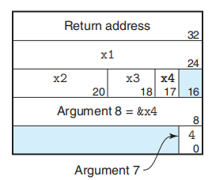{.mx-auto}

---

# 布尔运算

boolean operation

<div grid="~ cols-2 gap-12">

<div>

| `~`(not) 非 |     |
| ----------- | --- |
| 0           | 1   |
| 1           | 0   |

</div>

<div>


| `&`(and)  与 | 0   | 1   |
| ------------ | --- | --- |
| 0            | 0   | 0   |
| 1            | 0   | 1   |

</div>

<div>

| `\|`(or) 或 | 0   | 1   |
| ----------- | --- | --- |
| 0           | 0   | 1   |
| 1           | 1   | 1   |

</div>

<div>

| `^` (eor)  异或 | 0   | 1   |
| --------------- | --- | --- |
| 0               | 0   | 1   |
| 1               | 1   | 0   |
</div>

</div>

---

# 逻辑运算

logical operation

- 逻辑运算符：`&&`(and，与)、`||`(or，或)、`!`(not，非)
- 逻辑运算符的运算结果只有两种：`true` 和 `false`

**注意与位运算区分！逻辑运算具有短路特性，位运算没有！**

#### 短路特性{.mt-6.mb-2}

- `&&`：前一个表达式为假时，后一个表达式不执行，因为无论后一个表达式是什么，结果都是假
- `||`：前一个表达式为真时，后一个表达式不执行，因为无论后一个表达式是什么，结果都是真

也即：如果对第一个参数求值能确定表达式的结果，那么逻辑运算符不会对第二个参数求值

Q：为什么 `p && *p++` 不会引用空指针？（注意这里也有短路特性）

A：因为 `&&` 运算符的短路特性，当 `p` 为空指针时（对应其数字表达为 `0x00000000`，或者说是 `NULL`），`*p` 不会被执行，所以不会出现引用空指针的情况。


---
layout: image-right

image: ./newres/image/w2/logical_operation.png

backgroundSize: 25em 80%
---
# 位移

bit shift

- 左移：`<<`
- 右移：`>>`

#### 逻辑右移 / 算术右移{.mt-6.mb-2.font-bold}


<div>

- 逻辑右移：左边补 0
- 算术右移：左边补 最高位（思考：为什么？）
- 逻辑左移 / 算术左移：右边补 0
</div>


C 语言：有符号数算术右移, 无符号数逻辑右移

`a<<3+b<<2`
运算时，需要注意**运算符优先级** <span class="text-sm">（如果记不住就全加上括号！）</span>


---

# 整数表示
<!-- 图片居中 -->

<div style="text-align: center;">
  
</div>

---

# 整数编码

integer encoding

<div grid="~ cols-2 gap-12">

<div>


### 无符号数

对向量 $x = [x_{w-1}, x_{w-2}, ..., x_0]$：

$$
\text{B2U}_w(x) = \sum_{i=0}^{w-1}(x_i \times 2^i)
$$

- $\text{B2U}_w$ 表示把二进制编码转化为非负整数
  <br>
  <span class="text-sm">（Binary to Unsigned）</span>  

  该函数是双射，即无符号数编码具有唯一性

- $\text{UMax}_w = 2^w - 1$

</div>

<div>

### 有符号数

对向量 $x = [x_{w-1}, x_{w-2}, ..., x_0]$：

$$
\text{B2T}_w(x) = - x_{w-1} \times 2^{w-1} + \sum_{i=0}^{w-2}(x_i \times 2^i) 
$$

- $\text{B2T}_w$ 表示把二进制编码转化为补码
  <br>
  <span class="text-sm">（Binary to Two's Complement）</span>

- 当最高位为 1，整个数表示为一个负数
- 同样具有唯一性

</div>

</div>

---

# 整数编码

integer encoding


对于有符号数，取值范围是不对称的，典型例子 int：

- $\text{TMax}_{32} = 2147483647$
- $\text{TMin}_{32} = -2147483648$

<span class="text-sm">为什么？</span>

---

# 数据的其他表示

other representations

- **补码**：上下文无关——同构环
  $$
  B2T_w(\vec{x})=-x_{w-1}2^{w-1}+\sum^{w-2}_{i=0}x_i2^i
  $$

- **反码**：$0$ 的表示有两种：$000...0$ 和 $111...1$
  $$
  B2O_w(\vec{x})=-x_{w-1}(2^{w-1}-1)+\sum^{w-2}_{i=0}x_i2^i
  $$

- **原码**：最高位是符号位用来确定剩下的是正数还是负数（e.g.浮点数）
  $$
  B2S_w(\vec{x})=(-1)^{x_{w-1}}\cdot \sum^{w-2}_{i=0}x_i2^i
  $$

---

# 有符号数与无符号数之间的转换

conversion between signed and unsigned

强制类型转换保持位值不变，**只改变解释这些位的方式**

<div grid="~ cols-2 gap-12">

<div>

### 补码→无符号数

对满足 $\text{TMin}_w \leq x \leq \text{TMax}_w$ 的 $x$ 来说：

- 若 $\text{TMin}_w \leq x < 0$，则 $\text{T2U}(x) = x + 2^w$
- 若 $0 \leq x \leq \text{TMax}_w$，则 $\text{T2U}(x) = x$

<br>

> 对于负数，最高位“翻转了阵营”，从补码的代表的 $-2^{w-1}$ 变成了 $+2^{w-1}$

</div>

<div>
  
### 无符号数→补码

对满足 $0 \leq x \leq \text{UMax}_w$ 的 $x$ 来说：

- 若 $x > \text{TMax}_w$，则 $\text{U2T}(x) = x - 2^w$
- 若 $0 \leq x \leq \text{TMax}_w$ 则 $\text{U2T}(x) = x$

<br>

> 当一个无符号数与一个有符号数进行计算时，有符号数在这个表达式中会被当做无符号数（即发生了隐式的强制类型转换）
>  
> **例如** ：`-1 > 0u` 此为无符号的比较

<span class="text-sm">（-1 在计算机中表示为全 1，即 $\text{UMax}_w$，而 0u 表示为全 0 的无符号数）</span>

</div>

</div>

---

# 有符号数与无符号数之间的转换

conversion between signed and unsigned


---

# 扩展和截断

extension and truncation

### 扩展一个数{.mb-2}

- 对于无符号数，高位补 0
- 对于有符号数（补码），高位补符号位

当把 short（有符号数，2 字节）强制转换为 unsigned（无符号数，4 字节）时？

**先进行数位扩展，再转换为无符号数**{.text-sky-5}

#### 为什么对于有符号数，高位补符号位？{.mt-6.mb-2}

<div grid="~ cols-2 gap-12">

<div>

Hint：消消乐！

- 若最高位为 0，显然；
- 若最高位为 1，则你补的一堆 1 和原先的 1 等价

</div>

<div>

设现在位数为 $m$，补到 $n$ 位，且 $n > m$，则：

$$
-2^{n-1} + \sum_{i=m-1}^{n-2}2^i = -2^{m-1}
$$

</div>

</div>

---

# 扩展和截断

extension and truncation

### 截断一个数{.mt-6.mb-2}

- 对于无符号数 $x = [x_{w-1}, ..., x_0]$，截断为 $w'$ 位，则 $x' = [x_{w'-1}, ..., x_0]$
  
  即 $x' = x \mod 2^k$

- 补码截断，原理上与无符号数类似，但对于数位的解释方式不同

---

# 整数加减法

integer addition and subtraction

### 无符号数加法

由于两个 $w$ 位的无符号数相加，结果的范围是 $[0, 2^{w+1}-2]$，而这需要 $w+1$ 位来表示，所以实际上：

结果表示 $x+y$ 的低 $w$ 位，也即 $x + y \mod 2^w$

- 当 $x + y < 2^w$ 时，结果正确；
- 当 $x + y \geq 2^w$ 时，$x + y$ 的结果需要减去 $2^w$，才会得到实际结果，即 $x + y - 2^w$，这就是 **溢出**

{.h-180px}

---

# 整数加减法

integer addition and subtraction

### 有符号数加法

由于两个 $w$ 位的有符号数相加，结果的范围是 $[-2^w, 2^{w}-2]$，所以实际上：

- 若 $-2^{w-1} \leq x + y < 2^{w-1}$，结果正确；
- 若 $x + y \geq 2^{w-1}$，结果需要减去 $2^w$，才会得到实际结果，即 $x + y - 2^w$，此时称为 **正溢出/上溢出**
- 若 $x + y < -2^{w-1}$，结果需要加上 $2^w$，才会得到实际结果，即 $x + y + 2^w$，此时称为 **负溢出/下溢出**

{.h-200px}


---

# 判断溢出

determine overflow

### 无符号数加法

- $s = x + y$，若 $s < x$ 或 $s < y$ 则溢出

<br>

### 有符号数加法

<div grid="~ cols-2 gap-12">

<div>

- $s = x + y$，若 $x > 0$ 且 $y > 0$ 且 $s \leq 0$，则正溢出；
- 若 $x < 0$ 且 $y < 0$ 且 $s \geq 0$，则负溢出


为什么只有这两种情况？

</div>

<div>

{.h-250px}

</div>

</div>

---

# 判断溢出

determine overflow

关于整数加减法/溢出的一个有趣事实：这里的加法是个 **环**（阿贝尔群）！

无论你怎么改变次序，它总是可以轮换回来~

这是一个做题很方便的技巧！


- **补码的非**（加法逆元）：

  - 数学公式
    $$
    -^t_wx
    =\left\{
    \begin{aligned}
    &TMin_w &x=TMin_w\\ 
    &-x &x>TMin_w
    \end{aligned}
    \right.
    $$
    
  - 计算机实现(位级表示)
    $$
    -x=\sim x+1\\ \ because: \ x+(-x)=^u_w2^w
    $$
  
  

---

<div grid="~ cols-2 gap-12">

<div>

#### 证明： `~x + 1 = -x` (`x != TMin`)

证：

$$
\begin{aligned}
\sim x + 1 &= -x \\
\sim x + x &= -1 \\
\end{aligned}
$$

对于TMin
$$
\begin{aligned}
\sim ~TMin = 0111...1111 \\
\sim ~TMin + 1 = 1000...0000
\end{aligned}
$$
从数学上：
-TMin = 01000...000
截断之后仍为TMin

</div>

<div>

#### 证明： $\text{TMax} + 1 = \text{TMin}$

证：想想消消乐

$$
\begin{aligned}
0111...1111 + 1 = 1000...0000
\end{aligned}
$$

</div>

</div> 

---

# 补码的非运算

two's complement negation

对满足 $\text{TMin}_w \leq x \leq \text{TMax}_w$ 的 $x$ 来说：

- 若 $x = \text{TMin}_w$，则 $-x = \text{TMin}_w$
- 否则，$-x = -x$（算术上的）

注：这里式子左边的 $-x$ 是 **算数逆元**

- 对于 $x \neq \text{TMin}_w$ 时，本身 $-x$ 也在表示范围内，结论是平凡的
- 对于 $x = \text{TMin}_w$ 时，$-x$ 不在表示范围内。
  
  但是，两个 $\text{TMin}_w$ 相加，溢出到了上一位，结果是 0，所以此时我们说 $\text{TMin}_w$ 的算数逆元就是它自身

回忆：刚才说的 `~x + 1 = -x`
---

# 乘除法

multiplication and division

### 无符号数乘法

等于乘法计算得到的结果（一个 $2w$ 位长的数），而后截断到 $w$ 位

### 补码乘法{.mt-6.mb-2}

等于有符号数乘法后得到的结果（一个 $2w$ 位长的数），无符号截断到 $w$ 位，而后将最高位转化为符号位

**核心：粗暴的位级表示截断**

### 乘以二的幂次{.mt-6.mb-2}

此时，**相当于左移**{.text-yellow-5}


---

# 乘除法

multiplication and division

特别注意：除法这里以二的幂次作为除数，也只有此时可以采用右移来取巧。

### 无符号数除法

无符号数 $u$ 除以 $2^k$：将 $u$ **逻辑右移**{.text-yellow-5} $k$ 位

（此时恰好就是舍入到 0 的）

### 有符号数除法{.mt-6.mb-1}

直接右移 `x >> k` 得到的是 **向下舍入**{.text-yellow-5} 的结果，而不是正常来讲的向 0 取整。

例如：`-3 / 2 = -1`，而 `-3 >> 1 = -2`

向 0 取整：`(x < 0) ? (x + (1 << k) - 1 : x) >> k`

证明见书 P73


---

# 作业讲评

## P88 2.59, 2.60
<br/>

<div style="text-align: center;">
  
</div>

根据题目给出的示例，这里认为使用32位机器，一个字大小为4字节。

```c
unsigned concat_byte(unsigned x, unsigned y){
    return (x & 0xFF) | (y & 0xFFFFFF00);
}
```

---

# 作业讲评

## P88 2.59, 2.60
<br/>

<div style="text-align: center;">
  
</div>

<br/>

```c
unsigned replace_byte(unsigned x, int i, unsigned char b)
{
    unsigned mask = 0xFF << (i * 8);
    unsigned shifted_byte = (unsigned)b << (i * 8);
    return (x & ~mask) | shifted_byte;
}
```

---

# 作业讲评

## P91 2.71
<br/>

<div style="text-align: center;">
  
</div>

---

# 作业讲评

## P91 2.71
<br/>

**A** : 这段代码错在，当获取的`unsigned int`字节的最高位上为1的时候，转换后的`int`应为负数，但这一算法得到的结果却是正数。

**B** :
```c
int xbyte(packed_t word, int bytenum) {
    // 先将word左移，使word最高位上是所要提取byte的最高位
    int shifted = (int)(word << ((3 - bytenum) << 3));
    // 再执行右移运算，高位自动填入1或0，实现正负
    return shifted >> 24; 
}
``` 

---

# TIPS
datalab...

<br/>
认真看readme
<br/><br/>
实在想不出也没关系，这些tricks用处不大
<br/><br/>
一个数学tips
<br/>

- `(a + b) mod c = [(a mod c) + (b mod c)] mod c`
- 设`c`与`m`互素，则`a ≡ b (mod m)`当且仅当`ca ≡ cb (mod m)`


---

# 习题试炼 1
<br/>

<div style="text-align: center;">
  
</div>


---

# 习题试炼 1
<br/>

<div style="text-align: center;">
  
</div>


---

# 习题试炼 2
<br/>

<div style="text-align: center;">
  
</div>

---

# 习题试炼 2
<br/>

<div style="text-align: center;">
  
</div>

---

# 习题试炼 3
<br/>

<div style="text-align: center;">
  
</div>


---

# 习题试炼 3
<br/>

<div style="text-align: center;">
  
</div>

---

# 习题试炼 4
<br/>

<div style="text-align: center;">
  
</div>


---

# 习题试炼 4
<br/>

<div style="text-align: center;">
  
</div>


---

# 习题试炼 5

<br/>

<div style="text-align: center;">
  
</div>

---

# 习题试炼 5

<br/>

<div style="text-align: center;">
  
</div>


---

# 习题试炼 6

<br/>

<div style="text-align: center;">
  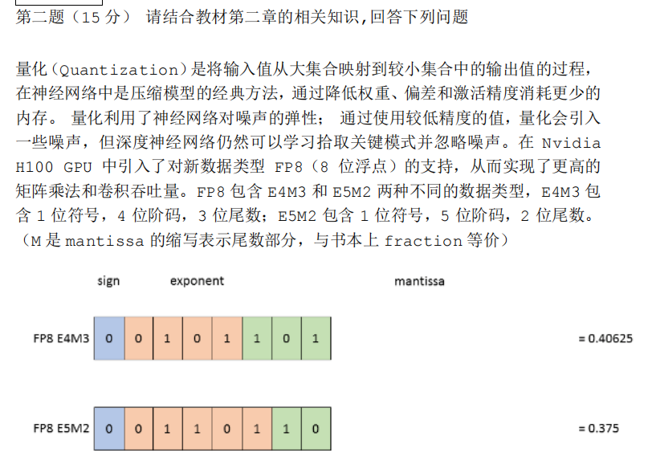
</div>

---

# 习题试炼 6

<br/>

<div style="text-align: center;">
  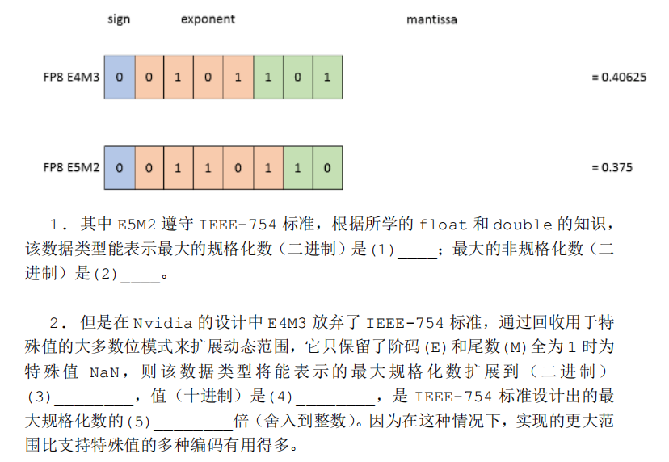
</div>

---

# 习题试炼 6

<br/>

<div style="text-align: center;">
  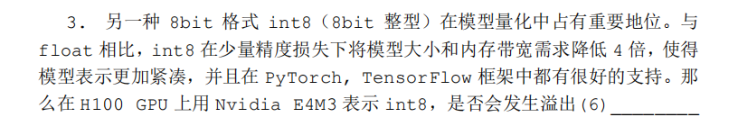
</div>
<div style="text-align: center;">
  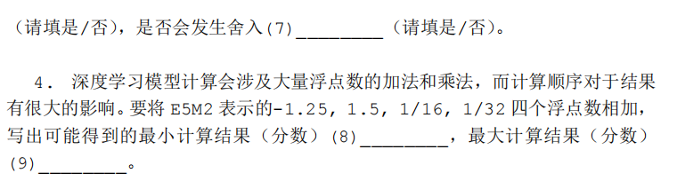
</div>

---


# 习题试炼 6

<br/>

<div style="text-align: center;">
  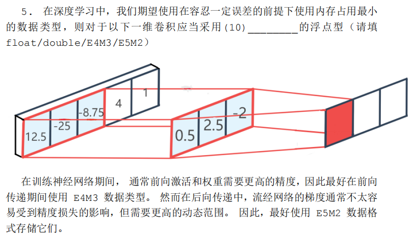
</div>


---

# 习题试炼 6

<br/>

<div style="text-align: center;">
  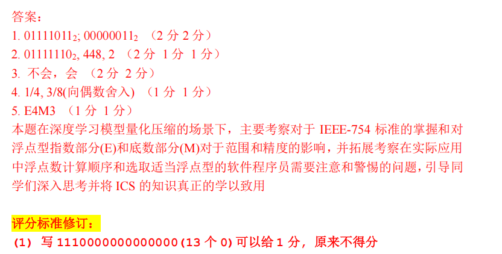
</div>

---


# 习题试炼 7

<br/>

<div style="text-align: center;">
  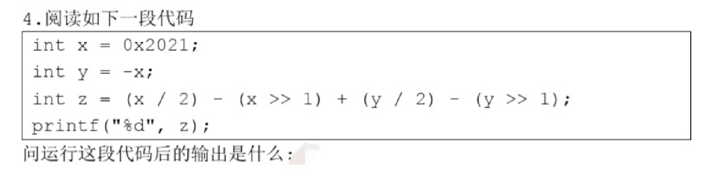
</div>

---

# 习题试炼 7

<br/>

<div style="text-align: center;">
  
</div>

答案：1

---

# 习题试炼 8

<br/>

<div style="text-align: center;">
  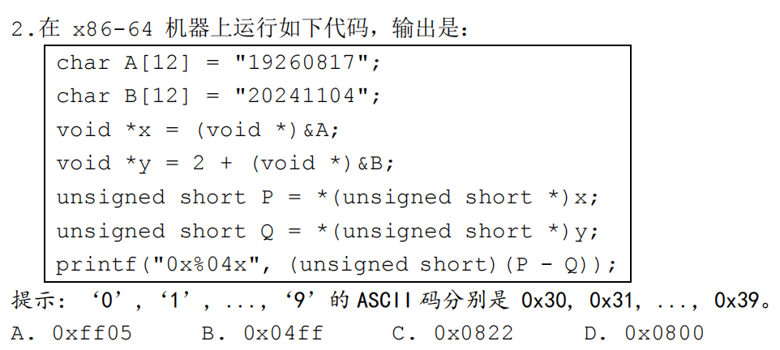
</div>

---

# 习题试炼 8

<br/>

<div style="text-align: center;">
  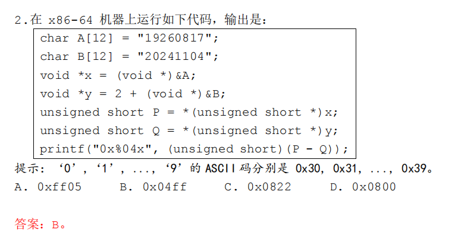
</div>

---

# 习题试炼 9

<br/>

<div style="text-align: center;">
  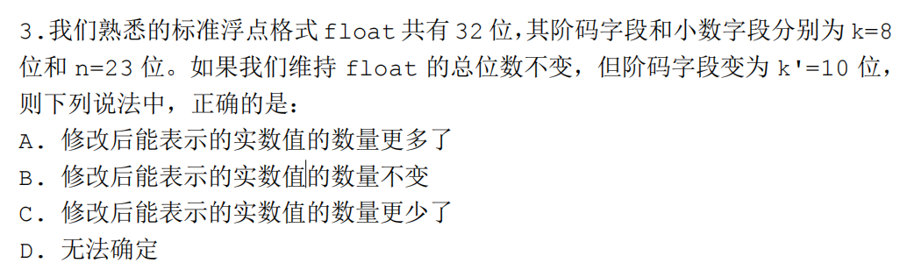
</div>


---

# 习题试炼 9

<br/>

<div style="text-align: center;">
  
</div>


---

# 习题试炼 10

<br/>

<div style="text-align: center;">
  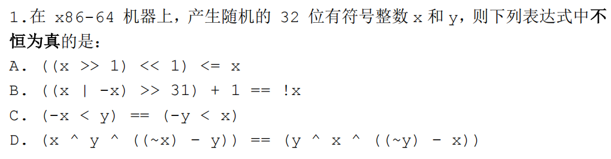
</div>


---

# 习题试炼 10

<br/>

<div style="text-align: center;">
  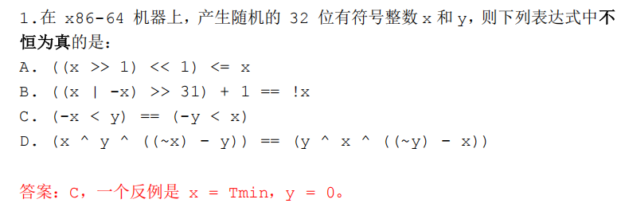
</div>

---
layout: center
---

<div flex="~ gap-20"  mt-2 justify-center items-center>

<div  w-fit h-fit mb-2>

# THANKS

Made by WEB-05

webrun@stu.pku.edu.cn

<p class="text-gray-40">
  <font size = '3'>
    Reference: [WalkerCH]'s and [Arthals]'s presentations.<br>
  </font>
</p>


</div>

{.w-50.rounded-md}

</div>
