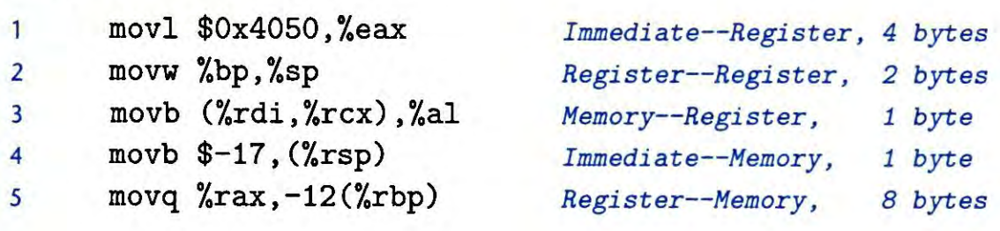

---
# You can also start simply with 'default'
theme: academic
# random image from a curated Unsplash collection by Anthony
# like them? see https://unsplash.com/collections/94734566/slidev
# background: https://cover.sli.dev
highlighter: shiki
# some information about your slides (markdown enabled)
title: 03-Machine Programming
info: |
  ICS 2024 Fall Slides
  Presented by WalkerCH
titleTemplate: '%s'
# apply unocss classes to the current slide
class: text-center
# https://sli.dev/features/drawing
drawings:
  persist: false
# slide transition: https://sli.dev/guide/animations.html#slide-transitions
transition: fade-out
# enable MDC Syntax: https://sli.dev/features/mdc
mdc: true
# download: true
layout: cover
coverBackgroundUrl: ./newres/image/w3/cover.jpg

---

# Machine Programming {.font-bold}

<p class="text-gray-100">
<font size = '5'>
  元培数科 王恩博
</font>
</p>

<div class="pt-12  text-gray-1">
  <span @click="$slidev.nav.next" class="px-2 py-1 rounded cursor-pointer" hover="bg-white bg-opacity-10">
    Let's get started <carbon:arrow-right class="inline"/>
  </span>
</div>


<div class="abs-br m-6 flex gap-2">
  <button @click="$slidev.nav.openInEditor()" title="Open in Editor" class="text-xl slidev-icon-btn opacity-50 !border-none !hover:text-white">
    <carbon:edit />
  </button>
  <a href="https://github.com/WEB-05/WEB-ICS-TA-Slides2025
  " target="_blank" alt="GitHub" title="Open in GitHub"
    class="text-xl slidev-icon-btn opacity-50 !border-none !hover:text-white">
    <carbon-logo-github />
  </a>
</div>

<style>
  div{
   @apply text-gray-2;
  }
</style>

<!-- ---

# 目录

<Toc columns="3" minDepth="1"></Toc> -->

---

# 浮点数表示

floating point

### IEEE 754 标准

本质是对实数的近似

<div grid="~ cols-2 gap-12">

<div>

- 符号位：1 位
- 指数位：$e$ 位
- 尾数位：$m$ 位

实际表示：

- 单精度浮点数（`float`）: $e = 8, {~} m = 23$
- 双精度浮点数（`double`）: $e = 11, {~} m = 52$

各个位长多少要牢牢记清楚！考试会考！

<span class="text-sm">注意，0 的表示有两种，+0 和 -0</span>

</div>

<div>


</div>

</div>


---

# 理解 IEEE 754

underlying IEEE 754

<div grid="~ cols-2 gap-12">

<div>

### 规格化值

$$
V = (-1)^s \times (1.M) \times 2^E
$$

- $s$ 为符号位，$M$ 为尾数，$E$ 为阶码
- $E = [e] - Bias$，其中 $[e]$ 为阶码处这 $e$ 位的实际值，$Bias = 2^{e-1} - 1$
- 尾数隐含的 1（Implied leading 1），可以获得 1 位额外精度

</div>

<div>

### 非规格化值

$$
V = (-1)^s \times (0.M) \times 2^{1 - Bias}
$$

- $E = 1 - Bias$，虽然此时 $[e] = 0$，但如此规定可以实现规格化值和非规格化值的平滑过渡
- 尾数没有隐含的 1

</div>

</div>

<br/>

非规格化值的看似反直觉的定义实现了**规格化值和非规格化值的平滑过渡**


---

# 理解 IEEE 754

underlying IEEE 754


$$
V=(-1)^s\times 2^E\times M
$$

$$
偏置:Bisa=2^{k-1}-1\\
指数：E=e-Bias
$$


### 特殊值
<br/>

- 最小的非规格化数 $not_{min}=2^{1-Bias}*2^{-n}=2^{2-2^{k-1}}*2^{-n}=2^{2-2^{k-1}-n}$
- 最大的规格化数 $not_{max}=2^{1-Bias}*(1-2^{-n})=2^{2-2^{k-1}}*(1-2^{-n})$
- 最小的规格化数 $yes_{min}=2^{1-Bias}*(1)=2^{2-2^{k-1}}$
- 最大的规格化数 $yes_{max}=2^{(2^k-1)-Bias-1}*(2-2^{-n})=2^{2^{k-1}-1}*(2-2^{-n})$

---

# 理解 IEEE 754

underlying IEEE 754

<div grid="~ cols-2 gap-12">

<div>

### 无穷（$\pm \infty$）

- 符号位 $s$ 区分正无穷/负无穷
- 阶码 $[e] = 1...1$（全1），尾数 $M = 0$
- 表示无穷大，在计算中可以用于表示溢出或未定义的结果

</div>

<div>

### 非数值 (NaN，Not a Number)

- 符号位 $s$ 任意，阶码 $[e] = 1...1$（全1），尾数 $M \ne 0$
- NaN 用于表示未定义或无法表示的值，例如 $0/0$ 或 $\sqrt{-1}$
- 通常在比较中被认为不等于任何值，包括自身{.text-yellow-5}

</div>


<div>

### 零

- 符号位 $s$ 任意，阶码 $[e] = 0...0$（全0），尾数 $M = 0$

</div>

<div>

### 特殊值的应用

- 处理异常情况：如除零错误、溢出、下溢等
- 提高计算的鲁棒性，避免程序崩溃
- 在数值算法中用于标记和处理特殊情况

</div>

</div>

<!-- <div grid="~ cols-2 gap-12">

<div>

### 特殊值


</div>

<div>

</div>

</div> -->

---

# 理解 IEEE 754

underlying IEEE 754

### 平滑过渡

考虑$e=2$，$m=3$


<div grid="~ cols-2 gap-12">

<div>


```
0 01 000

0 00 111
```

</div>

<div>

$$
Bias = 2^{e-1} - 1 = 2^{2-1} - 1 = 1
$$

$$
1.000_2 \times 2^{01_2 - 1} = 1.000_2
$$

$$
0.111_2 \times 2^{1 - 1} = 0.111_2
$$

</div>

</div>

---

# 浮点舍入

rounding

由于浮点数是对实数的近似，浮点数可以精确表示的实数是有限的，所以舍入是不可避免的。

### 实数舍入到浮点数

- **向偶数舍入（round-to-even）（round-to-nearest）**
- 类比“四舍六入五成双”，**避免统计偏差**

$$
1.234 \Rightarrow 1.0 \\
1.678 \Rightarrow 2.0 \\
1.500 \Rightarrow 2.0
$$

\* 实际上，这一过程发生在浮点数精度最末位

### 浮点数转整型{.mt-6}

- 如果舍入，向零舍入
- 如果溢出，C 语言未规定（undefined behavior），各自处理（Intel：$T_{\text{min}}^w$，即舍入到限定最接近的数）


---


# 浮点类型转换

- 舍入规则
  - 一般情况看舍入位，0 舍 1 入
  - 类似“四舍六入五成双”，若舍入位为 1 且后续位全 0，向偶舍入
- int/float/double 互转
  - int 转 float
    - 可能发生舍入
  - double 转 float
    - 可能溢出，可能舍入
  - float/double 转 int
    - 如果需要舍入，向零舍入
    - 如果发生溢出，未定义行为，一般得到 Tmin
  - 其余情况，得到精确值
- 和 long 之间的转换类似，但需另作讨论


---

# 浮点运算

floating point arithmetic

- 加法可交换，加法不可结合，`NaN`没有加法逆元
- **浮点加法单调性**，如果 $a \ge b$，那么对于任何 $a$，$b$ 以及 $x$ 的值，除了 `NaN` 都有 $x + a \ge x + b$
- 乘法可交换，乘法不可结合，乘法在加法上不可分配
- 小心特殊值：`+inf`，`-inf`，`NaN` (NaN 不能通过任何运算变为其它值)

<span class="text-sm text-gray-500">* 这些东西说了没用，得你自己做题踩坑才会知道。</span>


- Invalid operation：零乘无穷、零除零、无穷除无穷、无穷绝对值相减......
- Division by zero：有穷数除零结果为无穷
- Overflow：无穷
- Underflow：舍入结果
- Inexact：舍入结果

更多详情请见 [IEEE754](https://en.wikipedia.org/wiki/IEEE_754) 异常处理

---

# 浮点运算

floating point arithmetic

<div style="text-align: center;">
  
</div>


---
layout: center
---

<div>
  <text class="text-17 font-bold gradient-text">Machine Basics</text>
</div>

<style>
  .gradient-text {
    background-image: linear-gradient(45deg, #4ec5d4 10%, #146b8c 20%);
    -webkit-background-clip: text;
    color: transparent;
  }
</style>

---


# 数据格式

- 基本的数据格式，`b,w,l,q`，对应的 `size` 和 `C declaration`

<br/>

<div style="text-align: center;">
  
</div>


---
layout: image-right

image: ./res/image/slides.assets/integer_registers.png

backgroundSize: 25em 80%
---


# 寄存器

- %rax: accumulator
- %rbx: base
- %rcx: count
- %rdx: data
- %rsi: source index
- %rdi: destination index
- %rsp: stack pointer
- %rbp: base pointer
- %rip(PC): instruction pointer
- 注意名称由长到短变化规律

<!--  -->

---

# 寻址模式


$$
Imm(r_b,r_i,s)\Rightarrow Imm+\mathrm{R[r_b]+R[r_i]}*s
$$

- 注意基址和变址寄存器必须是 64 位寄存器，比例因子必须是 1,2,4,8
  - (%eax) 不合法
  - (,%rax,3)不合法

<div style="text-align: center;">
  
</div>


---
layout: image-right

image: ./res/image/slides.assets/image-20231027162029200.png

backgroundSize: 25em 80%
---

# mov指令

- 具有指令后缀 b/w/l/q
- 两个操作数不能都是内存，寄存器大小必须和指令后缀匹配
- 扩展数据传送指令 movz/movs，z 表示零扩展，s 表示符号扩展
- movl 指令以寄存器为目的时，会将高位 4 字节清零，因此没有 movzlq
- 特殊指令 **movabsq** 和 **cltq**
  - movabsq将64位立即数传送至寄存器
  - cltq将%eax有符号扩展到%rax
- 计算机的底层是很机械的，所以很多指令都可执行，但要**注意匹配**

---

# mov指令

- **Legal instruction**

{.w-150}


- **illegal instruction**

{.w-150}

---
layout: image-right

image: ./res/image/slides.assets/push_pop2.png

backgroundSize: 40em 30%
---


# push&pop指令

- push：先将 %rsp 减 8，再压栈
- pop：先弹栈，再将 %rsp 加 8
- 先这么理解，原理会在第四章学习（与表象并不完全一致）
- call：push + jmp，可进行间接跳转
- ret：pop + jmp

{.w-100}

<!--  -->

---
layout: image-right

image: ./res/image/slides.assets/image-20231027163419097.png

backgroundSize: 33em 80%
---


# 常见算术操作

#### 

- leaq 进行优化运算
- sub 指令是后减前

<!--  -->

- 移位操作的第二个操作数必须是**立即数或 %cl**

---


# 特殊算术操作

- 乘法：高位 %rdx，低位 %rax
- 除法：模 %rdx，商 %rax
- 带 i 为有符号


---

# 解码复杂表达式

decode complex expression

<div grid="~ cols-2 gap-12">
<div>

1. 从变量名开始
2. 往右读直到读到右括号或到底
3. 往左，忽略读过的
4. 上面的括号均不包括成对的括号
5. `*` 读作 “指针，指向”
6. `[x]` 读作 “长为 x 的数组，元素类型为”
7. `(…)` 读作 “函数，返回值为” + 上面提的成对括号（参数列表可选）
8. 如果为匿名类型，手动补充变量名（参数列表里会出现）

</div>

<div>

```c
int *(*p[2])[3];
```

<div text-sm>

1. `p`：变量名
2. `[2]`：往右读，这是一个长度为 2 的数组，元素类型为...
3. `)`：往左读，忽略读过的
4. `(*p[2])`：这是一个指针，指向...
5. `(*p[2])[3]`：一个长度为 3 的数组
6. `;`：到底了，往左读
7. `*(*p[2])[3]`：一个指针，指向...
8. `int *(*p[2])[3]`：`int` 类型

合并：这是一个长度为 2 的数组，元素类型为<span text-sky-5>指针，指向一个长度为 3 的数组</span>，<span text-yellow-5>数组元素类型为指针，指向 `int`</span>。

</div>

</div>
</div>

---

# 解码复杂表达式

decode complex expression

<div grid="~ cols-2 gap-12">
<div>

1. 从变量名开始
2. 往右读直到读到右括号或到底
3. 往左，忽略读过的
4. 上面的括号均不包括成对的括号
5. `*` 读作 “指针，指向”
6. `[x]` 读作 “长为 x 的数组，元素类型为”
7. <span text-sky-5>`(…)` 读作 “函数，返回值为” + 上面提的成对括号（参数列表可选）</span>
8. 如果为匿名类型，手动补充变量名（参数列表里会出现）

</div>

<div>

<div text-sm>

```c
int func(); 
```

函数，返回值为 `int`

```c
void func(int a, float b); 
```

函数，返回值为 `void`，参数列表为 `int a` 和 `float b`

```c
int* func();
```

函数，返回值为 `int*`

```c
int (*func)();
```

函数指针，指向返回值为 `int` 的函数


</div>

</div>
</div>


---

# 解码复杂表达式

decode complex expression

<div grid="~ cols-2 gap-12">
<div>

#### Quiz

```c
int *(*p[2])[3];
```

你可以在 [cdecl.org](https://cdecl.org/) 验证，或者尝试其他表达式。

</div>

<div v-click>

让我们逐步解码：

1. `p`：变量名
2. `p[2]`：一个长度为 2 的数组，元素类型为...
3. `*p[2]`：一个指针，指向...
4. `(*p[2])[3]`：一个长度为 3 的数组，元素类型为...
5. `*(*p[2])[3]`：一个指针，指向...
6. `int *(*p[2])[3]`：`int` 类型

合并：声明 `p` 为一个包含 2 个元素的<span text-sky-5> 数组 </span>，每个元素是<span text-sky-5> 指向一个包含 3 个元素的<span text-yellow-5> 数组 </span>的指针 </span>，<span text-yellow-5> 这些数组的元素是指向 `int` 类型的指针 </span>。

</div>
</div>


---

# 解码复杂表达式

- 指针运算动图：阅读方法：先找变量名，一层一层括号往外读

  

---

# Tips

- 国庆前剩余的三节课是汇编的关键部分，Control本节做一些练习
- Procedures 和 Data 考前来不及复习做题，十一注意自己复习，做题，尤其是对函数调用传参与返回的理解，往年题中的汇编填空涉及递归等调用方法。
- 复习时整体理解和细节两手抓，参考课本和往年题，汇编部分细节更多更杂，**注意各种特例**


---
layout: center
---

<div>
  <text class="text-17 font-bold gradient-text">作业讲评</text>
</div>

<style>
  .gradient-text {
    background-image: linear-gradient(45deg, #4ec5d4 10%, #146b8c 20%);
    -webkit-background-clip: text;
    color: transparent;
  }
</style>

---

# 作业讲评

1. 对于非规格化数，E = 1 - Bias
2. 正确理解二进制值、十进制值，尤其注意 0
3. (dx+dy)+dz == dx+(dy+dz)
4. (dx*dy)*dz == dx*(dy*dz)

**注意datalab截止时间！**


---
layout: center
---

<div>
  <text class="text-17 font-bold gradient-text">习题试炼</text>
</div>

<style>
  .gradient-text {
    background-image: linear-gradient(45deg, #4ec5d4 10%, #146b8c 20%);
    -webkit-background-clip: text;
    color: transparent;
  }
</style>

---

# 习题试炼1

{.w-150}

<!--  -->

---

# 习题试炼1

{.w-150}


---

# 习题试炼2


<!-- {.w-150} -->

---


# 习题试炼2


{.w-150}

---

# 习题试炼3

{.w-150}

<!-- {.w-150} -->


---

# 习题试炼3

{.w-150}

{.w-150}

---

# 习题试炼4

{.w-150}

<!-- {.w-150} -->

---

# 习题试炼4

{.w-150}

{.w-150}

---

# 习题试炼5

- 加法指令：ADD、ADC、INC、XADD除了INC不影响CF标志位外，都影响条件标志位。
           CF、ZF、SF、OF
           CF最高位是否有进位
           DF若两个操作数符号相同而结果符号与之相反OF=1，否则OF=0.
- 减法指令：SUB、SBB、DEC、NEG、CMP、CMPXCHG、CMPXCHG8B
           前六种除了DEC不影响CF标志外都影响标志位。CMPXHG8B只影响ZF。
           CF说明无符号数相减的溢出，同时又确实是被减数最高有效位向高位的借位。
           OF位则说明带符号数的溢出
           无符号运算时，若减数>被减数，有借位CF=1，否则CF=0.
           OF若两个数符号相反，而结果的符号与减数相同则OF=1.否则OF=0.
- 乘法指令：MUL、IMUL
           MUL：如果乘积高一半为0，则CF和OF位均为0，否则CF和OF均为1.
           IMUL：如果高一半是低一半符号的扩展，则CF位和OF位均为0，否则就均为1.
- 除法指令：DIV、IDIV  对所有条件位均无定义。
- 逻辑指令：AND、OR、NOT、XOR、TEST
            NOT不允许使用立即数，其它4条指令除非源操作数是立即数，至少要有一个操作数必须存放在寄存器中。另一个操作数则可以使用任意寻址方式。
            NOT不影响标志位，其余4种CF、OF、置0，AF无定义，SF、ZF、PF位看情况而定。


---

# 习题试炼6


<!--  -->

---

# 习题试炼6


---

# 习题试炼7


<!--  -->

---

# 习题试炼7


---

# 习题试炼8


<!-- {.w-170} -->

---

# 习题试炼8


{.w-170}

---

# 习题试炼9


<!--  -->

---

# 习题试炼9


---

# 习题试炼10

{.w-130}

<!--  -->

---

# 习题试炼10

{.w-130}


---

# 习题试炼11


<!--  -->

---

# 习题试炼11


---


# 习题试炼12

{.w-150}

<!-- {.w-150} -->

---

# 习题试炼12

{.w-130}


---
layout: center
---

<div>
  <text class="text-17 font-bold gradient-text">其他说明</text>
</div>

<style>
  .gradient-text {
    background-image: linear-gradient(45deg, #4ec5d4 10%, #146b8c 20%);
    -webkit-background-clip: text;
    color: transparent;
  }
</style>

---

# 从 C 源代码到汇编代码

> - [Linux环境下GCC基本使用详解（含实例）_linux gcc-CSDN博客](https://blog.csdn.net/qq_39872252/article/details/133309120)
> - [objdump(Linux)反汇编命令使用指南_怎么用objdump反汇编-CSDN博客](https://blog.csdn.net/wwchao2012/article/details/79980514#:~:text=在Linux中，可以#:~:text=在Linux中，可以)

- -S 生成汇编代码文件，-c 生成不可执行的二进制文件（未经过链接）
- gcc x.c –S x.s
- gcc –c x.s –o x.o
- 使用 objdump 可以将二进制汇编文件通过反汇编得到它的汇编代码
- **objdump –d x.o > x.s**
- 右图是 objdump 可能的输出，左侧是汇编代码的二进制编码和对应的存储地址，右侧是汇编代码

```bash
ubuntu@yaen:~/ICS/HW/02$ gcc -S exam.c -Og
ubuntu@yaen:~/ICS/HW/02$ gcc -c exam.c -Og
ubuntu@yaen:~/ICS/HW/02$ gcc exam.c -o exam -Og
ubuntu@yaen:~/ICS/HW/02$ objdump -s -d exam.o > exam_obj.o.s
ubuntu@yaen:~/ICS/HW/02$ objdump -s -d exam > exam.out.s
```


---
layout: center
---

<div flex="~ gap-20"  mt-2 justify-center items-center>

<div  w-fit h-fit mb-2>

# THANKS

Made by WEB-05

webrun@stu.pku.edu.cn

<p class="text-gray-40">
  <font size = '3'>
    Reference: [WalkerCH]'s and [Arthals]'s presentations.<br>
  </font>
</p>


</div>

{.w-50.rounded-md}

</div>

