---
# You can also start simply with 'default'
theme: academic
# random image from a curated Unsplash collection by Anthony
# like them? see https://unsplash.com/collections/94734566/slidev
# background: https://cover.sli.dev
highlighter: shiki
# some information about your slides (markdown enabled)
title: W10-Linking
info: |
  ICS 2025 Fall Slides
titleTemplate: '%s'
# apply unocss classes to the current slide
class: text-center
# https://sli.dev/features/drawing
drawings:
  persist: false
# slide transition: https://sli.dev/guide/animations.html#slide-transitions
transition: fade-out
# enable MDC Syntax: https://sli.dev/features/mdc
mdc: true
layout: cover
coverBackgroundUrl: /newres/image/W10/1.jpg

---

# Linking {.font-bold}

<p class="text-gray-100">
<font size = '5'>
  元培数科 王恩博
</font>
</p>

<div class="pt-12  text-gray-1">
  <span @click="$slidev.nav.next" class="px-2 py-1 rounded cursor-pointer" hover="bg-white bg-opacity-10">
    Let's get started <carbon:arrow-right class="inline"/>
  </span>
</div>


<div class="abs-br m-6 flex gap-2">
  <button @click="$slidev.nav.openInEditor()" title="Open in Editor" class="text-xl slidev-icon-btn opacity-50 !border-none !hover:text-white">
    <carbon:edit />
  </button>
  <a href="https://github.com/WEB-05/WEB-ICS-TA-Slides2025
  " target="_blank" alt="GitHub" title="Open in GitHub"
    class="text-xl slidev-icon-btn opacity-50 !border-none !hover:text-white">
    <carbon-logo-github />
  </a>
</div>

<style>
  div{
   @apply text-gray-2;
  }
</style>


---
layout: center
---

<div style="text-align: center;">
  <text class="text-17 font-bold gradient-text">Knowledge Review</text>
  <br />
</div>


<style>
  .gradient-text {
    background-image: linear-gradient(45deg, #4ec5d4 10%, #146b8c 20%);
    -webkit-background-clip: text;
    color: transparent;
  }
</style>

---
layout: center
---

<div style="text-align: center;">
  <text class="text-17 font-bold gradient-text">Program optimization</text>
  <br />
</div>


<style>
  .gradient-text {
    background-image: linear-gradient(45deg, #4ec5d4 10%, #146b8c 20%);
    -webkit-background-clip: text;
    color: transparent;
  }
</style>

---

# 编译器能力与局限
Capabilities

对程序只使用**安全**的优化,保证**一定不会**改变程序行为

例1：代码移动

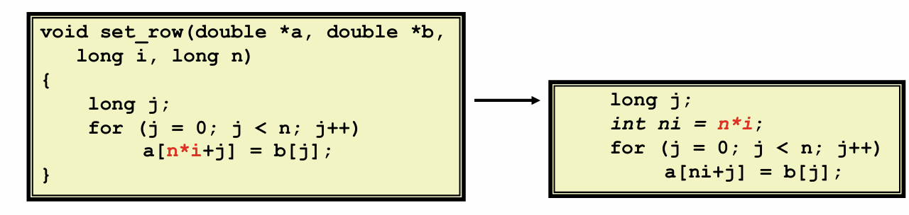{.w-250}

---

# 编译器能力与局限
Capabilities

对程序只使用**安全**的优化,保证**一定不会**改变程序行为

例2：用简单的操作替换复杂操作

- 移位和加减法代替乘法

- 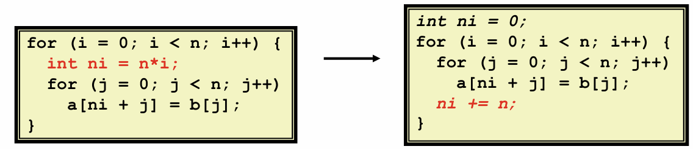{.w-250}

---

# 编译器能力与局限
Capabilities

对程序只使用**安全**的优化,保证**一定不会**改变程序行为

例3：表达式重用

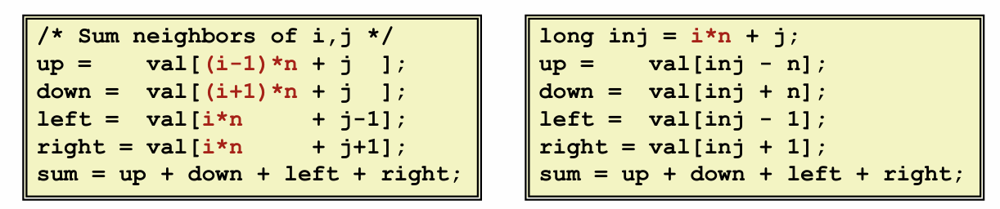{.w-250}

---

# 编译器能力与局限
Limitations

**不安全的情况1**：

- 内存别名使用：
```c++
void func1(long *xp,long *yp)
{
  *xp += *yp;
  *xp += *yp;
}

void func2(long *xp,long *yp)
{
  *xp += 2 * *yp;
}
```

- 特点 ：有**指针/数组**等，考虑可能指向同一位置

---

# 编译器能力与局限
Limitations

**不安全的情况2**：

- 函数调用：
```c++
int a = 0;
int fun()
{
  return a++;
}
int func1()
{
  return fun()+fun()+fun()+fun();
}

void func2()
{
  return fun() * 4;
}
```

- 特点 ：有**函数调用**，考虑不清楚函数具体操作是否有副作用
- 优化 ： **内联函数调用**
---

# 表示程序性能

## CPE

- cycles per element
- 延迟、吞吐量
- 延迟界限、吞吐量界限
- 吞吐量界限是程序性能的最终限制

{.w-150}

---

# 优化示例
开编译器的优化很有用


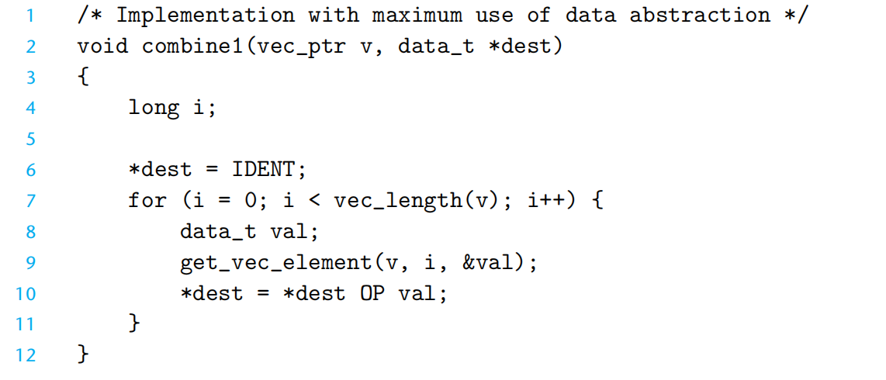{.w-150}
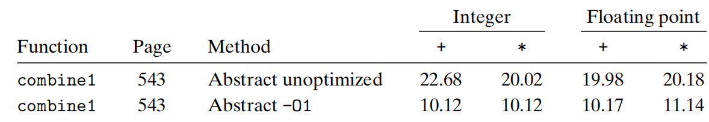{.w-150}

---

# 循环效率
Eliminating Loop Inefficiencies

代码移动，移出循环 <br>
有**函数调用**时，编译器很可能无法自动进行
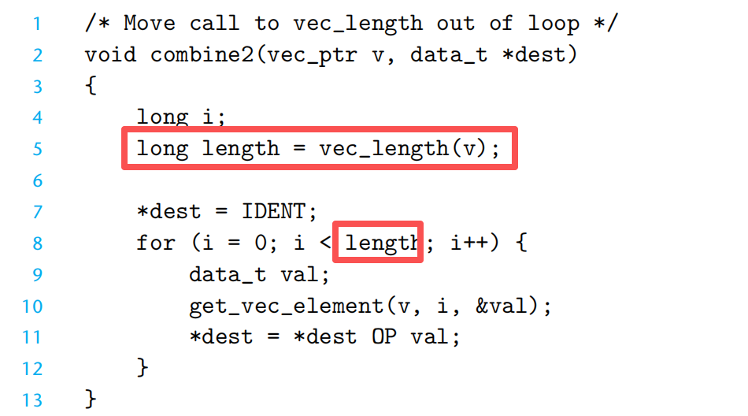{.w-100}
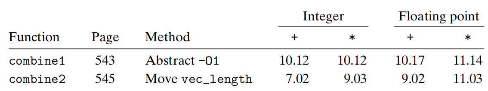{.w-150}

---

# 减少过程调用
Reducing Procedure Calls


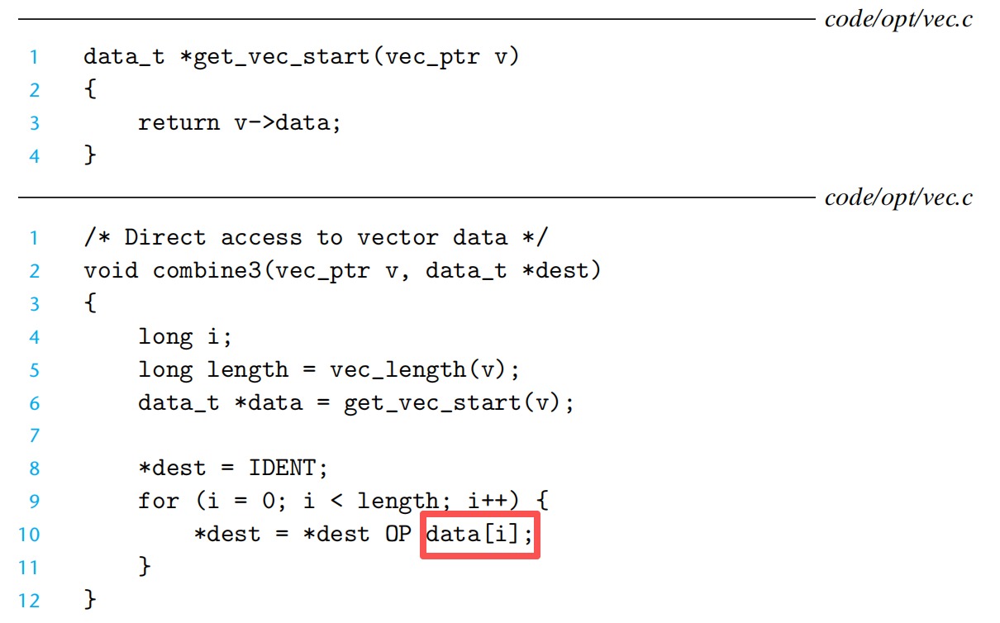{.w-150}

---

# 内存读写
Eliminating Unneeded Memory References

减少内存读写次数，内存读写代价大 <br>
可能有**别名引用**，编译器无法自动进行
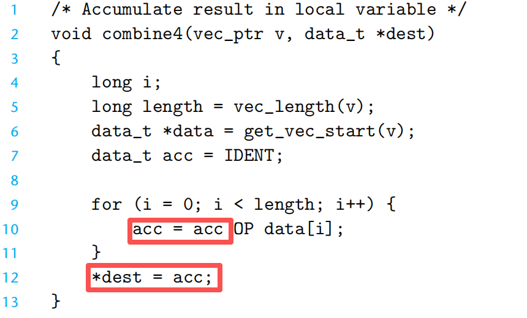{.w-100}
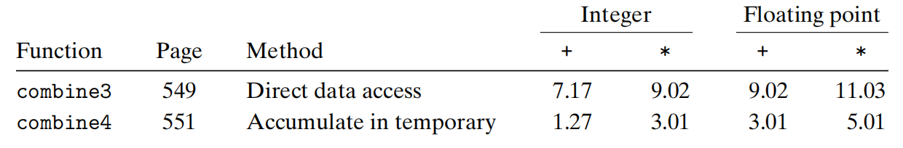{.w-150}

---

# 现代处理器
Modern Processors

- 超标量、乱序、指令级并行
- 取指：投机执行
- 译码：复杂指令拆为微操作
- 投机执行结果不会放在程序寄存器或数据内存中
- 退役单元 ：一条指令操作完成，并且所有分支点预测正确，退役。更新程序寄存器
- 寄存器重命名： 操作数在执行单元间传递
- 重命名表 ： 未进行写操作的寄存器
- 指令1更新r，加入(r,t)
- 后续指令需要r,等待1执行完毕加入(v,t),以v操作数值

---

# 功能单元性能
Functional Unit Performance

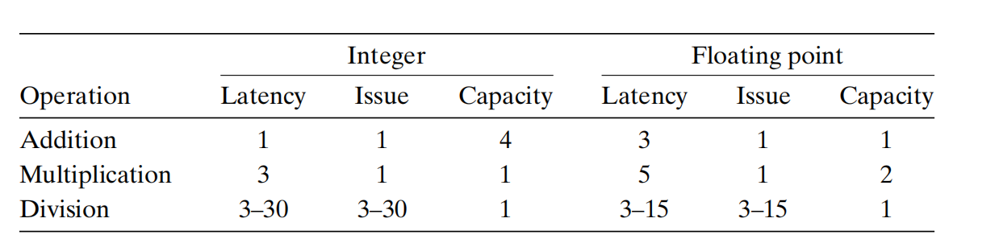{.w-150}
- 发射时间为 1：完全流水线化
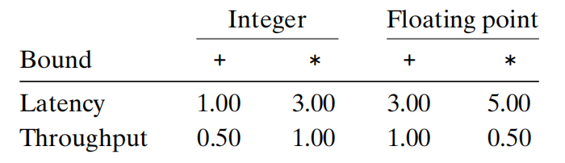{.w-120}
- 加法吞吐量界限受到内存读取数据限制，一个周期最多读两个数据

---

# 回顾之前优化结果
Review

{.w-80}
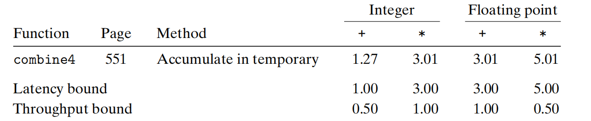{.w-150}
- 一次一个互相限制，因此接近延迟界限

---

# 数据流图+关键路径
Critical Path

- 关注循环寄存器
- 只是下界，其他：功能单元数量（够不够并行的）、传递数据值的数量
- 整数加法：加法很快，其他操作供应不够

<div grid="~ cols-2 gap-2">

<div>


</div>

<div>


{.w-70}


</div>
</div>

---

# 循环展开
Loop Unrolling

## k*1
<div grid="~ cols-2 gap-2">

<div>

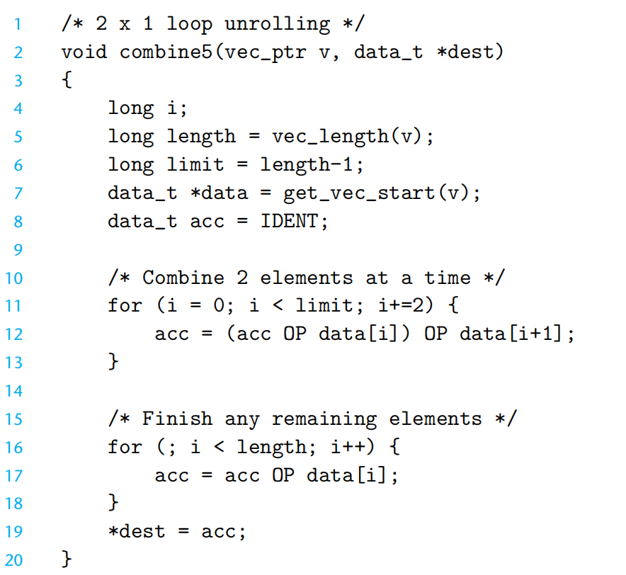{.w-80}

</div>

<div>

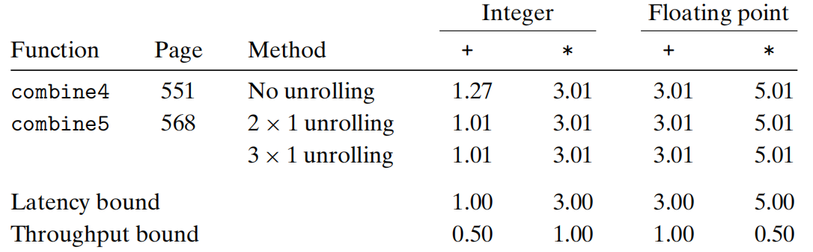{.w-150}

</div>
</div>

- 减少循环开销，但不低于延迟界限

---

# k*1不低于延迟界限
Why？

<div grid="~ cols-2 gap-2">

<div>

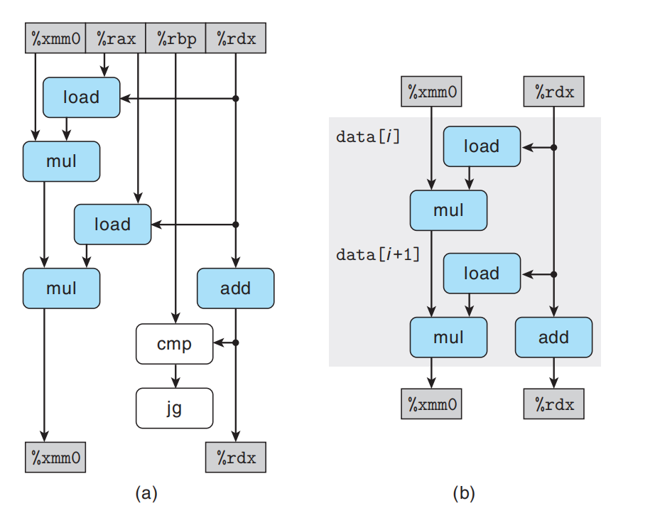{.w-80}

</div>

<div>

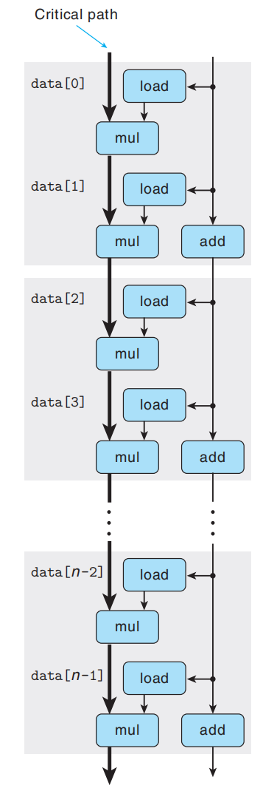{.w-30}

</div>
</div>

---


# 提高并行性
Enhancing Parallelism


- 循环展开：`acc = (acc OP data[i]) OP data[i+1]`
- 多个累计变量：`acc0 = acc0 OP data[i], acc1 = acc1 OP data[i+1]`
  - $CPE$ 为满，需要执行该操作的所有功能单元的流水线都是满的——**吞吐量界限**
  - $k\times k$ 循环展开：$k\ge C\cdot L$，延迟$C$，容量$L$
- 重新结合变换：`acc = acc OP (data[i] OP data[i+1])`

<br/>

## 局限性

- 寄存器溢出
- 分支预测处罚（避免方法：可预测的分支、条件传送）
- 不可重排的运算

---

# 多个累计变量
Multiple Accumulators

## k*k
<div grid="~ cols-2 gap-2">

<div>

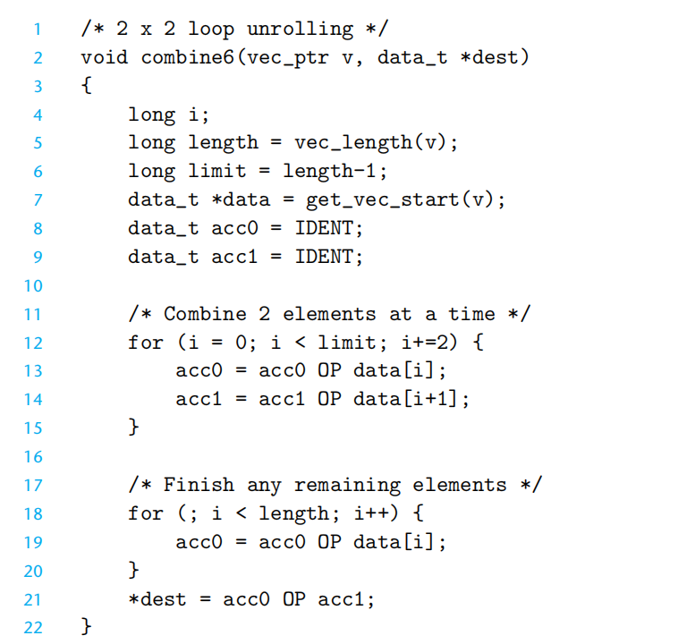{.w-80}

</div>

<div>

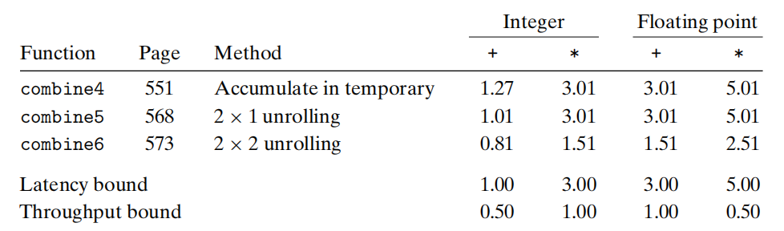{.w-150}

</div>
</div>

---

# 多个累计变量
Multiple Accumulators

<div grid="~ cols-2 gap-2">

<div>

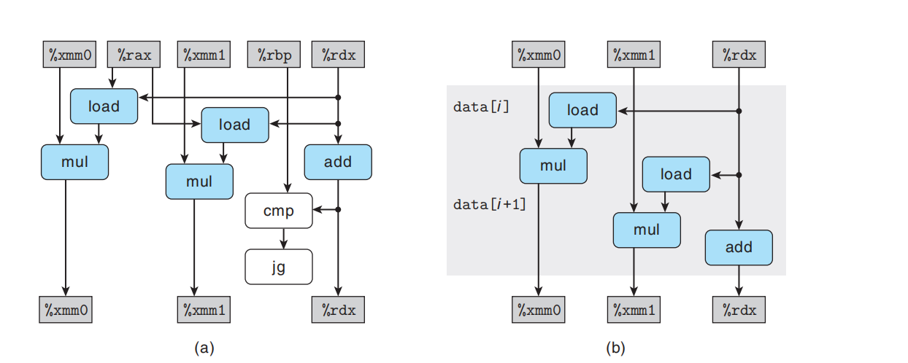{.w-100}

</div>

<div>

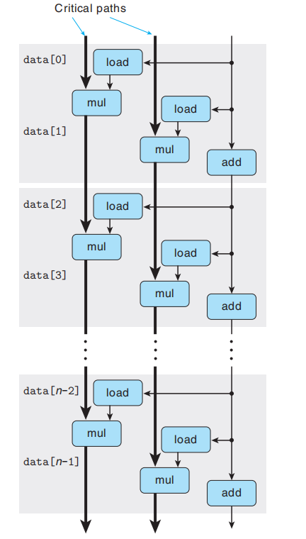{.w-50}

</div>
</div>

---

# 重新结合变换
Reassociation Transformation

## 2*1a
<br>

```c++
acc = acc OP (data[i] OP data[i+1])
```


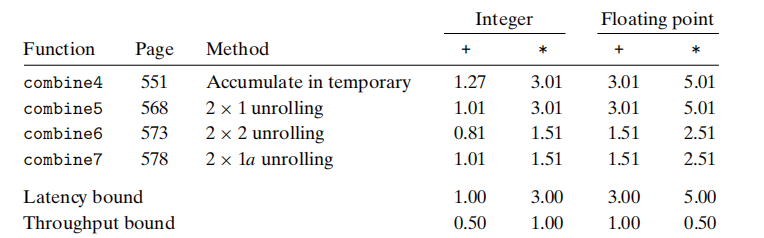{.w-150}

---

# 重新结合变换
Reassociation Transformation

<div grid="~ cols-2 gap-2">

<div>

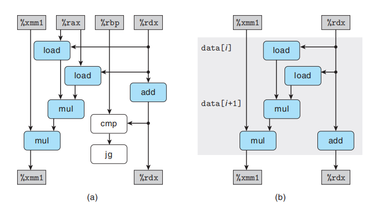{.w-100}

</div>

<div>

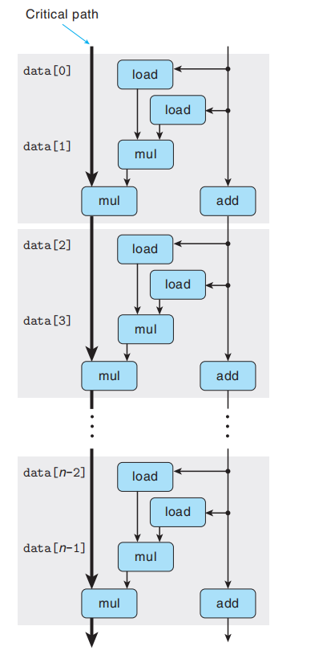{.w-50}

</div>
</div>

---

# 内存性能
Memory Performance

- load ：与cache的访问周期有关
- store ：完全流水线化
- 写/读相关 ：检查地址是否相同

<div grid="~ cols-2 gap-2">

<div>

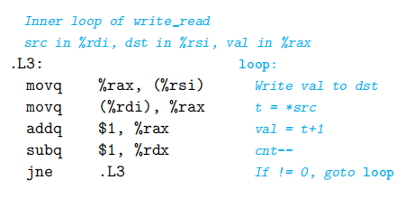{.w-80}

</div>

<div>

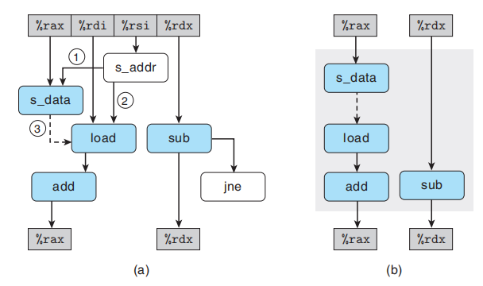{.w-80}

</div>
</div>

---

# 写/读相关
Write/Read Dependency

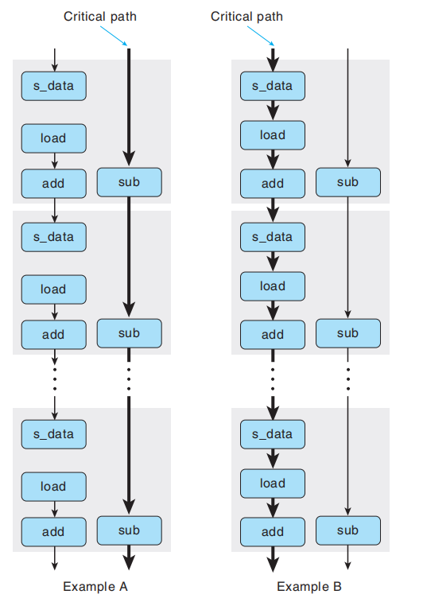{.w-60}

---
layout: center
---

<div style="text-align: center;">
  <text class="text-17 font-bold gradient-text">Linking</text>
  <br />
</div>


<style>
  .gradient-text {
    background-image: linear-gradient(45deg, #4ec5d4 10%, #146b8c 20%);
    -webkit-background-clip: text;
    color: transparent;
  }
</style>


---

# 链接

Linking

**链接**：将多个目标文件组合成一个可执行文件。

**目标文件**：编译器将源代码文件编译后的产物，但还未链接成最终的可执行文件。

**可执行文件**：链接后的最终产物，这个文件可被加载（复制）到内存并执行。

链接在 **编译时、加载时、运行时** 均可执行（后文会说都是啥）。

链接的优势：

- **代码模块化**：方便查找问题与维护，可以建立常见函数的库
- **时间和空间效率**：只需要改一处代码可同时影响多个代码，只会编译你引用的库中用到的代码


---

# 从源代码到可执行文件

From source code to executable file


研讨题1.1
$$
\text{.c} \xrightarrow{\text{cpp}} \text{.i} \xrightarrow{\text{cc1}} \text{.s} \xrightarrow{\text{as}} \text{.o} \xrightarrow{\text{ld}} \text{prog}
$$

<div class="text-sm">

<v-clicks>


- `gcc`：编译器驱动程序
- `cpp`：C 预处理（c preprocessor），将 xx.c 翻译成一个 ASCII 码的 **中间文件**{.text-sky-5} xx.i（intermediate file）
- `cc1`：C 编译器（c compiler），将 xx.i 翻译成一个 ASCII **汇编语言文件**{.text-sky-5} xx.s（assembly language file）
- `as`：汇编器（assembler），将 xx.s 翻译成一个 **可重定位目标文件**{.text-sky-5} xx.o（relocatable object file）
- `ld`：链接器（linker），将 xx.o 和其他的 xx.o，以及必要的系统目标文件组合起来，创建一个**可执行目标文件**{.text-sky-5} prog

</v-clicks>


</div>


---

# 静态链接

Static Linking


<div grid="~ cols-2 gap-12">
<div>

### main.c
```c
int sum(int *a, int n);  // 这里声明了函数，但未定义
int array[2] = {1, 2};  

int main()  
{  
    int val = sum(array, 2);  
    return val;  
}
```

### sum.c
```c
int sum(int *a, int n)   // 这里定义了函数
{  
    int i, s = 0;  
    for (i = 0; i < n; i++) {  
        s += a[i];  
    }  
    return s;  
}
```

</div>

<div flex="~ col gap-4 justify-center items-center">


{.h-60}

</div>
</div>


---

# 静态链接

Static Linking

研讨题1.3

在静态链接中，链接器需要实现如下功能：

- **符号解析**{.text-sky-5}：将 **符号引用** 与输入的可重定位目标文件中的 **符号表** 中的一个确定的符号（全局变量、函数等）关联起来。
- **重定位**{.text-sky-5}：**合并重定位输入模块**，将符号定义与一个地址关联起来，并为找到的每个符号指向对应的该地址。

好处：
- 复用一些常用函数，不用自己写。
- 把函数写在多个文件里，方便维护。
- 编译更有效率。


---

# 目标文件

Object File

1. **可重定位目标文件**
   - 这是一个包含计算机能直接理解的代码和数据的文件，**但它还不能单独运行**{.text-sky-5}。
   - 它就像是一个半成品，需要和其他半成品合并在一起才能变成一个完整的产品。
2. **可执行目标文件**
   - 这是一个已经准备好 **可以直接在计算机上运行的文件**{.text-sky-5}。
   - 它就像是一个已经组装好的玩具，拿到手就可以玩了，不需要再做其他操作。
3. **共享目标文件**
   - **特殊类型的可重定位目标文件**{.text-sky-5}，可以在程序运行的时候 **动态加载**{.text-sky-5} 进来使用。
   - 它就像是一个插件，可以在需要的时候装上去，不需要的时候可以取下来。


---

# 可重定位目标文件

Relocatable Object File 研讨题1.6

<div grid="~ cols-2 gap-12">
<div>

```
ELF 可重定位目标文件
│
├── ELF 头（ELF Header）[低地址]
│
├── 节（Sections）
│   ├── .text（机器代码）
│   ├── .rodata（只读数据）
│   ├── .data（已初始化数据）
│   ├── .bss（未初始化数据）
│   ├── .symtab（符号表）
│   ├── .rel.text（重定位信息）
│   ├── .rel.data（重定位信息）
│   ├── .debug（调试信息）
│   └── .strtab（字符串表）
│
├── 节头部表（Section Header Table）[高地址]
│   ├── 节头部条目 1
│   ├── 节头部条目 2
│   ├── ...
│   └── 节头部条目 N
```

</div>

<div>


</div>
</div>


---

# 可重定位目标文件

Relocatable Object File

<div grid="~ cols-2 gap-12">
<div>

### ELF 头

存储关于这个二进制文件的一般信息：

文件的类型、字节序、ELF 头长度、节头部表偏移量、节头部表条目大小和数量等信息。

运行时，会根据这些信息：

1. 先定位到 ELF 头
2. 然后根据 ELF 头中的信息找到节头部表
3. 再根据节头部表找到相应的节

</div>

<div>


</div>
</div>


---

# 可重定位目标文件

Relocatable Object File

<div grid="~ cols-2 gap-12">
<div>

### 节


`.text`：已编译程序的机器代码

`.rodata`：只读<span class="text-sm text-gray-5">（read-only）</span>数据，如 `printf` 中的格式串、开关语句的跳转表、字符串常量等

`.data`：<span text-sky-5> 已初始化的全局与静态 C 变量</span>

`.bss`：<span text-sky-5> 未初始化的全局和静态 C 变量，以及所有被初始化为 0 的全局和静态 C 变量</span><br><span class="text-sm text-gray-5">（Block Storage Start / Better Save Space）</span>

<span class="text-sm text-gray-5">

\* 将初始化为 0 的变量放在 `.bss` 段而不是 `.data` 段，可以使可执行文件更小，因为 `.bss` 段只需要记录变量的大小和位置，而不需要存储实际的 0 值（直到运行时才真的去内存中分配空间）。

</span>

</div>


<div>


</div>
</div>


---

# 可重定位目标文件

Relocatable Object File

<div grid="~ cols-2 gap-12">
<div>

### 节


`.symtab`：符号表 <span class="text-sm text-gray-5">（symbol table）</span>，存放定义和引用的函数与全局变量信息

`.rel.text`：重定位信息 <span class="text-sm text-gray-5">（relocate text）</span>

`.rel.data`：重定位信息 <span class="text-sm text-gray-5">（relocate data）</span>，（未初始化或为 0 的变量不需要重定位）

`.strtab`：字符串表 <span class="text-sm text-gray-5">（string table）</span> ，包括： 

<span class="text-sm text-gray-5">

- `.symtab` 和 `.debug` 节中的符号表
- 节头部中的节名字

字符串表就是以 null（`\0`）结尾的字符串的序列。

</span>


</div>


<div>


</div>
</div>

<!-- 

还有 `.debug` 节，存储调试信息。`.line` 节，存储行号信息。

-->


---

# 可重定位目标文件

Relocatable Object File

<div grid="~ cols-2 gap-12">
<div>

### 节头部表

存储不同部分的起始位置。

</div>

<div>


</div>
</div>

---

# 可执行目标文件

Executable Object File

<div grid="~ cols-2 gap-12">
<div text-sm>


ELF 头描述文件的整体格式，包含程序的入口点（entry point），即程序运行时执行的第一条指令地址。

**段**：链接器根据目标文件中 **属性相同的多个节合并后的节的集合**{.text-sky-5}，这个集合称为段。

- `.init` 段：比可重定位目标文件多出来的，包含初始代码（`_init` 函数），会在程序开始时调用。
- `.text` `.rodata` `.data` 段：与同名节对应，已被重定位到最终的运行时内存地址。
- `.rel.text` 和 `.rel.data` 节：不再存在，因为已经完全链接。

</div>

<div>

{.mx-auto}

<span class="text-xs text-gray-5">

段代表的是可执行代码和数据等内存区域，而节则更加抽象，它代表的是文件中的一组相关数据。在 ELF 文件中，节是按照功能和目的来划分的，比如代码节、数据节、符号表节等等，而段则是按照内存区域来划分的。

</span>

</div>
</div>


---

# 加载可执行目标文件

Loading an Executable Object File

<div grid="~ cols-2 gap-12">
<div>

### 内存布局{.mb-2}

- **代码段**：从地址 `0x400000` = $2^{21}$ 开始，后面是数据段
- **堆内存**：由 `malloc` 分配，运行时堆在数据段之后
- **用户栈**：从最大合法用户地址 $2^{48} - 1$ 向下增长
- **内核区**：从地址 $2^{48}$ 开始，用于内核代码和数据段
- 中间可能有间隔：对齐要求

`_start`（入口点） → `_libc_start_main`（定义在 libc.so 中） → `main`

</div>

<div>

{.mx-auto}

</div>
</div>

<!-- 

实际上存在 虚拟内存映射，以及 ASLR（每次程序运行时，这些区域的**地址都会改变**，但**相对位置不变**）

libc.so：一定会被链接。

-->


---

# 符号和符号表

Symbols and Symbol Table

每个可重定位目标模块 $m$ 都有一个符号表，包含符号的定义和引用详情，它们包括：

- **全局符号**：$m$ 定义并能被其他模块 $n$ 引用的，对应非静态的 C 函数和全局变量。
- **局部符号**：$m$ 定义且 **只**{.text-sky-5} 在模块 $m$ 内自己使用的，对应带 `static` 属性的 C 函数和全局变量，这些符号在模块 $m$ 内任何位置都可见。
- **外部符号**：$m$ 引用但 $m$ 中 **未定义**{.text-sky-5} 的，对应其他模块 $n$ 定义的函数或全局变量。

符号表 **不关心本地非静态程序变量**，如：

```c{2}
int main() {
    int a = 1;
    return 0;
}
```

这里的 `a` 是局部变量，不会出现在符号表中，而是出现在栈中。

<button @click="$nav.go(14)">🔙</button>


---

# Static 属性

`static` Attribute

`static` 定义的函数和全局变量 **只能在其声明模块中使用（类似 C++ 的 `private`）**{.text-sky-5}，对其他模块不可见。

编译器会在 `.data` 或 `.bss` 中为其分配空间，创造一个具有唯一名字的符号。

<div grid="~ cols-2 gap-12">
<div text-sm>

在右侧代码中：

- 带有 `static` 关键字的变量会出现在符号表中，且在 `.data` 或 `.bss` 中分配空间
- 未带有 `static` 关键字的变量不会出现在符号表中，而是出现在栈中
- 由于出现了重名的 `static` 变量，编译器生成不同名称的局部链接器符号，如 `x.1` 表示函数 `f` 中的静态变量，而 `x.2` 表示函数 `g` 中的静态变量


</div>

<div>


```c
int f() {
    static int x = 0;
    int y = 1;
    return x + y;
}

int g() {
    static int x = 1;
    int y = 2;
    return x + y;
}
```

</div>
</div>


---

# 符号表结构

Symbol Table Structure

<div grid="~ cols-2 gap-12">
<div text-sm>

- `name`：指向符号的 null（`\0`） 结束的字符串名字
- `value`
  - 对于可重定位的模块来说，表示相对于定义所在节（`section`）起始位置的偏移
  - 对于可执行目标文件来说，该值是一个绝对运行时地址
- `size`：目标的大小（字节为单位）
- `type`：符号类型（函数或数据）
- `binding`：符号是否是本地的还是全局的（是否可以被其他模块引用，即有无 `static` 关键字）<button @click="$nav.go(12)">💡</button>
- `section`：符号所在的节

</div>

<div>

```c
typedef struct {
    int name;        // .strtab 中的偏移
    char type:4,     // 函数或数据
         binding:4;  // 局部或全局
    char reserved;   // 是否使用
    short section;   // 节头部表索引
    long value;      // 节内偏移或绝对地址
    long size;       // 对象大小（字节）
} Elf64_Symbol;
```

</div>
</div>


---

# 符号表条目分配

Allocation of Symbol Table Entries

每个符号将被分配到目标文件的某个节（section），如 `.text` `.data` `.bss` 等。

有三个特殊的伪节（pseudosection），它们在节头部表中是没有条目的：

- `ABS`：代表不该被重定位的符号（absolute）
- `UNDEF`：代表未定义的符号（undefined）
- `COMMON`：未被分配位置的未初始化的数据目标

`COMMON` vs `.bss`：

- `COMMON`：未初始化的全局变量，**从而它们可能定义在其他模块中**{.text-sky-5}
- `.bss`：未初始化的静态变量，以及初始化为 0 的全局或静态变量，**必然定义在当前模块中**{.text-sky-5}

<br>

```c
int a; // 未初始化的全局变量，属于 COMMON
static int b; // 未被初始化的静态变量，属于 .bss
```


---
clicks: 5
---

# 符号表条目分配

Allocation of Symbol Table Entries

<div class="text-sm">

对于 `m.o` 和 `swap.o` 模块，对每个符号在 `swap.o` 中定义或引用的符号，指出是否在 **模块 `swap.o` 的 `.symtab` 节**{.text-sky-5} 中有一个符号条目。如果是，请指出该符号的模块（`swap.o` 或者 `m.o`）、符号类型（局部、全局或者外部）以及它在模块中被分配到的节（`.text`、`.data`、`.bss` 或 `COMMON`）。

<div grid="~ cols-2 gap-4">
<div grid="~ cols-2 gap-4">
<div>

```c
// m.c
void swap();
int buf[2] = {1, 2};

int main() 
{
    swap();
    return 0;
}
```

</div>

<div>

```c
// swap.c
extern int buf [];

int *bufp0 = &buf[0];
int *bufp1;

void swap(){
  int temp;

  bufp1 = &buf[1];
  temp = *bufp0;
  *bufp0 = *bufp1;
  *bufp1 = temp;
}
```

</div>
</div>

<div text-xs>

<div :class="$clicks>0 ? 'hidden' : ''">

| 符号  | .symtab 条目? | 符号类型 | 在哪个模块中定义 | 节  |
| ----- | :-----------: | -------- | ---------------- | --- |
| buf   |               |          |                  |     |
| bufp0 |               |          |                  |     |
| bufp1 |               |          |                  |     |
| swap  |               |          |                  |     |
| temp  |               |          |                  |     |

</div>
<div :class="$clicks==1 ? '' : 'hidden'">

| 符号  | .symtab 条目? | 符号类型 | 在哪个模块中定义 | 节  |
| ----- | :-----------: | -------- | ---------------- | --- |
| buf   |       ✔       | 外部     | m.o              | UND |
| bufp0 |               |          |                  |     |
| bufp1 |               |          |                  |     |
| swap  |               |          |                  |     |
| temp  |               |          |                  |     |


</div>
<div :class="$clicks==2 ? '' : 'hidden'">

| 符号  | .symtab 条目? | 符号类型 | 在哪个模块中定义 | 节    |
| ----- | :-----------: | -------- | ---------------- | ----- |
| buf   |       ✔       | 外部     | m.o              | UND   |
| bufp0 |       ✔       | 全局     | swap.o           | .data |
| bufp1 |               |          |                  |       |
| swap  |               |          |                  |       |
| temp  |               |          |                  |       |


</div>
<div :class="$clicks==3 ? '' : 'hidden'">

| 符号  | .symtab 条目? | 符号类型 | 在哪个模块中定义 | 节     |
| ----- | :-----------: | -------- | ---------------- | ------ |
| buf   |       ✔       | 外部     | m.o              | UND    |
| bufp0 |       ✔       | 全局     | swap.o           | .data  |
| bufp1 |       ✔       | 全局     | swap.o           | COMMON |
| swap  |               |          |                  |        |
| temp  |               |          |                  |        |


</div>
<div :class="$clicks==4 ? '' : 'hidden'">

| 符号  | .symtab 条目? | 符号类型 | 在哪个模块中定义 | 节     |
| ----- | :-----------: | -------- | ---------------- | ------ |
| buf   |       ✔       | 外部     | m.o              | UND    |
| bufp0 |       ✔       | 全局     | swap.o           | .data  |
| bufp1 |       ✔       | 全局     | swap.o           | COMMON |
| swap  |       ✔       | 全局     | swap.o           | .text  |
| temp  |               |          |                  |        |


</div>
<div :class="$clicks==5 ? '' : 'hidden'">

| 符号  | .symtab 条目? | 符号类型 | 在哪个模块中定义 | 节     |
| ----- | :-----------: | -------- | ---------------- | ------ |
| buf   |       ✔       | 外部     | m.o              | UND    |
| bufp0 |       ✔       | 全局     | swap.o           | .data  |
| bufp1 |       ✔       | 全局     | swap.o           | COMMON |
| swap  |       ✔       | 全局     | swap.o           | .text  |
| temp  |       ✘       | 局部     | swap.o           |        |


</div>
</div>
</div>
</div>


---

# 符号解析

Symbol Resolution

符号解析：在多个模块间，将每个引用与一个确定的符号定义关联起来。


链接时，将编译器输出的全局符号分为：

- **强符号**{.text-sky-5}：包含函数和已初始化的全局变量
- **弱符号**{.text-sky-5}：未初始化的全局变量

选择规则：（研讨题1.5）

1. 不允许有多个同名的强符号
2. 如果有一个强符号和多个弱符号同名，则选择强符号
3. 如果有多个弱符号同名，则从这些弱符号中任意选择一个（一般选择第一个）

多个全局符号同名的时候，即使不违背上述规则，也有可能会导致潜在问题：类型混淆、预期以外的作用等。

为了安全，尽量使用 `static` 属性定义全局变量。


---

# 符号解析的问题

Symbol Resolution Problems

<div grid="~ cols-3 gap-4">
<div>

### Case 1

```c
// foo1.c
int main()
{
    return 0;
}

// bar1.c
int main() // 重复定义强符号
{
    return 0;
}
```

</div>

<div>

### Case 2

```c
// foo2.c
int x = 15213;
int main()
{
    return 0;
}

// bar2.c
int x = 15213; // 重复定义强符号
int f()
{
    return 0;
}
```


</div>

<div>

### Case 3

```c
// foo3.c
#include <stdio.h>
void f(void);
int x = 15213;
int main()
{
    f(); // 会修改 x 的值
    printf("x = %d\n", x);
    return 0;
}

// bar3.c
int x;
void f()
{
    x = 15212;
}
```

</div>
</div>


---

# 符号解析的问题

Symbol Resolution Problems

### Case 4

<div grid="~ cols-3 gap-8">
<div>


```c
// foo4.c
#include <stdio.h>
void f(void);

int y = 15212; // 高地址
int x = 15213; // 低地址

int main()
{
    f();
    printf("x = 0x%x y = 0x%x\n",
            x, y);
    // 0x0 0x80000000
    return 0;
}
```

</div>

<div>

```c
// bar4.c
double x;

void f()
{
    x = -0.0;
}
```

</div>

<div>

`x` 会按照 `double`（8 字节）的方式计算，但实际上 `x` 只占用 4 个字节的空间（因为它是 `int` 类型），这会导致对内存的非法访问。

</div>
</div>

---

# 符号解析

Symbol Resolution 

研讨题1.4

<div grid="~ cols-2 gap-12">
<div>


```c
//main.c
int sum(int *a, int n);
int sum1(int *a, int n);
int array[2] = {1, 2};

int main(int argc, char** argv)
{
    int val = sum(array, 2);
    return val;
}
//sum.c
int sum(int *a, int n)
{
    int i, s = 0;
    for (i = 0; i < n; i++) {
        s += a[i];
    }
    return s;
}
```

</div>

<div>

```shell
objdump -t main.o

main.o:     file format elf64-x86-64

SYMBOL TABLE:
0000000000000000 l  df *ABS*  0000000000000000 main.c
0000000000000000 l  d  .text  0000000000000000 .text
0000000000000000 g  O .data  0000000000000008 array
0000000000000000 g  F .text  000000000000002f main
0000000000000000       *UND*  0000000000000000 sum

objdump -t sum.o

sum.o:     file format elf64-x86-64

SYMBOL TABLE:
0000000000000000 l  df *ABS*  0000000000000000 sum.c
0000000000000000 l  d  .text  0000000000000000 .text
0000000000000000 g   F .text  0000000000000049 sum
```


</div>
</div>


---

# 静态库

Static Libraries

研讨题2.1：

**静态库（Static Library）**：是一组目标文件的集合，通过将这些目标文件打包成一个单独的文件来实现代码的重用。静态库在编译时链接到应用程序中，生成一个包含所有代码的可执行文件。

### Why 静态库？{.mb-4}

1. 区分标准函数 / 程序函数：复杂 
2. 所有标准函数放一起，存为单独的可重定位目标文件：文件体积太大，维护要重新打包
3. 每个函数一个模块：文件多、维护复杂，手动指定链接累死了
4. 相关的函数才放在一起：✔✔✔


---

# 静态库的创建和使用

Creating and Using Static Libraries

<div grid="~ cols-2 gap-8">

<div>

### 创建静态库{.my-2}

1. 编译源文件生成目标文件（.o文件，object file）。
    ```bash
    gcc -c addvec.c multvec.c # -c 只编译，不链接
    ```
2. 使用 `ar`（archive）工具将目标文件打包成静态库：
    ```bash
    ar rcs libvector.a addvec.o multvec.o
    ```
</div>

<div>


### 使用静态库{.my-2}

1. 编译使用静态库的程序文件。
    ```bash
    gcc -c main2.c
    ```
2. 链接生成可执行文件，指定静态库的位置。
    ```bash
    gcc -static -o prog2c main2.o ./libvector.a
    ```
    `-static`：指定静态链接，无需运行时链接<br>
    或者使用 `-L` 和 `-l` 参数（library）：
    ```bash
    gcc -static -o prog2c main2.o -L. -lvector
    ```
3. C编译器驱动程序总是传送`libc.a`给链接器。

</div>
</div>


---

# 解析静态库引用

Resolving Static Library References

研讨题2.3

对于一行代码，链接器从左到右按需解析库中的符号：

```bash
gcc foo.c libx.a liby.a libx.a
```

集合定义：

- $E$：最终所需要的成员目标文件（Exported），目标文件肯定丢进去，存档文件看有没有用上再决定。
- $U$：未解析的符号（Undefined），没定义的符号就先加进去，遇到存档文件再看能不能匹配上。
- $D$：已定义的符号（Defined），已经匹配上、找到定义的符号。

解析完成后，不在 $E$ 中的成员目标文件会被丢掉（用不上）。

解析完成后，$U$ 非空，链接器会输出一个错误并终止。


---

# 解析静态库引用

Resolving Static Library References

因为从左到右解析，所以在命令行链接的顺序变得至关重要。

```bash
gcc foo.c libx.a liby.a libz.a
```

和

```bash
gcc foo.c libz.a liby.a libx.a
```

结果不一样，前者会报错，后者不会。

- `.a` 文件中也可能有未定义的符号，也可能依赖于其他 `.a` 文件
- 在解析过程中，一个 `.a`  文件可以出现多次。
- `.o`文件不会丢弃，只要加入一次

怎么做题：**画出依赖图，满足最终的次序能够遍历每条有向边。**


---

# 重定位

Relocation

研讨题1.7


**重定位节**：将所有相同类型的节合并为同一类型的新的聚合节，并把运行时内存地址赋给新的聚合节。这样，程序中的每一条指令和全局变量都有唯一的运行时内存地址了。

**重定位符号**：链接器会修改代码节和数据节中对每个符号的引用，使得它们指向正确的运行时内存地址。这一步依赖于可重定位目标模块中的 **重定位条目**。


---

# 重定位条目

Relocation Entries

当 **汇编器** 生成一个目标模块时，它并不知道数据和代码最终将放在内存中的什么位置。

所以，它就会生成一个**重定位条目**，告诉 **链接器** 将目标文件合并成可执行文件时如何修改这个引用。

代码的重定位条目放在 `.rel.text` 中，数据的重定位条目放在 `.rel.data` 中。

### ELF 重定位条目的格式

```c
typedef struct {
    long offset;    /* 偏移量：引用重定位的偏移量 */
    long type:32;   /* 重定位类型 */
    long symbol:32; /* 符号表索引 */
    long addend;    /* 常量部分：重定位表达式的常量部分 */
} Elf64_Rela;
```


---

# 重定位过程

Relocation Process

### 重定位类型{.mb-2}

- `R_X86_64_PC32`：重定位一个使用 32 位 PC 相对地址的引用
- `R_X86_64_32`：重定位一个使用 32 位绝对地址的引用

相对地址：距离 PC 的**当前运行时值**的偏移量


---
clicks: 4
---

# 重定位过程

Relocation Process

<div grid="~ cols-3 gap-4">
<div text-sm relative>

<div :class="$clicks==0 ? 'opacity-100' : 'opacity-0'" transition duration-200 absolute>

假设：

- `ADDR(s)` 和 `ADDR(r.symbol)` 表示运行时地址，与之相对的，`s` 表示当前还没有重定位时，原始目标文件的地址。
- 第 3 行计算的是需要被重定位的 4 字节引用的数值 $r$ 中的地址。
- 如果这个引用使用的是 PC 相对寻址，那么它就用第 5～9 行来重定位。
- 如果该引用使用的是绝对寻址，它就通过第 11～13 行来重定位。

</div>

<div :class="$clicks==1 ? 'opacity-100' : 'opacity-0'" transition duration-200 absolute>

`refptr`：计算你要修改的地址（在哪里，现在留着的是 00，我们需要填写上正确的偏移量 / 地址）

</div>

<div :class="$clicks==2 ? 'opacity-100' : 'opacity-0'" transition duration-200 absolute>

`refaddr`：链接后，填写相对值的地址

这里利用了：偏移量（`r.offset`）不变。

</div>

<div :class="$clicks==3 ? 'opacity-100' : 'opacity-0'" transition duration-200 absolute>

`r.addend`：补偿 `refaddr` 和运行时 `PC` 之间的差值

`refaddr = ADDR(PC) + r.addend`

这样，我们就有如下式子：

`PC = refaddr - r.addend`

`PC + *refptr = ADDR(r.symbol)`

这正是我们想要的相对定位。

</div>

<div :class="$clicks==4 ? 'opacity-100' : 'opacity-0'" transition duration-200 absolute>

`r.addend`：对于绝对重定位来讲，一般就设置为 0 了。

此时，我们直接就有：

`*refptr = ADDR(r.symbol)`

</div>


</div>

<div col-span-2>

```c {all|3|3,7|5-10|12-16}{at:1}
foreach section s {  /* 迭代节 */
    foreach relocation entry r {  /* 迭代重定位条目 */
        refptr = s + r.offset;  /* 需要重定位的引用的指针，要写哪里 */

        /* 重定位 PC-relative 引用 */
        if (r.type == R_X86_64_PC32) {
            refaddr = ADDR(s) + r.offset;  /* 引用的运行时地址 */
            /* addend = -4 */
            *refptr = (unsigned) (ADDR(r.symbol) + r.addend - refaddr);
        }

        /* 重定位绝对引用 */
        if (r.type == R_X86_64_32) {
            /* addend = 0 */
            *refptr = (unsigned) (ADDR(r.symbol) + r.addend); 
        }
    }
}
```

</div>
</div>


---

<div grid="~ cols-2 gap-8">
<div>

# 相对重定位举例

PC-relative Relocation Example


<div class="text-xs">


```
r.offset = 0xf
r.symbol = sum
r.type = R_X86_64_PC32
r.addend = -4
```

- `r.offset`：`call` 指令第二个字节与 `main` 函数起始地址的偏移量 = `0xf`
- `r.refptr`：要修改的地址，`s + r.offset` = `main + 0xf` = `0xf`
- `refaddr`：引用的运行时地址 = `ADDR(s) + r.offset` = `0x4004d0 + 0xf` = `0x4004df`
- `PC`：运行时的 PC，下一条指令的地址 = `0x4004e3`
- `r.addend`：补偿 `refaddr` 和运行时 `PC` 之间的差值 = `0x4004df - 0x4004e3 = -4`
- `ADDR(r.symbol)`：真实要得到的地址，也即 `sum` 的运行时地址 = `0x4004e8`

`*refptr = (unsigned) (ADDR(r.symbol) + r.addend - refaddr) = (unsigned) (0x4004e8 + (-4) - 0x4004df) = 5`

</div>

</div>

<div>

{.mx-auto}

</div>
</div>


---

<div grid="~ cols-2 gap-8">
<div>


# 绝对重定位举例

Absolute Relocation Example

<div class="text-xs">


```
r.offset = 0xa
r.symbol = array
r.type = R_X86_64_32
r.addend = 0
```

- `r.offset`：`call` 指令第二个字节与 `main` 函数起始地址的偏移量 = `0xa`
- `r.refptr`：要修改的地址，`s + r.offset` = `main + 0xa` = `0xa`
- `r.addend`：对于绝对重定位，设置为 0。
- `ADDR(r.symbol)`：真实要得到的地址，也即 `array` 的运行时地址 = `0x601018`

`*refptr = (unsigned) (ADDR(r.symbol) + r.addend) = (unsigned) (0x601018 + 0) = 0x601018`

</div>

</div>

<div>

{.mx-auto}

</div>
</div>


---

<div grid="~ cols-2 gap-12">
<div>

# 动态链接共享库

Dynamic Linking Shared Libraries

研讨题2.4

<div>

共享库：**在运行时被动态加载和链接的库文件**{.text-sky-5}，通常以 `.so`（Linux）或 `.dll`（Windows）为后缀。

- 节省资源：避免静态库复制很多次
- 简化更新：更新共享库只需替换库文件，无需重新编译所有依赖的程序
- 动态链接：运行时加载库文件，多个程序共享同一份库文件

C 标准库 `libc.so` 通常是动态链接的。

</div>

</div>

<div>

{.mx-auto}

</div>
</div>


<!-- 

回顾静态库的链接方式，我们可以发现其在链接的过程中从库中提取出需要执行的代码和其它可重定位文件一起生成可执行文件。但是这样做仍有一些不足之处：
1.对于一些很基本的函数（比如I/O操作中的printf,scanf等），在每一个可执行文件的text段中都会存在其的一个副本，这对于磁盘空间来说是极大的浪费行为。
2.如果库进行了更新或者改动，必须重新进行链接行为以生成新的可执行文件（这对一个复杂的系统来说是很不友好的，因为其意味着一个小改动可能会牵涉到很多显式操作）

回忆我们之前的链接行为，我们总是修改代码当中的全局变量和函数的地址从而完成重定位行为，这种方法是低效而“笨重”的：这意味着在动态链接的过程，每一次对全局变量和函数地址的改动都会牵涉到引用其的所有代码的改变。我们显然不希望看到这种行为。

所以我们需要使用位置无关代码来保证即使是使用动态链接共享库，我们也不会在运行中改变代码段(.text)（在静态链接的过程中因为一个可执行文件只会用到自己复制到内存当中的东西，所以这件事情是显然的）


 -->


---

<div grid="~ cols-2 gap-12">
<div>

# 动态链接共享库

Dynamic Linking Shared Libraries

<div>
研讨题2.5

#### 链接器、加载器、动态链接器 {.mb-2.mt-4}

- **链接器**：在编译阶段之后工作，将多个目标文件和库文件链接成一个可执行文件或库文件。
- 动态链接中链接器只复制了一些重定位和符号表信息。
- **加载器**：在程序执行阶段工作，将可执行文件加载到内存并准备好执行环境。
- **动态链接器**：在加载器将程序加载到内存后、程序开始执行前工作，负责在运行时加载动态库并解析符号（重定位）。

</div>

</div>

<div>

{.mx-auto}

</div>
</div>

---

# 静态与动态对比
Compare

研讨题2.6

<div grid="~ cols-2 gap-12">
<div>

## 静态：
<br>

- 没有运行时链接需要查找、重定位的开销
- 不需要位列重定位函数需要的PLT占用的开销
- 相较于复制多次？

</div>

<div>

## 动态：
<br>

- 节省资源：避免静态库复制很多次
- 简化更新：更新共享库只需替换库文件，无需重新编译所有依赖的程序
- 动态链接：运行时加载库文件，多个程序共享同一份库文件
- 多次使用，命中率高


</div>
</div>


---
clicks: 1
---

# 位置无关代码

Position Independent Code

位置固定：会引起内存的浪费，无法高效利用（Why?）

<div :class="$clicks>0 ? 'opacity-100' : 'opacity-0'" transition duration-200>

位置无关：共享库可以被加载到内存的任何位置，从而多个程序可以同时使用同一个共享库实例，节省内存。

<span class="text-sm text-gray-5">

需要使用 `-fpic` （flag position independent code）选项编译共享库

</span>

</div>

---

# 过程链接表（PLT） 和 全局偏移表（GOT）

Procedure Link Table and Global Offset Table, PLT & GOT

数据引用

- 动态链接器重定位GOT中条目

{.w-150}


---

# 过程链接表（PLT） 和 全局偏移表（GOT）

Procedure Link Table and Global Offset Table, PLT & GOT

延迟绑定
<br>

假设有一个共享库函数 `foo`，以下是调用过程：

1. 在第一次调用 `foo` 时，程序跳转到 PLT 表的 `foo` 入口
2. PLT 表的 `foo` 入口跳转到 **动态链接器的解析函数**{.text-sky-5}
3. 动态链接器解析 `foo` 的地址，并将地址写入 GOT 表中相应的条目
4. 动态链接器返回，程序继续执行 `foo` 函数
5. 下一次调用 `foo` 时，PLT 表直接从 GOT 表中读取 `foo` 的地址并跳转，**无需再次解析**{.text-sky-5}


<!-- 

如果代码位置是固定的，那么每个程序或库都需要在特定的内存地址执行。这会导致内存碎片的产生和浪费。例如，如果一个程序需要占用特定的内存区域，那么在该区域内的其他内存空间可能会被浪费掉。位置无关代码允许程序和库在内存中的任意位置加载和执行，从而更高效地利用内存空间。

 -->

---
clicks: 8
---

# PLT 和 GOT 举例

PLT & GOT Example

<div grid="~ cols-2 gap-12">
<div>

```asm{all|1,2|1,2|1,2,7|1,2,7|1,2,7|1,2,4,7|1,2,4-5,7}{at:1}
# 数据段
# 全局偏移量表 (GOT)
GOT[0]: addr of .dynamic
GOT[1]: addr of reloc entries # 重定位条目的地址
GOT[2]: addr of dynamic linker # 动态链接器的地址
GOT[3]: 0x4005b6 # sys startup
GOT[4]: 0x4005c6 # addvec()
GOT[5]: 0x4005d6 # printf()
```

```asm
# 代码段
callq 0x4005c0 # call addvec()
```

```asm{all|1|6-7|6-7|6-8|6-9|1-3,6-9|1-4,6-9}{at:1}
# 过程链接表 (PLT)
# PLT[0]: call dynamic linker
4005a0: pushq *GOT[1]
4005a6: jmpq *GOT[2]
...
# PLT[2]: call addvec()
4005c0: jmpq *GOT[4]
4005c6: pushq $0x1 # addvec 的 ID
4005cb: jmpq 4005a0
```

</div>

<div v-click="8">

```asm{1-2,7}
# 数据段
# 全局偏移量表 (GOT)
GOT[0]: addr of .dynamic
GOT[1]: addr of reloc entries
GOT[2]: addr of dynamic linker
GOT[3]: 0x4005b6 # sys startup
GOT[4]: &addvec()
GOT[5]: 0x4005d6 # printf()
```

```asm
# 代码段
callq 0x4005c0 # call addvec()
```

```asm{1,6-7}
# 过程链接表 (PLT)
# PLT[0]: call dynamic linker
4005a0: pushq *GOT[1]
4005a6: jmpq *GOT[2]
...
# PLT[2]: call addvec()
4005c0: jmpq *GOT[4]
4005c6: pushq $0x1
4005cb: jmpq 4005a0
```

</div>
</div>


---

# 库打桩机制

Library Interposition

研讨题2.7-2.9

**打桩**：在运行时替换库函数的行为。

打桩机制有三种主要方法：
- 编译时打桩
- 链接时打桩
- 运行时打桩

---

# 编译时打桩

Compile-Time Interposition

<div grid="~ cols-2 gap-12">
<div>


```c
//malloc.h
#define malloc(size) mymalloc(size)
#define free(ptr) myfree(ptr)

void *mymalloc(size_t size);
void myfree(void *ptr);

//int.c
#include <stdio.h>
#include <malloc.h>

int main()
{
    int *p = malloc(32);
    free(p);
    return(0); 
}
```

</div>

<div>

```c
//mymalloc.c
#ifdef COMPILETIME
#include <stdio.h>
#include <malloc.h>

/* malloc wrapper function */
void *mymalloc(size_t size)
{
    void *ptr = malloc(size); 
    printf("malloc(%d)=%p\n", 
           (int)size, ptr); 
    return ptr;
} 

/* free wrapper function */
void myfree(void *ptr)
{
    free(ptr); 
    printf("free(%p)\n", ptr); 
}
#endif
```


</div>
</div>


---

# 编译时打桩

Compile-Time Interposition


**概念**：通过在编译源代码时插入打桩函数来实现。

**实现方式**：使用 `-D` 编译选项将标准函数替换为自定义函数。

编译命令：
```sh
gcc -DCOMPILETIME -c mymalloc.c
gcc -I. -o intc int.c mymalloc.o
```

- `-I.`：告诉编译器在当前目录（`.`）中查找头文件（Include）
- `-o intc`：指定输出文件名为 `intc`
- `int.c`：源文件
- `mymalloc.o`：自定义动态库

这样做后，会在搜索 `malloc` 时，优先搜索 `mymalloc.o` 中的 `malloc`，然后再搜索通常的系统目录。

---

# 链接时打桩

Link-Time Interposition

<div grid="~ cols-2 gap-12">
<div>


```c
//malloc.h
#define malloc(size) mymalloc(size)
#define free(ptr) myfree(ptr)

void *mymalloc(size_t size);
void myfree(void *ptr);

//int.c
#include <stdio.h>
#include <malloc.h>

int main()
{
    int *p = malloc(32);
    free(p);
    return(0); 
}
```

</div>

<div>

```c
//mymalloc.c
//#ifdef LINKTIME
#include <stdio.h>

void *__real_malloc(size_t size);
void __real_free(void *ptr);

/* malloc wrapper function */
void *__wrap_malloc(size_t size)
{
    void *ptr = __real_malloc(size); /* Call libc malloc */
    printf("malloc(%d) = %p\n", (int)size, ptr);
    return ptr;
}

/* free wrapper function */
void __wrap_free(void *ptr)
{
    __real_free(ptr); /* Call libc free */
    printf("free(%p)\n", ptr);
}
//#endif
```


</div>
</div>


---


# 链接时打桩

Link-Time Interposition


**概念**：在链接阶段，用自定义函数替换标准库函数。

**实现方式**：使用 `--wrap` 选项告诉链接器用自定义函数替换标准函数。

链接命令：
```sh
gcc -c mymalloc.c # -c 只编译，不链接，得到 mymalloc.o
gcc -c int.c # 得到 int.o
# -Wl：将后面的选项传递给链接器 ld。
gcc -Wl,--wrap,malloc \
    -Wl,--wrap,free \
    -o intl int.o mymalloc.o # 链接时打桩
```

给链接器传递的参数是`--wrap malloc`和`--wrap free`


---

# 运行时打桩

Runtime Interposition

<div grid="~ cols-2 gap-12">
<div>


```c
//mymalloc.c
#define _GNU_SOURCE
#include <stdio.h>
#include <stdlib.h>
#include <dlfcn.h>
/* malloc wrapper function */
void *malloc(size_t size)
{
    void *(*mallocp)(size_t size);
    char *error;

    mallocp = dlsym(RTLD_NEXT, "malloc"); 
    /* Get address of libc malloc */
    if ((error = dlerror()) != NULL) {
        fputs(error, stderr);
        exit(1);
    }
    char *ptr = mallocp(size); /* Call libc malloc */
    //SOME PROBLEMS HERE!!!!!
    printf("malloc(%d) = %p\n", (int)size, ptr);
    return ptr;
}
```

</div>

<div>

```c


/* free wrapper function */
void free(void *ptr)
{
    void (*freep)(void *) = NULL;
    char *error;

    if (!ptr)
        return;

    freep = dlsym(RTLD_NEXT, "free"); 
    /* Get address of libc free */
    if ((error = dlerror()) != NULL) {
        fputs(error, stderr);
        exit(1);
    }
    freep(ptr); /* Call libc free */
    printf("free(%p)\n", ptr);
}
```


</div>
</div>

---

# 运行时打桩

Runtime Interposition

**概念**：在程序运行时，动态替换库函数。

**实现方式**：使用 `LD_PRELOAD` 环境变量加载自定义动态库。

```sh
gcc -shared -fpic -o mymalloc.so mymalloc.c -ldl
gcc -o intr int.c
LD_PRELOAD="./mymalloc.so" ./intr
```

- `-shared`：生成共享库
- `-fpic`：生成位置无关代码，**这是共享库所必需的，因为共享库可以加载到内存中的任何位置**{.text-sky-5}
- `-ldl`：链接动态链接器库，`libdl` 是动态链接器库
- `LD_PRELOAD`：环境变量，指定在运行程序时加载的自定义动态库

---

# 运行结果
Result

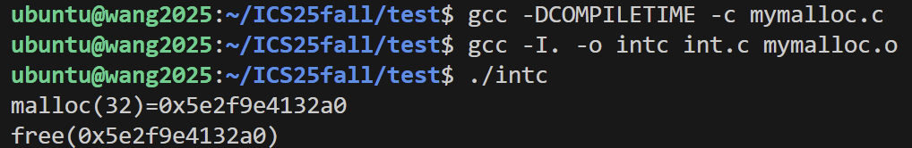{.w-150}
<br>

{.w-150}
<br>

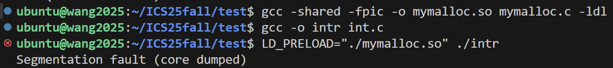{.w-150}

What happened?

---

# 运行结果
What happened?

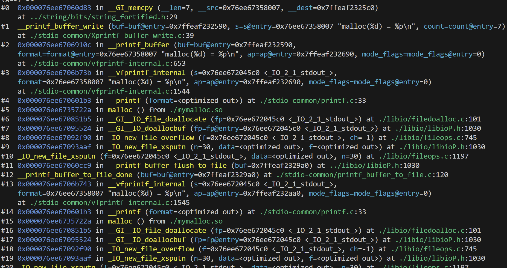{.w-150}

`printf`和`malloc`递归调用

---

# 运行结果
What happened?

简单的解决方法：把出问题的注释掉就好了。

或者改为
```c
char buf[128];
int len = sprintf(buf, "malloc called, size=%zu\n", size);
write(2, buf, len); 
```
<br>
重新编译动态库后运行

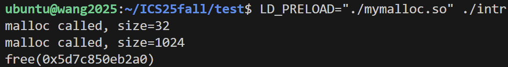{.w-150}

文件描述符2代表`stderr`，一次性分配足够大的空间，因此不会递归

---
layout: center
---

<div>
  <text class="text-17 font-bold gradient-text">Emphasis
</text>
</div>

<style>
  .gradient-text {
    background-image: linear-gradient(45deg, #4ec5d4 10%, #146b8c 20%);
    -webkit-background-clip: text;
    color: transparent;
  }
</style>


---

# 编译流程

{.w-110}

预处理器`cpp` $\rightarrow$ 编译器`ccl` $\rightarrow$ 汇编器`as`  $\rightarrow$ 链接`ld` $\rightarrow$ 加载器`loader`


---

# 文件符号

- **源文件（.c）**：包含人类可读的源代码。
- **预处理文件（.i）**：包含展开的宏和头文件内容（通过预处理生成）。
- **汇编文件（.s）**：C 文件编译后的汇编代码（通过编译生成）。
- **目标文件（.o）**：汇编文件或 C 文件编译后的机器代码，包含符号表和重定位信息。
- **静态库文件（.a）**：包含多个 `.o` 文件的归档文件，用于静态链接。
- **共享库文件（.so）**：动态链接库文件，程序运行时加载。
- **可执行文件**：最终的可执行程序，包含所有已解析的符号和重定位的代码。

**.c -> .o -> .a / .so -> 可执行文件** 是一个常见的编译-链接-执行的完整流程


---


# 目标文件-ELF


---


# 符号和符号表

- `.symtab`：一个符号表，它存放在程序中**定义**和**引用**的函数和全局变量的信息


---


# 伪节

- 伪节只存在于可重定位目标文件中，不存在于可执行目标文件中
- `ABS`：不该被重定位的符号
- `UNDEF`：未定义的符号（只有引用）
- `COMMON`：未初始化的全局变量（适配符号解析规则）
  - 初始化为 0 的全局变量与所有静态变量存放于 .bss 中
  - 在可执行目标文件中 COMMON 保存的数据会进入 .bss


---

# 示例


<div grid="~ cols-2 gap-2">

<div>

{.w-50}


</div>

<div>


</div>
</div>


---

# 可重定位目标文件

#### 文件类型

- **文件后缀**：通常以 `.o`（Unix/Linux）、`.obj`（Windows）为后缀。

- **生成方式**：通过编译源文件生成。例如：

  ```bash
  gcc -c example.c -o example.o
  ```

- **示例**：假设有文件 `example.c`，将其编译为 `example.o`，得到的就是一个可重定位目标文件。


可重定位目标文件包含以下内容：

- **代码段**：如 `.text` 段，包含编译生成的机器指令。
- **数据段**：如 `.data`（已初始化的全局变量）和 `.bss`（未初始化的全局变量）段。
- **符号表**：列出文件中的符号（函数、变量等）定义和引用。
- **重定位信息**：标识出需要在链接阶段调整的地址。


---

# 可执行目标文件

#### 文件类型

- **文件后缀**：在 Unix/Linux 系统上没有特定后缀，一般命名为 `a.out` 或直接以程序名称命名；在 Windows 系统上通常以 `.exe` 作为后缀。

- **生成方式**：通过链接器将多个 `.o` 文件组合并重定位生成。例如：

  ```bash
  gcc main.o example.o -o example_program
  ```

- **示例**：运行 `gcc main.o example.o -o example_program` 后生成的 `example_program` 就是一个可执行目标文件。

可执行目标文件包含以下内容：

- **代码段**：包含程序的指令，设置为可执行。
- **数据段**：包含程序的数据，已完成重定位。
- **程序入口**：指明程序开始执行的入口地址。
- **动态链接信息**（若为动态链接）：包含对共享库的依赖信息。


---


# 共享目标文件

#### 文件类型

- **文件后缀**：在 Unix/Linux 系统上以 `.so` 为后缀，在 Windows 系统上以 `.dll` 为后缀。

- **生成方式**：通过编译器或链接器指定生成共享库。例如：

  ```bash
  gcc -shared -fPIC example.c -o libexample.so
  ```

- **示例**：运行 `gcc -shared -fPIC example.c -o libexample.so` 后生成的 `libexample.so` 就是一个共享目标文件。

共享目标文件包含以下内容：

- **代码段**：包含共享库的代码，可以被多个程序加载并共享。
- **数据段**：包含共享库的全局数据。
- **动态段**：记录共享库的依赖和符号表，用于动态链接时符号解析。
- **全局偏移表（GOT）和过程链接表（PLT）**：用于延迟绑定的符号解析机制。

---

{.w-190}


---

# 流程梳理


<div grid="~ cols-2 gap-2">

<div>

- **静态链接**
  - 符号解析
    - 符号定义
    - 解析规则：强、弱、未定义
    - 解析方法：E、U、D
  - **重定位**
    - 重定位条目（Relocation Entry）
    - 重定位类型（PC-relative、absolute）
    - 重定位算法（Relocation Algorithm）

</div>

<div>


- 注意： .o 与 .a 的不同
  - **.o 在链接算法中会直接重定位加入汇编而 .a 只会加入其被引用的符号**


</div>
</div>


---

# 流程梳理

<div grid="~ cols-2 gap-2">

<div>

- **动态链接**
  - dynamic linker：
    - (1) 将动态库加载到虚拟内存空间中; 
    - (2) 对可执行文件中的 reference 进行重定位（修改 .text 和 .data）
  - **PIC**：（编译）将源文件编译为位置无关代码，加载到不同进程的不同地址时依然能够正确执行
    - **GOT**：（链接）为每个全局变量和外部函数保留一个条目，并在运行时将实际地址填入
    - **PLT**：（加载）对于动态库中的函数调用，PLT 会保存函数的入口地址


</div>

<div>


{.w-70}

1. **加载可执行文件和共享库**，并启动动态链接器。
2. **解析依赖关系**，加载所有依赖的共享库。
3. **准备 GOT 和 PLT** 表，确保符号可以被动态解析。
4. **符号解析和重定位**，在初次加载时完成大部分符号的解析。
5. **延迟绑定**，当第一次调用共享库的函数时，动态链接器解析符号并绑定。
6. **完成初始化并跳转到入口点**，程序开始正常执行。


</div>
</div>


---


# 位置无关代码（PIC）


---

# GOT


---

# PLT


---
layout: center
---

<div>
  <text class="text-17 font-bold gradient-text">Homework Review</text>
</div>

<style>
  .gradient-text {
    background-image: linear-gradient(45deg, #4ec5d4 10%, #146b8c 20%);
    -webkit-background-clip: text;
    color: transparent;
  }
</style>

---

# 5.13-1

<div grid="~ cols-2 gap-2">
<div>

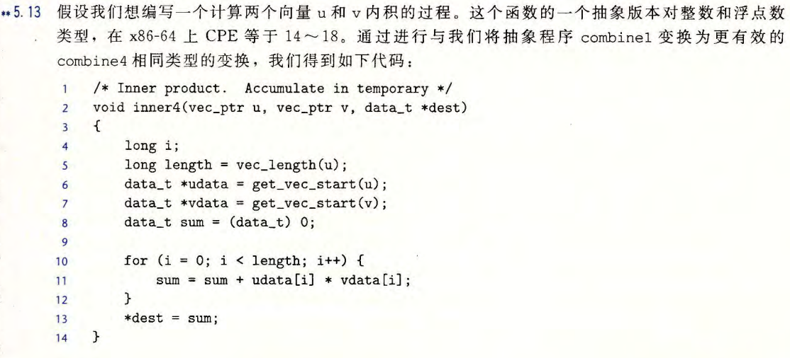{.w-120}
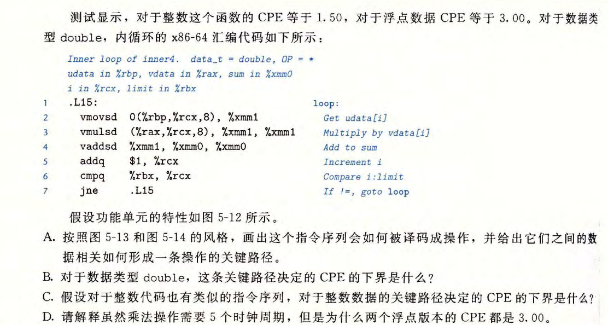{.w-120}
</div>
<div>
<v-clicks>
A.

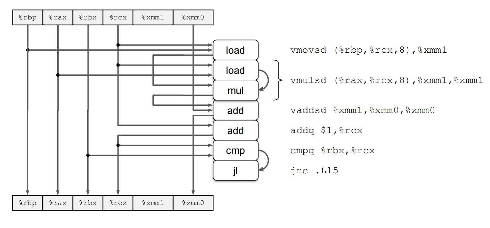{.w-120}
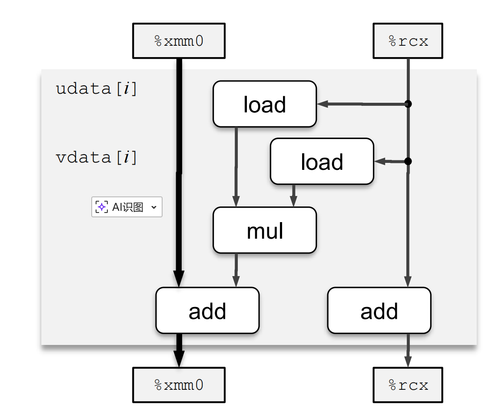{.w-60}
</v-clicks>
</div>
</div>

---

# 5.13-2

- B. 浮点数加法，3.0
- C. 整数加法，1.0
- D. 关键路径是`%xmm0`中的浮点加法，乘法可以并行地进行。

---

# 5.14

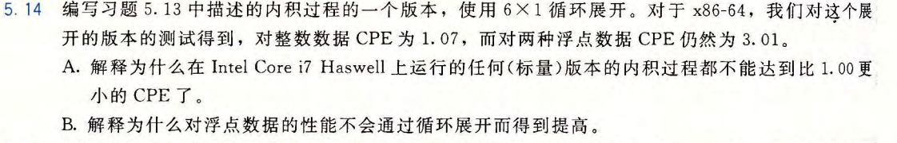{.w-150}

```c
int limit = length - 5;
for(i=0 ; i<limit ; i+=6)
{
  sum += udata[i]*vdata[i] + udata[i+1]*vdata[i+1] + udata[i+2]*vdata[i+2]
       + udata[i+3]*vdata[i+3] + udata[i+4]*vdata[i+4] + udata[i+5]*vdata[i+5];
}
for(;i<length;i++)
{
  sum += udata[i]*vdata[i];
}
*dest = sum;

```

- A.每个元素都需要加载操作，而处理器只有两个加载单元，一周期最多进行两次加载。
- B.关键路径仍为n个浮点加法，只能顺序执行。

---

# 5.15

{.w-150}

```c
int limit = length - 5;
data_t sum0=0,sum1=0,sum2=0,sum3=0,sum4=0,sum5=0;
for(i=0 ; i<limit ; i+=6)
{
  sum0 += udata[i]*vdata[i]; sum1 += udata[i+1]*vdata[i+1]; sum2 += udata[i+2]*vdata[i+2];
  sum3 += udata[i+3]*vdata[i+3]; sum4 += udata[i+4]*vdata[i+4]; sum5 += udata[i+5]*vdata[i+5];
}
for(;i<length;i++)
{
  sum0 += udata[i]*vdata[i];
}
*dest = sum0 + sum1 + sum2 + sum3 + sum4 + sum5;

```

- 1.0 是吞吐量界限，k >= C*L满足，因此下限就是1.0。
- 但仍然有循环开销等。

---

# 5.16

{.w-150}

```c
int limit = length - 5;
for(i=0 ; i<limit ; i+=6)
{
  sum = sum + ( (udata[i]*vdata[i] + udata[i+1]*vdata[i+1]) + 
              (udata[i+2]*vdata[i+2] + udata[i+3]*vdata[i+3]) + 
              (udata[i+4]*vdata[i+4] + udata[i+5]*vdata[i+5]) );
}
for(;i<length;i++)
{
  sum += udata[i]*vdata[i];
}
*dest = sum;

```

---

# 7.6

<div grid="~ cols-2 gap-2">
<div>

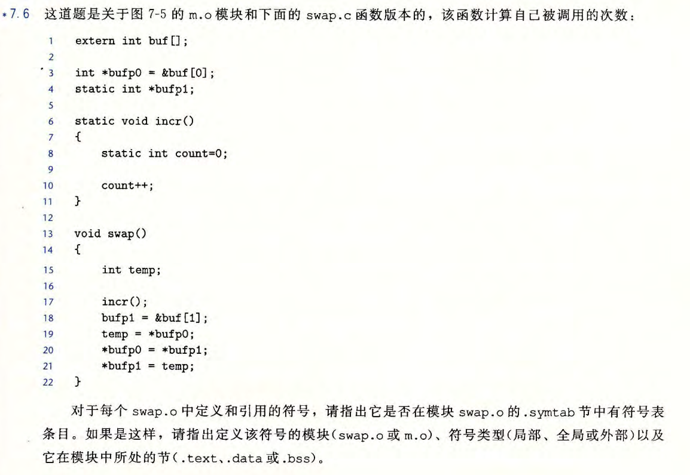{.w-120}

</div>
<div>

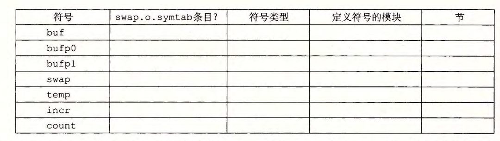{.w-120}
<v-clicks>

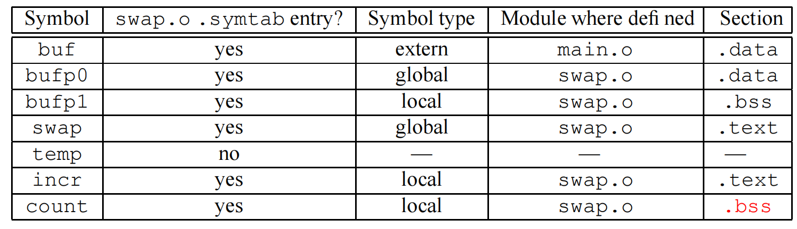{.w-120}
</v-clicks>
</div>
</div>

---

# 7.8

<div grid="~ cols-2 gap-2">
<div>

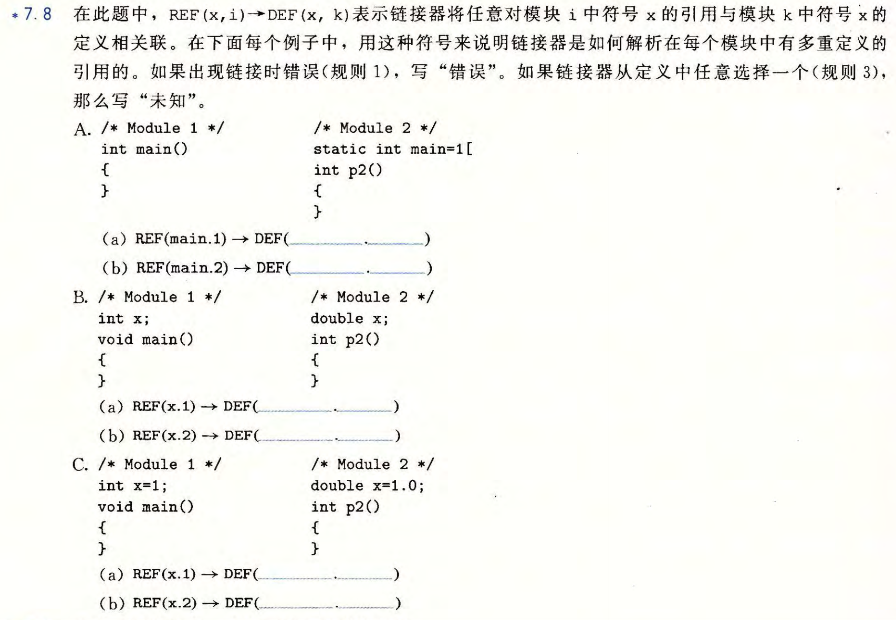{.w-120}

</div>
<div>

<v-clicks>

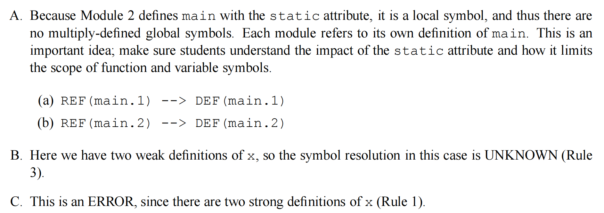{.w-120}
</v-clicks>
</div>
</div>

---

# 7.16


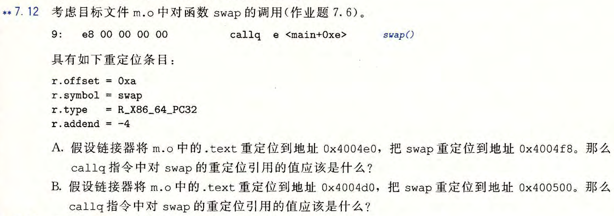{.w-180}

<v-clicks>

- A: `0x4004f8 - 0x4004e0 - 0xa - 4 = 0xa`
- B: `0x400500 - 0x4004d0 - 0xa - 4 = 0x22`
</v-clicks>


---
layout: center
---

<div>
  <text class="text-17 font-bold gradient-text">Exercises</text>
</div>

<style>
  .gradient-text {
    background-image: linear-gradient(45deg, #4ec5d4 10%, #146b8c 20%);
    -webkit-background-clip: text;
    color: transparent;
  }
</style>

---

# E1

<div grid="~ cols-2 gap-2">
<div>

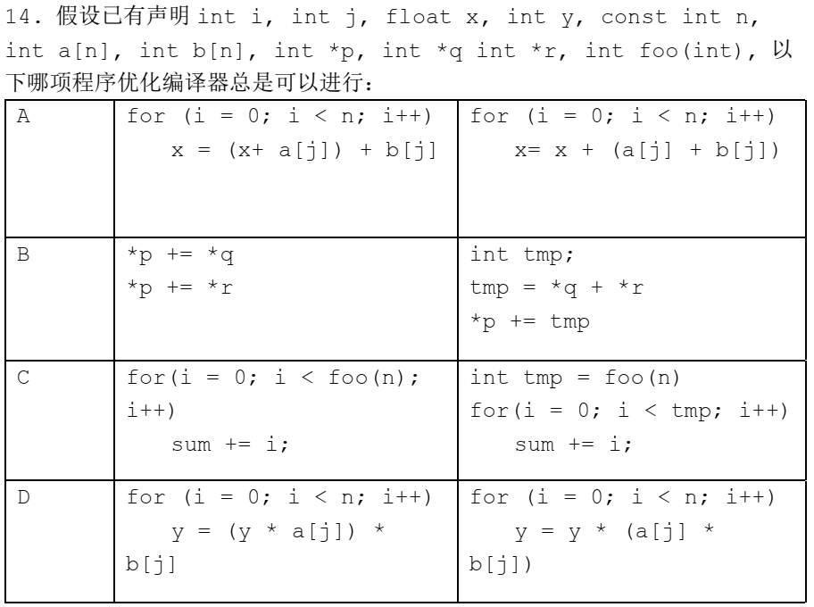{.w-120}
</div>
<div>

<v-clicks>


答案：D

</v-clicks>
</div>
</div>

---

# E2

<div grid="~ cols-2 gap-2">
<div>

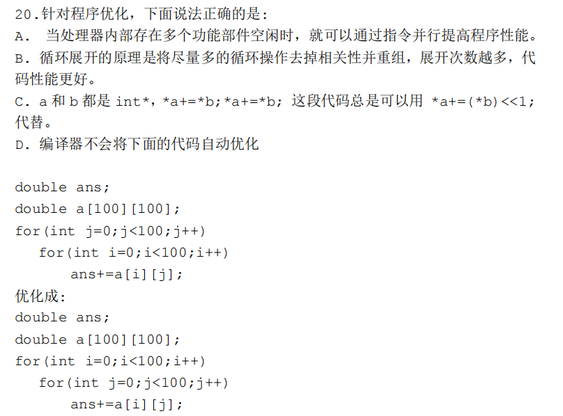{.w-120}

</div>
<div>
<v-clicks>


{.w-120}

</v-clicks>
</div>
</div>
---


# E3

<div grid="~ cols-2 gap-2">
<div>

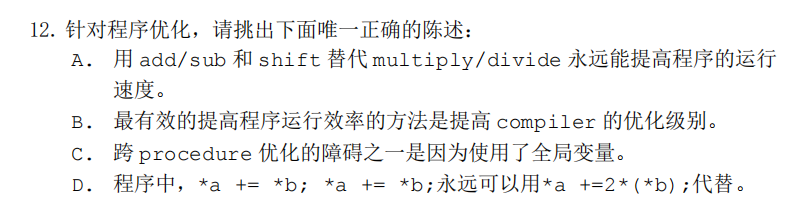{.w-120}

</div>
<div>
<v-clicks>


{.w-120}

</v-clicks>
</div>
</div>
---

# E4-1


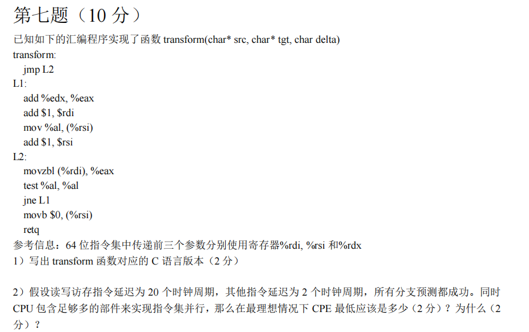{.w-150}

---

# E4-2


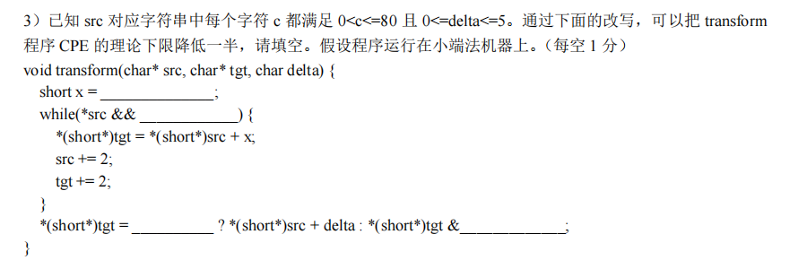{.w-150}
<v-clicks>


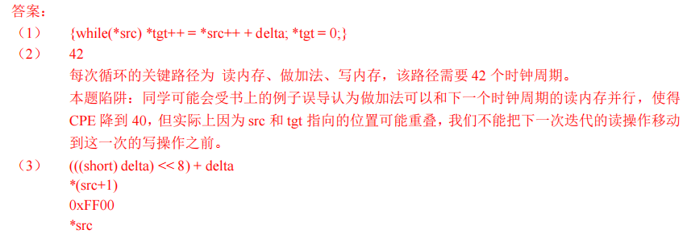{.w-120}

</v-clicks>

---

# E5


---

# E5


---

# E6

{.w-180}

---

# E6


---

# E7


<!--  -->

---

# E7


---

# E8

{.w-180}

<!-- {.w-160} -->


---

# E8

{.w-180}

{.w-160}

---

# E9

{.w-180}

---

# E9

{.w-180}

{.w-160}


---

# E10

{.w-120}


---

# E10


---

# E11

{.w-140}

---

# E11

{.w-180}
---

# E12


<!--  -->

---

# E12


---

# E13

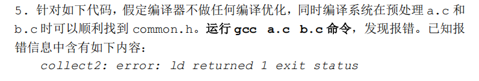{.w-120}

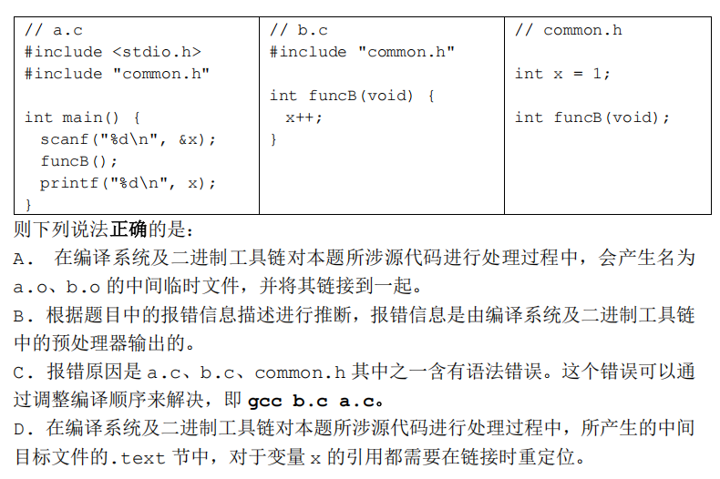{.w-120}

---

# E13


---

# E14

<div grid="~ cols-2 gap-2">
<div>

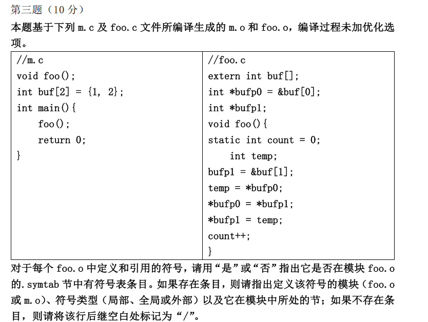{.w-120}

</div>
<div>

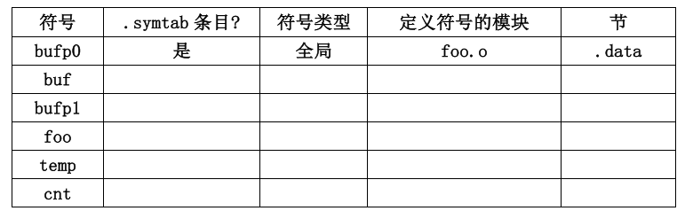{.w-120}

<v-clicks>


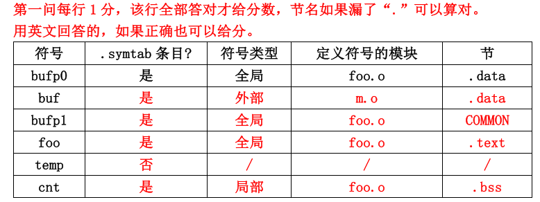{.w-120}

</v-clicks>
</div>
</div>

---


<div grid="~ cols-2 gap-2">
<div>

{.w-100}
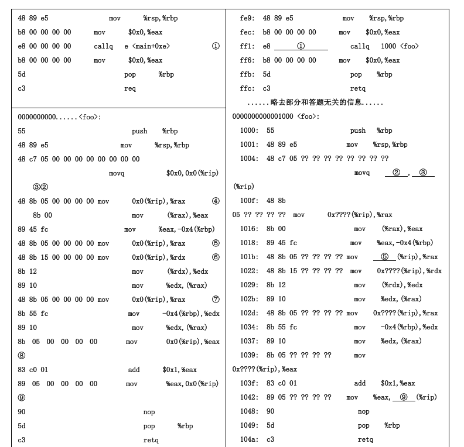{.w-110}

</div>
<div>

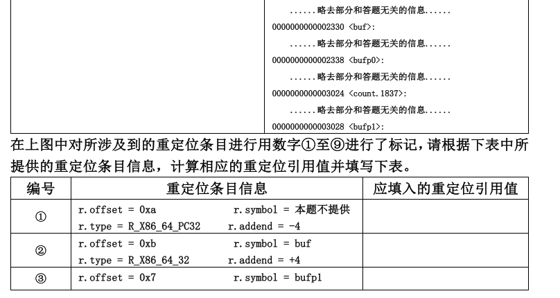{.w-120}
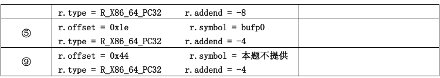{.w-120}

<v-clicks>


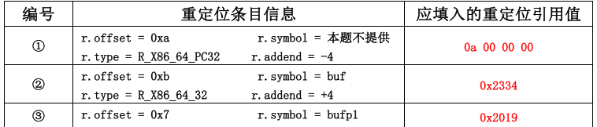{.w-120}
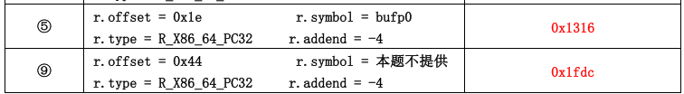{.w-120}

</v-clicks>
</div>
</div>

---
layout: center
---

<div>
  <text class="text-17 font-bold gradient-text">Notices</text>
</div>

<style>
  .gradient-text {
    background-image: linear-gradient(45deg, #4ec5d4 10%, #146b8c 20%);
    -webkit-background-clip: text;
    color: transparent;
  }
</style>

---

# 考试与Lab
Test & Lab

- 第二次阶段性测试：记得自己的小班号（**17**）
- 时间不够的时候**抓重点**。链接这里有些地方搞不懂的就算了(x)
- ECF 小班课件：~~周末前~~已经发出,供参考。
- 研讨题暂定不安排同学，作业仍是周二晚前ddl，但建议大家考前做完。
- 周日前放出研讨题解析和作业答案（如果陆老师能早点发题的话）。
- Arch Lab：Part C 解法
- Cache Lab: **变量数要求 and 注释**。
- Shell Lab：明日（Nov 13）放出。

---

# CacheLab
Style

去年(2024fall)标准，**仅供参考**。
<br/><br/>

****************************************
Style deductions (saturate at -7 points)
****************************************
* Missing or non-descriptive program header comment: -2 pts
* Missing or non-descriptive function header comments: -1 pt each,
  saturate at -2 pts
* Inconsistent indentation: -2 pts
* Lines greatly exceeding 80 chars (egregious only): -1 pt each, saturate at -2 pts
* Poor error checking: -1
* Any other egregious readability issue(s): -2 pts

---
layout: center
---

<div flex="~ gap-20"  mt-2 justify-center items-center>

<div  w-fit h-fit mb-2>

# THANKS

Made by WEB-05

webrun@stu.pku.edu.cn

<p class="text-gray-40">
  <font size = '3'>
    Reference: [WalkerCH]'s and [Arthals]'s presentations.<br>
  </font>
</p>


</div>

{.w-50.rounded-md}

</div>
