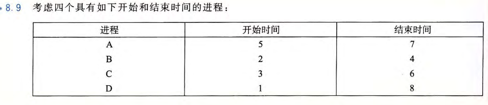
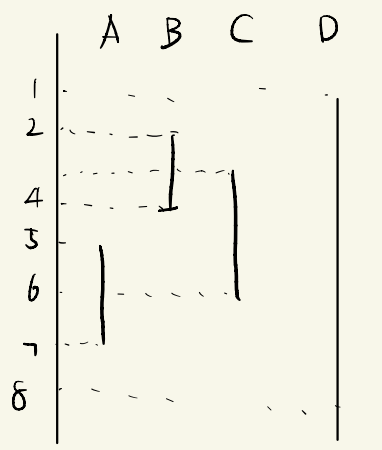
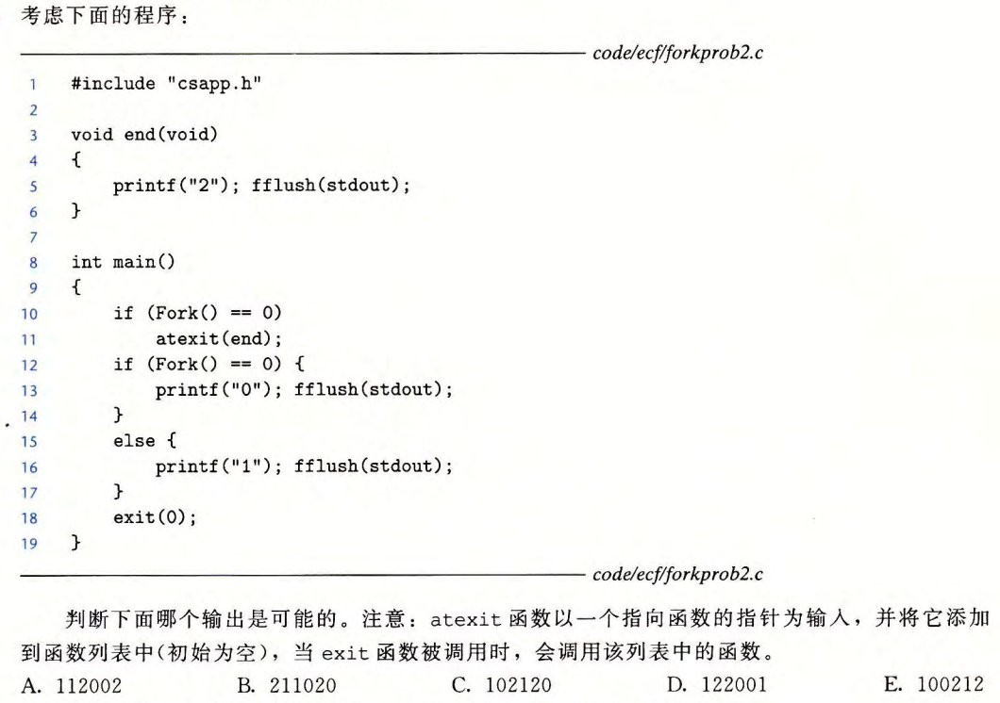
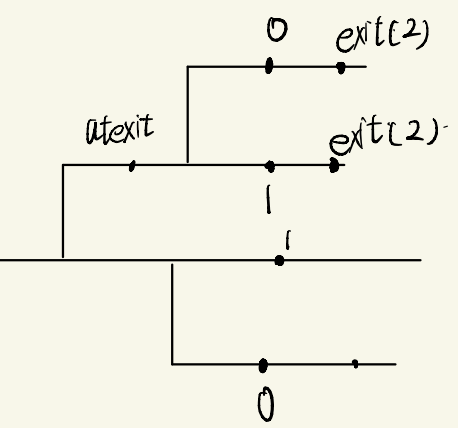
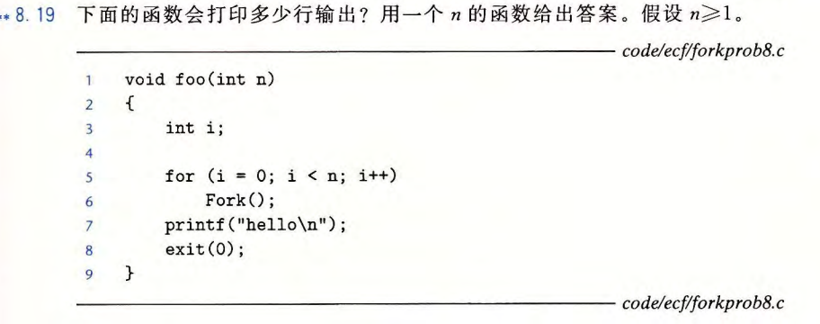

---
# You can also start simply with 'default'
theme: academic
# random image from a curated Unsplash collection by Anthony
# like them? see https://unsplash.com/collections/94734566/slidev
# background: https://cover.sli.dev
highlighter: shiki
# some information about your slides (markdown enabled)
title: 11-ECF-hw
info: |
  ICS 2025 Fall Slides
titleTemplate: '%s'
# apply unocss classes to the current slide
class: text-center
# https://sli.dev/features/drawing
drawings:
  persist: false
# slide transition: https://sli.dev/guide/animations.html#slide-transitions
transition: fade-out
# enable MDC Syntax: https://sli.dev/features/mdc
mdc: true
layout: cover
coverBackgroundUrl: /res/image/cover/cover_11.jpg

---

# ECF-HW {.font-bold}

  元培数科 王恩博

  
    Let's get started <carbon:arrow-right class="inline"/>
  

  <button @click="$slidev.nav.openInEditor()" title="Open in Editor" class="text-xl slidev-icon-btn opacity-50 !border-none !hover:text-white">
    <carbon:edit />
  </button>
  <a href="https://github.com/WEB-05/WEB-ICS-TA-Slides2025
  " target="_blank" alt="GitHub" title="Open in GitHub"
    class="text-xl slidev-icon-btn opacity-50 !border-none !hover:text-white">
    <carbon-logo-github />
  </a>

---
layout: center
---

  <text class="text-17 font-bold gradient-text">Homework Review</text>

---

# HW1

{.w-130}

| 进程对    | 是否并发 | 
| -------- | ------- | 
| AB     | 否    | 
| AC     | 是    | 
| AD     | 是    | 
| BC     | 是    | 
| BD     | 是    | 
| CD     | 是    | 

{.w-60}

---

# HW2

{.w-100}

{.w-60}

- 排序要求：第一个2前面至少有一个0或1，第二个2前面要至少既有一个0又有一个1。
- 答案：ACE

---

# HW3

{.w-150}

- 每次循环进程翻一番，执行完循环后打印出的行数就是$2^n$
- 注意上面假设每次当前所有进程都一起执行循环，循环执行完一起打印是为了方便分析的假设，实际上顺序是乱的，但不影响个数。