---
# You can also start simply with 'default'
theme: academic
# random image from a curated Unsplash collection by Anthony
# like them? see https://unsplash.com/collections/94734566/slidev
# background: https://cover.sli.dev
highlighter: shiki
# some information about your slides (markdown enabled)
title: W14-Dynamic Memory Allocation
info: |
  ICS 2025 Fall Slides
titleTemplate: '%s'
# apply unocss classes to the current slide
class: text-center
# https://sli.dev/features/drawing
drawings:
  persist: false
# slide transition: https://sli.dev/guide/animations.html#slide-transitions
transition: fade-out
# enable MDC Syntax: https://sli.dev/features/mdc
mdc: true
layout: cover
coverBackgroundUrl: /newres/image/W14/cover.jpg

---

# Dynamic Memory Allocation {.font-bold}

<p class="text-gray-100">
<font size = '5'>
  元培数科 王恩博
</font>
</p>

<div class="pt-12  text-gray-1">
  <span @click="$slidev.nav.next" class="px-2 py-1 rounded cursor-pointer" hover="bg-white bg-opacity-10">
    Let's get started <carbon:arrow-right class="inline"/>
  </span>
</div>


<div class="abs-br m-6 flex gap-2">
  <button @click="$slidev.nav.openInEditor()" title="Open in Editor" class="text-xl slidev-icon-btn opacity-50 !border-none !hover:text-white">
    <carbon:edit />
  </button>
  <a href="https://github.com/WEB-05/WEB-ICS-TA-Slides2025
  " target="_blank" alt="GitHub" title="Open in GitHub"
    class="text-xl slidev-icon-btn opacity-50 !border-none !hover:text-white">
    <carbon-logo-github />
  </a>
</div>

<style>
  div{
   @apply text-gray-2;
  }
</style>

---
layout: center
---

<div style="text-align: center;">
  <text class="text-17 font-bold gradient-text">Knowledge Review</text>
</div>

<style>
  .gradient-text {
    background-image: linear-gradient(45deg, #4ec5d4 10%, #146b8c 20%);
    -webkit-background-clip: text;
    color: transparent;
  }
</style>

---

# 基本概念

<div grid="~ cols-2 gap-8">
<div>

- `brk`指针指向堆顶
- 显示分配器：显示释放已分配的块
- 隐式分配器（垃圾收集器）：自动检测块不再被使用，进而自动释放
- `void *malloc(size_t size);`分配一个块，并且（8/16）对齐
- `calloc`分配块并且初始化为0
- `void *sbrk(intptr_t incr);`扩展或者**收缩**堆，成功返回`brk`旧值，出错返回-1。
- `void free(void *ptr);`不返回内容。如果ptr不是malloc/calloc/realloc分配块的起始位置，**行为未定义**。

</div>

<div>

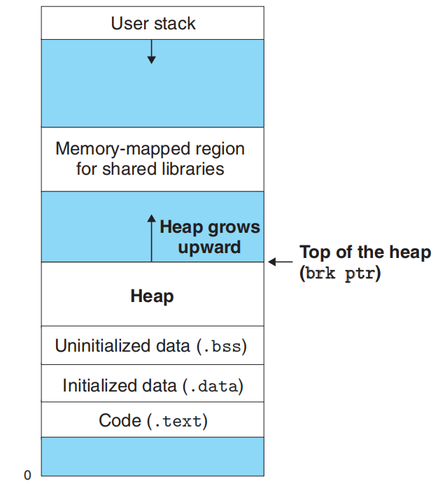{.w80}
</div>
</div>

---

# malloc 与 free 示例

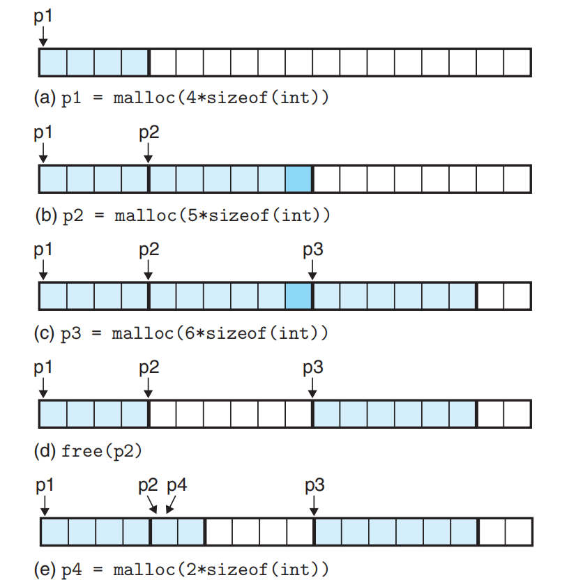{.w100}

---

# 为什么动态分配

- 例：做OJ题时候数组开多大？
- 浪费 or 不够用
- 不可预知/不同次差距极大

---

# 分配器要求和目标

- 处理任意请求序列
- 立即响应请求
- 只使用堆
- 对齐要求
- 不修改已分配的块

评价指标：
- 吞吐率：最差分配时间O(n),释放时间O(1)（n为空闲块数量）
- 内存利用率
- **峰值利用率**：<div>$U_k = \frac{\max_{i \leq k} P_i}{H_k}$ $P_k$为有效载荷之和，$H_k$为堆大小（单调递增）
<br/>使得$U_{n-1}$最大化</div>

寻找吞吐率和利用率的平衡。

---

# 碎片

- 内部碎片：为了**满足最小大小**/对齐带来的碎片
- 外部碎片：所有空闲块加在一起够，但单个空闲块不够（直观理解：空闲块被分碎了）

为什么会设置最小块大小？
- 可能增加了内部碎片，但会减少外部碎片的可能，不把空闲块分的太碎

---

# 实现

- 组织：如何记录空闲块？<br/>
隐式空闲链表、显式空闲链表、分离空闲链表
- 放置：选哪个空闲块？<br/>
首次适配、下一次适配、最佳适配
- 分割：拿走需要的剩下的怎么办？<br/>
整个使用、分割
- 合并：怎么处理释放的块？<br/>
立即合并、推迟合并

---

# 隐式空闲链表
Implicit Free Lists

<div grid="~ cols-2 gap-8" >
<div>

- size都包括什么？
- 因为大小8字节对齐，头部最后三位不需要，可用作标记
- padding 用于对齐/分配器的feature，可用于消除外部碎片
- 分配块的时候需要从头搜索

</div>

<div>

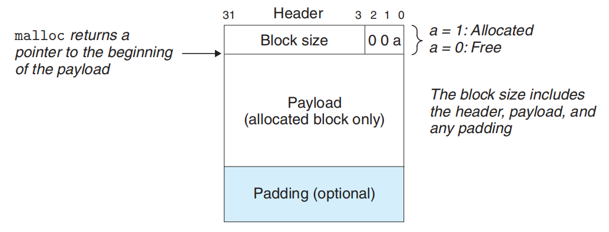{.w150}
</div>
</div>

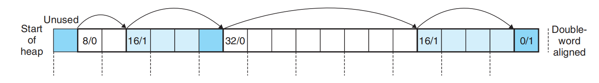{.w190}

---

# 放置与分割

- 首次适配：从头开始搜索
- 下一次适配：从上一次查询结束位置开始搜索
- 最佳适配：满足条件的最小的

- **内存利用率（平均）：最佳适配 > 首次适配 > 下一次适配**
- 找不到怎么办？合并空闲块/请求更多堆空间
<br/><br/>
- 不分割整个使用：内部碎片
- 分割：可能导致外部碎片
- 放置策略与分割策略需要匹配权衡。**这需要你自己衡量**

---

# 合并空闲块

- 假碎片：相邻的小空闲块
- 立即合并：释放的时候就合并
- 推迟合并：稍晚的时候（设定时间间隔/一直等到某次分配找不到符合的空闲块）再合并

---

# 带边界标记的合并

<div grid="~ cols-2 gap-8" >
<div>

- 关键问题：怎么找到前面的空闲块？
- 单向链表只能从头搜索，不是 O(1)
- 解决：增加一个脚部
- 新问题：浪费空间
- 只有空闲块需要脚部，已分配的块不需要
- 怎么判断前面的块空不空闲？
- 把这个状态也放到当前块头部低三位中

</div>

<div>

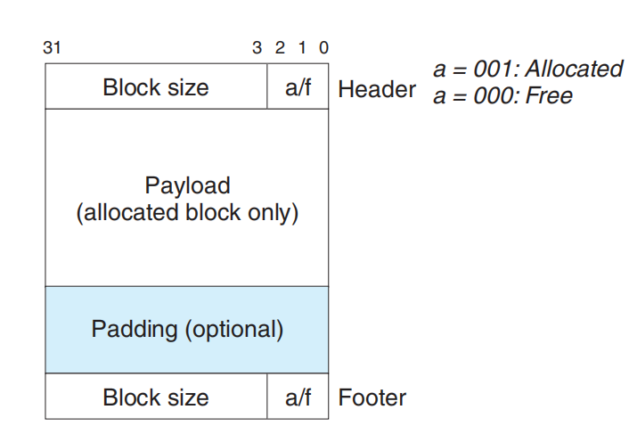{.w150}
</div>
</div>

---

# 带边界标记实现实例

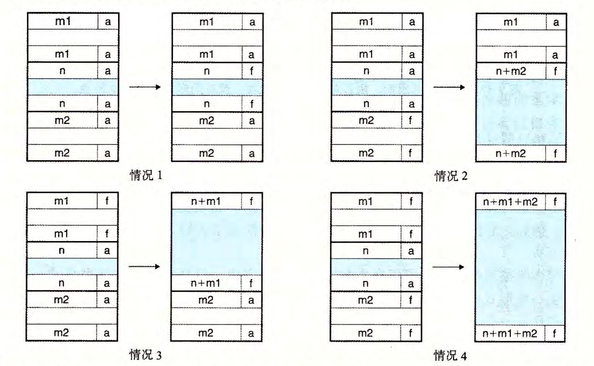{.w150}

---

# 隐式空闲链表的固定格式

- 序言块：8字节已分配块
- 结尾块：大小为0的已分配块

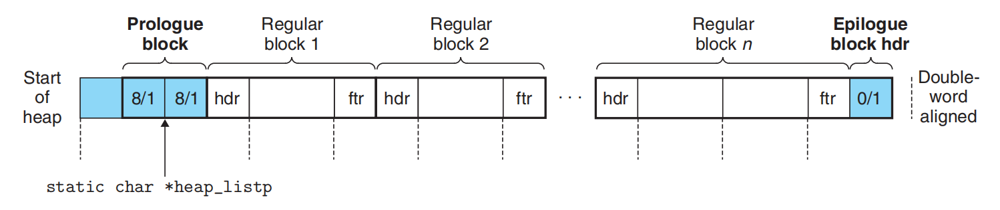{.w180}

---

# 代码实现

- 可参考大班课件或教材，做了lab应该会深刻理解
- 主要的新知识是理解宏定义
```c
#define WSIZE       4       /* Word and header/footer size (bytes) */ //line:vm:mm:beginconst
#define DSIZE       8       /* Double word size (bytes) */
#define CHUNKSIZE  (1<<12)  /* Extend heap by this amount (bytes) */  //line:vm:mm:endconst 

#define MAX(x, y) ((x) > (y)? (x) : (y))  
/* Pack a size and allocated bit into a word */
#define PACK(size, alloc)  ((size) | (alloc)) //line:vm:mm:pack
/* Read and write a word at address p */
#define GET(p)       (*(unsigned int *)(p))            //line:vm:mm:get
#define PUT(p, val)  (*(unsigned int *)(p) = (val))    //line:vm:mm:put
/* Read the size and allocated fields from address p */
#define GET_SIZE(p)  (GET(p) & ~0x7)                   //line:vm:mm:getsize
#define GET_ALLOC(p) (GET(p) & 0x1)                    //line:vm:mm:getalloc
/* Given block ptr bp, compute address of its header and footer */
#define HDRP(bp)       ((char *)(bp) - WSIZE)                      //line:vm:mm:hdrp
#define FTRP(bp)       ((char *)(bp) + GET_SIZE(HDRP(bp)) - DSIZE) //line:vm:mm:ftrp
/* Given block ptr bp, compute address of next and previous blocks */
#define NEXT_BLKP(bp)  ((char *)(bp) + GET_SIZE(((char *)(bp) - WSIZE))) //line:vm:mm:nextblkp
#define PREV_BLKP(bp)  ((char *)(bp) - GET_SIZE(((char *)(bp) - DSIZE))) //line:vm:mm:prevblkp
```

---

# 显式空闲链表
Explicit Free Lists

<div grid="~ cols-2 gap-8" >
<div>

- 减少放置时间：O(n)，n从所有块数目减少到空闲块数目
- 释放时间取决于链表组织方式
- 释放的放到链表最前面(LIFO)：释放时间O(1)
- 按地址排序：释放时间O(n),取决于前驱数目，不过可以提高在首次适配情况下的内存利用率
- 问题：提高了最小块大小（得放得下两个指针+首部+脚部），内部碎片加剧

</div>

<div>

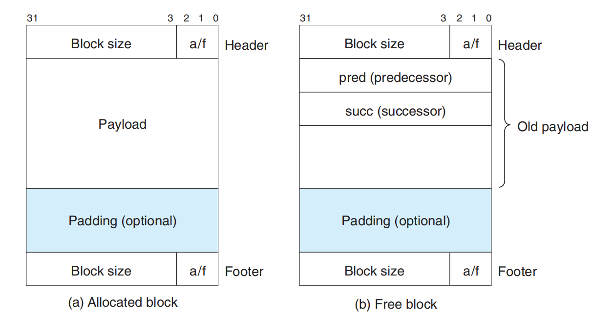{.w120}

</div>
</div>

---

# 分离的空闲链表
Segregated Free Lists

- 思想：分离存储，按块大小分为等价类（大小类）
- 每个大小类一个空闲链表
- 减少放置时间：在相应的空闲链表中搜索，找不到的时候去**更大的**大小类的链表中搜索

---

# 简单分离存储
Simple Segregated Storage

- 每个大小类只包括大小相同的块（取最大值）
- 不分割、不合并
- 分配和释放时候速度很快
- 不需要头部、脚部，只需要单向链表，最小块只需一个字
- 容易造成内部碎片和外部碎片
- 例：先对第一个大小类做大量分配和释放，然后对第二个大小类做大量分配和释放，以此类推……
- 因为前面释放的小块不会合并，会造成大量外部碎片

---

# 分离适配
Segregated Fits

- 对相应的空闲链表**首次适配**
- 可以做分割，将剩余的插入到**适当的空闲链表**中
- 新请求的堆空间也进行分割，将剩余部分插入适当空闲链表
- 释放的时候进行合并
- 对分离空闲链表的首次适配近似于对整个堆的最佳适配</br>
- **伙伴系统**（Buddy Systems）：分离适配的特例
- 每个块大小是2的幂，主要方便合并
- 合并时：为保证合并后大小还是2的幂，跟块 A 合并的找A的伙伴，只有一位地址不同
- 例：A地址为xxx10000，大小为32字节，其伙伴是xxx00000
- S -> A|B -> C|D|E|F
- 释放了D 和E 此时不会合并

---

# 垃圾收集
Garbage Collection

- 垃圾：程序不再需要的已分配块
- 根节点：不在堆中的位置，包含指向堆中的指针。**寄存器、栈中变量、全局变量**
- 可达性：有从根节点出发到达p的路径
- C 中无法判断一个变量是不是指针，因此使用**保守的垃圾收集器**
- 可以在无法分配的时候进行垃圾收集

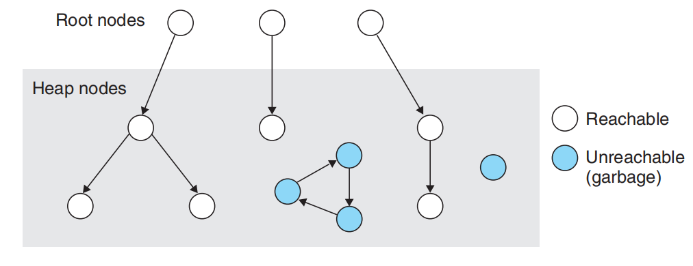{.w150}

---

# Mark&Sweep 垃圾收集器

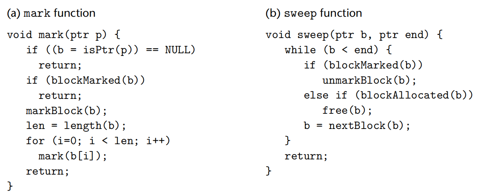{.w150}

<div grid="~ cols-2 gap-8" >
<div>

- C 中无法判断一个变量是不是指针，只能全当指针
- 无法判断位置是否指向一个已分配块的有效载荷
- 利用平衡二叉树，进行二分查找

</div>

<div>

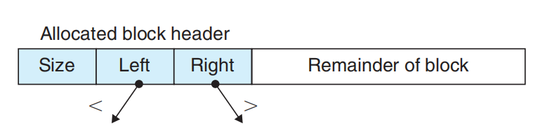{.w100}

</div>
</div>

---

# 补充

其他的垃圾清扫方法

<div grid="~ cols-2 gap-8" >
<div>

引用计数

- 对象分配/参数传递：引用计数设为1
- 引用赋值：u=v：u指向的对象引用减1、v指向的对象引用加1
- 过程返回：局部变量指向对象的引用计数减1
- 如果一个对象的引用计数为0, 在删除对象之前, 此对象中各个指针所指对象的引用计数减1

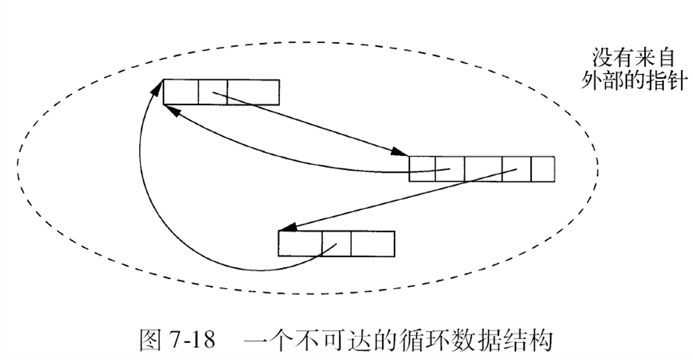{.w70}

</div>

<div>

标记压缩

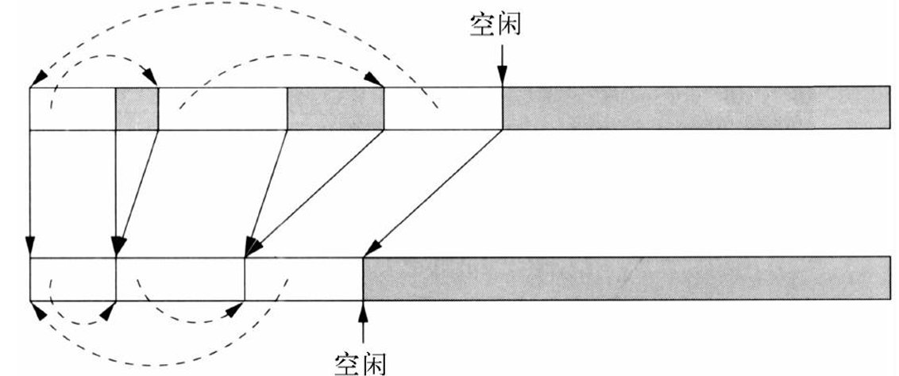{.w90}

复制回收<br/>分代回收<br/>……<br/>

实际应用：多种相结合

</div>
</div>


---

# 与内存有关的错误
Common Memory-Related Bugs in C Programs

- 间接引用坏指针（`scanf("%d",val)`）
- 读未初始化内存
- 允许栈缓冲区溢出（attacklab）
- 假设指针和它们指向的对象是相同大小的
- 造成错位错误（数组越界）
- **引用指针，而不是它所指向的对象**（`*size--`改变了指针的值）
- 误解指针运算（指针加 1 不一定是一字节）
- 引用不存在的变量（栈中局部变量返回之后就不能通过地址引用了）
- 引用空闲堆块中的数据（已经 free）
- 引起内存泄漏


---
layout: center
---

<div>
  <text class="text-17 font-bold gradient-text">Homework Review</text>
</div>

<style>
  .gradient-text {
    background-image: linear-gradient(45deg, #4ec5d4 10%, #146b8c 20%);
    -webkit-background-clip: text;
    color: transparent;
  }
</style>

---

# 9.15

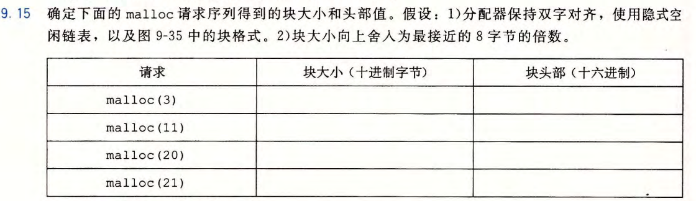{.w-150}

| 块大小 | 块头部 |
|---|---|
| 8 (1000)| (1001) 0x9|
|16 (10000) |(10001) 0x11|
| 24 (11000) |(11001) 0x19|
| 32 (100000)|(100001) 0x21|

---

# 9.16

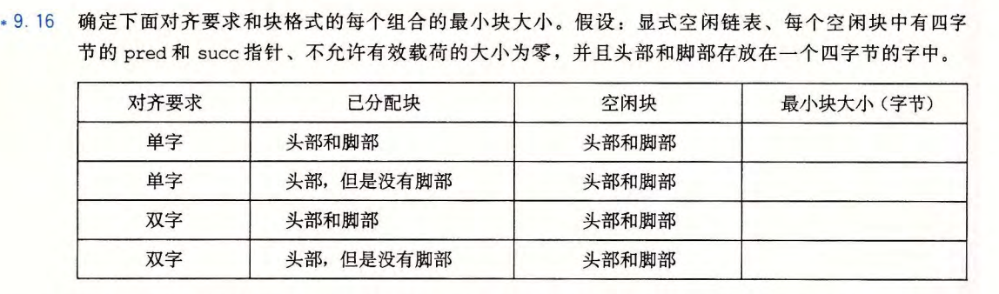{.w-150}

| 已分配块最小大小 | 空闲块最小大小 | 块最小大小|
|---|---|---|
| 4+4+1 = 9 -> 12| 4+2*4+4 = 16 | 16 |
| 4+1 = 5 -> 8 | 4+2*4+4 = 16 | 16 |
| 4+4+1 = 9 -> 16 | 4+2*4+4 = 16 | 16 |
| 4+1 = 5 -> 8 | 4+2*4+4 = 16 | 16 |

---

# 9.19 - 1

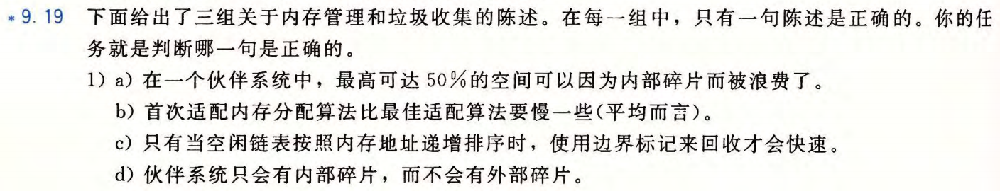{.w-150}

- 答案：a <br/><div>a: $\lim_{n \to \infty} \frac{2^{n-1} - 1}{2^n} = \frac{1}{2}$</div>
b:首次适配平均更快<br/>
c:与空闲链表排序方式无关，目的方便找到内存中相邻块，空闲链表排序方式主要影响分配<br/>
d:前面有举例<br/>
- S -> A|B -> C|D|E|F
- 释放了D 和E 此时不会合并

---

# 9.19 - 2

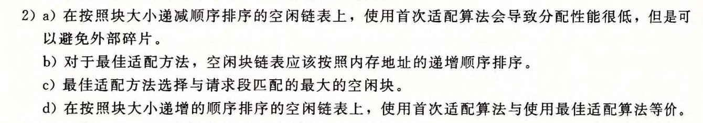{.w-150}

- 答案：d <br/>
a: 每次都会切割最大的块，会造成外部碎片<br/>
b、c:可以按照大小递增排序（不必须），找到最小的满足要求的块<br/>
d:首次适配找到的也是最小的大于等于要求的块<br/>

---

# 9.19 - 3

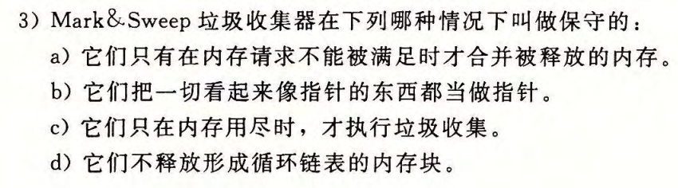{.w-150}

- 答案：b


---
layout: center
---

<div>
  <text class="text-17 font-bold gradient-text">Exercises</text>
</div>

<style>
  .gradient-text {
    background-image: linear-gradient(45deg, #4ec5d4 10%, #146b8c 20%);
    -webkit-background-clip: text;
    color: transparent;
  }
</style>


---

# E1


<!--  -->

---

# E1


---

# E2

{.w-105}

<!-- {.w-50} -->

---

# E2

{.w-105}

{.w-50}

---

# E11

<div grid="~ cols-2 gap-2">

<div>

{.w-70}

</div>

<div>

{.w-70}

</div>
</div>

---

# E11

<div grid="~ cols-2 gap-2">

<div>


</div>

<div>


</div>
</div>

---
layout: center
---

<div>
  <text class="text-17 font-bold gradient-text">Notices</text>
</div>

<style>
  .gradient-text {
    background-image: linear-gradient(45deg, #4ec5d4 10%, #146b8c 20%);
    -webkit-background-clip: text;
    color: transparent;
  }
</style>

---
layout: center
---

<div>
  <text class="text-17 font-bold gradient-text">Lab 测验</text>
</div>

<style>
  .gradient-text {
    background-image: linear-gradient(45deg, #4ec5d4 10%, #146b8c 20%);
    -webkit-background-clip: text;
    color: transparent;
  }
</style>


---
layout: center
---

<div flex="~ gap-20"  mt-2 justify-center items-center>

<div  w-fit h-fit mb-2>

# THANKS

Made by WEB-05

webrun@stu.pku.edu.cn

<p class="text-gray-40">
  <font size = '3'>
    Reference: [Arthals]'s template.<br>
  </font>
</p>


</div>

{.w-50.rounded-md}

</div>
