---
# You can also start simply with 'default'
theme: academic
# random image from a curated Unsplash collection by Anthony
# like them? see https://unsplash.com/collections/94734566/slidev
# background: https://cover.sli.dev
highlighter: shiki
# some information about your slides (markdown enabled)
title: W15-Network Programming
info: |
  ICS 2025 Fall Slides
titleTemplate: '%s'
# apply unocss classes to the current slide
class: text-center
# https://sli.dev/features/drawing
drawings:
  persist: false
# slide transition: https://sli.dev/guide/animations.html#slide-transitions
transition: fade-out
# enable MDC Syntax: https://sli.dev/features/mdc
mdc: true
layout: cover
coverBackgroundUrl: /res/image/cover/cover_14.jpg

---

# Network Programming {.font-bold}

<p class="text-gray-100">
<font size = '5'>
  元培数科 王恩博
</font>
</p>

<div class="pt-12  text-gray-1">
  <span @click="$slidev.nav.next" class="px-2 py-1 rounded cursor-pointer" hover="bg-white bg-opacity-10">
    Let's get started <carbon:arrow-right class="inline"/>
  </span>
</div>


<div class="abs-br m-6 flex gap-2">
  <button @click="$slidev.nav.openInEditor()" title="Open in Editor" class="text-xl slidev-icon-btn opacity-50 !border-none !hover:text-white">
    <carbon:edit />
  </button>
  <a href="https://github.com/WEB-05/WEB-ICS-TA-Slides2025
  " target="_blank" alt="GitHub" title="Open in GitHub"
    class="text-xl slidev-icon-btn opacity-50 !border-none !hover:text-white">
    <carbon-logo-github />
  </a>
</div>

<style>
  div{
   @apply text-gray-2;
  }
</style>

---
layout: center
---

<div style="text-align: center;">
  <text class="text-17 font-bold gradient-text">Knowledge Review</text>
</div>

<style>
  .gradient-text {
    background-image: linear-gradient(45deg, #4ec5d4 10%, #146b8c 20%);
    -webkit-background-clip: text;
    color: transparent;
  }
</style>

---

# 客户端 - 服务端模型

Client - Server Model

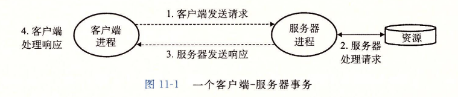{.mx-auto}

客户端和服务端是 **进程**{.text-sky-5}，而不是 **主机**，它们可以在同一台主机上，也可以在不同的主机上。

<span class="text-sm text-gray-5">

但是一般而言，你可以这么理解网络：到另一台计算机上获取文件（资源）

</span>

---

# 网络

Network

<div grid="~ cols-2 gap-8">
<div>

网络是一种 **I/O**{.text-sky-5} 设备，通常使用 DMA 传输。

网络是按照地理远近组成的层次系统。

</div>

<div>

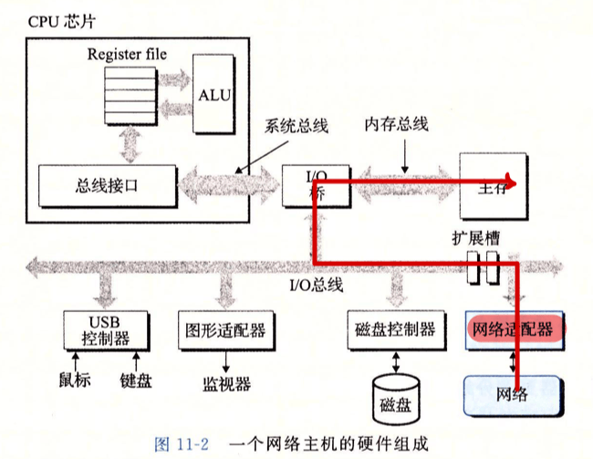{.mx-auto}

</div>
</div>

---

<div grid="~ cols-2 gap-8">
<div text-sm>


# 网络

Network

#### **局域网**（Local Area Network，LAN）

以太网（Ethernet）是一种 LAN 技术

- 主机
- 集线器（Hub）：不加分辨地转发到所有端口
- 桥（Bridge）：存在分配算法，有选择性地转发

LAN 帧 = LAN 帧头 + 互联网络包（有效载荷）

<div mt-4/>

#### **广域网**（Wide Area Network，WAN）

WAN 由路由器连接若干 LAN 组成。

- 路由器（Router）：每台路由器对它所连接到的每个网络都有一个适配器（端口）

互联网络包 = 互联网络包头 + 用户数据（有效载荷）


</div>

<div flex flex-col justify-center items-center h-full>

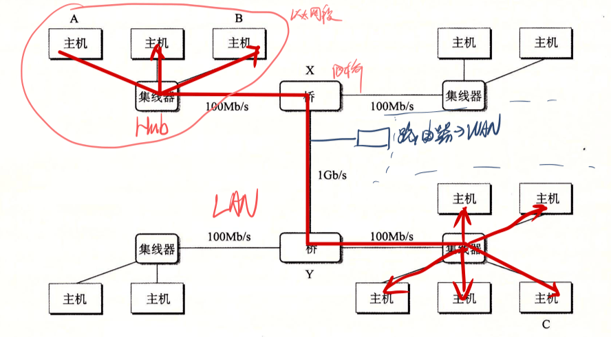{.mx-auto}

<div class="text-sm text-gray-5 mx-auto">
桥接 LAN
</div>

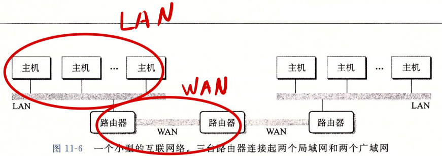{.mx-auto}

<div class="text-sm text-gray-5 mx-auto">
WAN
</div>

</div>
</div>


---

# 互联网

Internet

互联网（<span class="text-sky-5">i</span>nternet）：路由器连接若干 LAN 和 WAN

全球 IP 因特网（<span class="text-sky-5">I</span>nternet）：是互联网（internet）的具体实现

### 协议软件{.mb-2.mt-8}

协议软件：让主机能够跨过不兼容的网络发送数据

- 命名机制
- 传送机制：运行在主机和路由器上，控制主机和路由器协同工作。<br>一个包是由 **包头** 和 **有效载荷** 组成的，包头包括了传输所需信息，如源主机地址、目的主机地址

---

# 互联网络传输

internet transfer

<div flex gap-4>

<div>

你可能会疑惑：“网络”在哪里？

注意这是一个 internet 而不是 Internet，它只有两个 LAN。

- 帧的有效载荷是互联网络包
- 互联网络包的有效载荷是数据


</div>

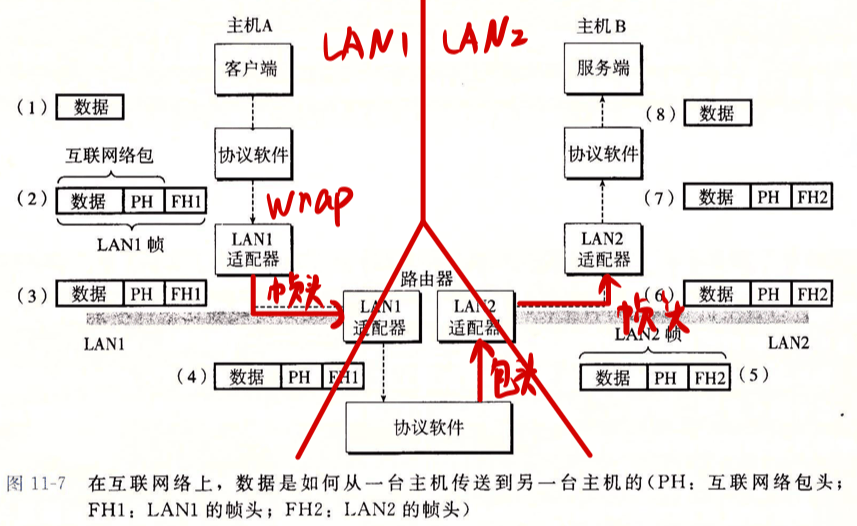

</div>


---

# 全球 IP 因特网

Internet

<div grid="~ cols-2 gap-8">
<div>


### TCP / IP 协议

- 内核模式运行
- 是协议族，提供不同的功能

Key points：

- 主机集合被映射为一组 32 位的 **IP 地址**{.text-sky-5}
- 这组 IP 地址被映射为一组称为因特网 **域名**{.text-sky-5}（Internet domain name）的标识符
- 因特网主机上的进程能够通过连接（connection）和任何其他因特网主机上的进程通信。

</div>

<div>


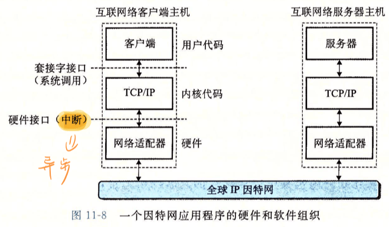{.mx-auto}


</div>
</div>

---

# 全球 IP 因特网

Internet


**IP协议**（Internet Protocol，互联网协议）：

- 它提供了一种基本的命名方法和传递机制（给每台电脑分配一个唯一的 32 位 IP 地址，并负责把数据包（或者叫数据宝，Datagram）送到正确的地址）
- 它是不可靠的（不保证数据包一定会到达目的地，也不负责重传丢失的数据包）

**UDP协议**（User Datagram Protocol，用户数据报协议）是对 IP 协议的扩展：

- 它允许数据包在不同的进程之间传送（就像允许不同的程序之间直接发送数据）
- 它也不保证数据的可靠传输

**TCP协议**（Transmission Control Protocol，传输控制协议）是构建在 IP 协议之上的更复杂的工具：

- 它提供了可靠的 **全双工连接**（就像在两个程序之间建立一条可靠的双向通道，确保数据准确无误地传输）


---

# 全球 IP 因特网

Internet

网络字节顺序：**大端法**{.text-sky-5}（可能需要相关函数进行转换）

IP 地址：点分十进制表示法（如 `128.2.194.242`）/ 十六进制 IP 地址（`0x8002c2f2`）

Linux 命令 `hostname -i` 可以查看主机的点分十进制地址

注意：**点分十进制表示法是以字符串形式存储的**

---

# 因特网域名

Internet domain name

<div grid="~ cols-2 gap-8">
<div>

域名是多层次的：`ics.huh.moe` `huh.moe` `moe`

DNS（Domain Name System，域名系统）维护域名集合和 IP 地址的映射

</div>

<div>

{.mx-auto}

</div>
</div>

---

# 因特网域名

Internet domain name

<div grid="~ cols-2 gap-8">
<div>

### 域名{.mb-4}

- 一个域名可以解析到多个 IP 地址
- 一个 IP 地址可以对应多个域名
- 某些合法的域名没有映射到任何 IP 地址
- `localhost` 回送地址 `127.0.0.1`

### 端口{.my-4}

表示服务类型，由 `/etc/services` 文件维护

- 22：SSH 远程登录
- 80：HTTP Web 端口
- 443：HTTPS Web 端口

</div>

<div>

{.mx-auto}

</div>
</div>

---

# 套接字

Socket

套接字（Socket）：提供了一层抽象，让网络 I/O 对于进程而言就像文件 I/O 一样，可以类比文件描述符。

<span class="text-sm text-gray-5">

然而，套接字还是与传统的文件 I/O 有所差异，在使用前需要调用一些特殊函数

</span>

套接字是连接的一个 **端点**{.text-sky-5}，一对套接字组成一个连接。

套接字地址形如 `(IP 地址:端口号)`

套接字对形如 `(客户端 IP:客户端端口, 服务端 IP:服务端端口)`，其唯一确定了一个连接。

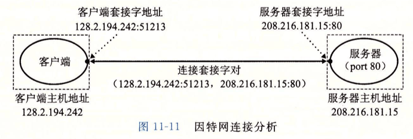{.mx-auto.h-30}

<!-- 

展示 Surge

 -->

---

# 套接字接口

Socket interface

<div grid="~ cols-3 gap-6">
<div>

### 类型定义


套接字接口是一组函数，和 Unix I/O 函数结合创建网络应用。

`sin` 前缀：Socket Internet

IP 地址结构中存放的地址总是以（大端法）网络字节顺序存放的

</div>

<div col-span-2>

```c
/* IP 地址结构，2B */
struct in_addr {
    uint32_t  s_addr; /* 网络字节顺序的地址 (大端序) */
}; 

/* 套接字地址结构，16B */
typedef struct sockaddr SA;
struct sockaddr {
    uint16_t sa_family; /* 协议族，2B，如 AF_INET（IPv4）、AF_INET6（IPv6） */
    char sa_data[14];   /* 存储具体的地址数据，14B，与协议族相关 */
}; // 整体 16B

/* 套接字地址结构，16B */
struct sockaddr_in {
    uint16_t sin_family;   /* 协议族 (总是 AF_INET) */
    uint16_t sin_port;     /* 端口号（网络字节序） */
    struct in_addr sin_addr; /* IP 地址（网络字节序） */
    unsigned char sin_zero[8]; /* 填充到 sizeof(struct sockaddr) = 16B */
}; // 兼容 sockaddr，整体 16B

```

</div>
</div>


---

# 套接字接口

Socket interface

<div grid="~ cols-3 gap-8">
<div text-sm>

### 客户端{.mb-4}

- `getaddrinfo`：获取地址信息
- `socket`：创建套接字
- `connect`：连接到服务器
- `rio_writen`：发送 $n$ 字节数据
- `rio_readlineb`：读取一行数据
- `close`：关闭套接字

</div>

<div col-span-2>

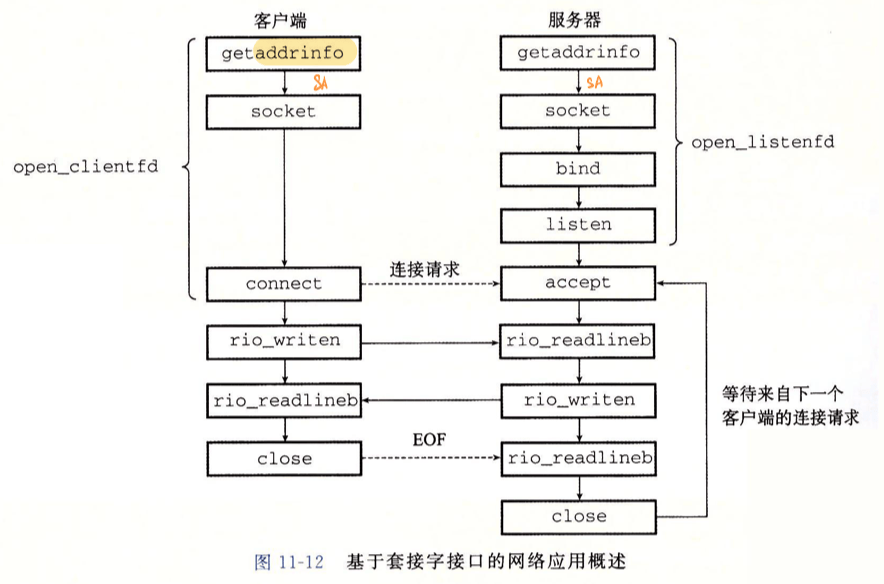{.mx-auto}

</div>
</div>

---

# 套接字接口

Socket interface

<div grid="~ cols-3 gap-8">
<div text-sm>

### 服务器{.mb-4}

- `getaddrinfo`：获取地址信息
- `socket`：创建套接字
- `bind`：绑定套接字到地址
- `listen`：监听套接字
- `accept`：接受连接
- `rio_readlineb`：读取一行数据
- `rio_writen`：发送 $n$ 字节数据
- `close`：关闭套接字

</div>

<div col-span-2>

{.mx-auto}

</div>
</div>

---

# 套接字接口

Socket interface

为什么要搞得这么复杂？

<v-clicks>

网络编程不像文件 I/O 那么 “确定”{.text-sky-5.font-bold}

对于客户端：

</v-clicks>

<v-clicks text-sm>

1. 为了得到连接对方的信息，我们需要先用 `getaddrinfo` 获取对方的网络连接信息。
2. 然后我们需要用 `socket` 创建一个套接字，但是这只是填入了对方的基础信息，我们不确定对方的状态，所以此时套接字是 **不可用**{.text-sky-5} 的。
3. 我们需要调用 `connect` 来尝试建立连接，若能正常建立，则得知此时套接字是 **可用**{.text-sky-5} 的。
4. 然后我们就可以调用 `rio_writen` 和 `rio_readlineb` 来发送和接收数据了。
5. 最后我们调用 `close` 关闭套接字，终止连接，释放描述符使之可以被重用。

</v-clicks>


---

# 套接字接口

Socket interface

对于服务端：

<v-clicks text-sm>

1. 为了能够参与到网络连接，我们需要先用 `getaddrinfo` 获取自己的网络连接信息。
2. 然后我们需要用 `socket` 创建一个套接字，用于监听客户端的连接请求，此时，这个套接字依旧是 **不可用**{.text-sky-5} 的。
3. 调用 `bind` 将套接字绑定到获取到的地址信息上，声明对某个端口（如 HTTP 对 80 端口）的占用，这样套接字就可以使用了。
4. 调用 `listen` 来将之转为监听套接字，这样套接字就可以监听客户端的连接请求了。
5. 接下来，我们调用 `accept` 来从监听序列中取出一个套接字，这代表我们接受了客户端的连接请求，这样，我们就可以使用这个套接字和客户端进行通信了。
6. 调用 `rio_readlineb` 和 `rio_writen` 来发送和接收数据。
7. 当读到客户端调用 `close` 关闭连接的信息后，我们也调用 `close` 关闭套接字，从而允许这个套接字被重用。

</v-clicks>

<div class="text-sm text-gray-5">

<v-clicks>

你可能会疑惑，为什么不能合并 `bind` 和 `listen`？它们似乎都只在服务端使用。

- `bind` 代表绑定，它使得侦听端口固定了下来。在客户端不需要这个过程，每次连接随便分配一个可用端口即可。
- `listen` 代表监听，它让套接字从主动套接字变为被动套接字。


</v-clicks>

</div>

---

# 套接字接口

Socket interface


`getaddrinfo` 函数用于获取地址信息


```c
int getaddrinfo(const char *host, const char *service, const struct addrinfo *hints, struct addrinfo **res);
void freeaddrinfo(struct addrinfo *res);
```

<div grid="~ cols-2 gap-8">
<div text-sm>

- `host`：主机名，可以是 `127.0.0.1` 或 `localhost`，域名或点分制都可以，甚至可以是 `NULL`，代表监听本机通配地址 `0.0.0.0`（监听所有网络接口）
- `service`：服务名，可以是 `80`（十进制端口号）或 `http`，端口号或服务名都可以
- `hints`：提示信息，控制行为
- `res`：地址信息链表，存放结果

`ai` 是 `addrinfo` 的缩写

`canonname` 全称 canonical name，即规范、权威名
返回的字段可以直接传给后面的套接字接口函数。

</div>

<div>

{.mx-auto.h-70}

</div>
</div>

---

# 套接字接口

Socket interface

`hints`参数

- `ai_family`设置为`AF_INET`将列表限制为IPv4地址，设置为`AF_INET6`将列表限制为IPv6地址。
- `ai_socketype`设置为`SOCK_STREAM`将列表限制为每个地址最多一个`addrinfo`结构。
- `ai_flag`可以用or组合的掩码：
- `AI_ADDRRCONFIG`使用连接时建议使用。要求只有当本地主机配置为IPv4时，`getaddeinfo`返回IPv4地址。IPv6同理
- `AI_CANONNAME`把列表中第一个`addrinfo`结构的`ai_canonname`指向host的权威名字。（默认为NULL）
- `AI_NUMERICSERV`强制参数`service`为端口号。
- `AI_PASSIVE`告诉函数返回的套接字地址可能被服务器用作监听套接字，此时host应为NULL。得到的地址字段是通配符地址，会接受发到该主机所有IP地址的请求。

---

# 套接字接口

Socket interface

`getnameinfo` 函数用于获取主机和服务名字符串


```c
int getnameinfo(const struct sockaddr *sa, socklen_t salen, char *host, size_t hostlen, 
char *service, size_t servlen,int flags);
```

- `host`指向大小为`hostlen`字节的缓冲区，`service`指向大小为`servlen`字节的缓冲区。
- 把套接字地址结构`sa`转换为对应的主机和服务名字符串，并复制到相应的缓冲区。
- 可以把`host`**或**`sercive`设置为NULL，并把相应的长度设置为0。（至少一个不为NULL）
- `flags`为掩码：
- `NI_NUMERICHOST`返回数字地址字符串。（默认为域名）
- `NI_NUMERICSERV`返回端口号。（默认为检查`/ect/services`，尽可能返回服务名）


---


# 套接字接口

Socket interface

`socket` 函数用于创建可供读写的套接字。

```c
int socket(int domain, int type, int protocol);
```

- `domain`：协议族，如 `AF_INET` / `AF_INET6`
- `type`：套接字类型，如 `SOCK_STREAM` / `SOCK_DGRAM`
- `protocol`：协议，如 `0`

使用 `getaddrinfo` 获取地址信息后，可以自动生成这些所需参数。

---

# 套接字接口

Socket interface

`connect` 函数用于建立和服务器的连接。

```c
int connect(int sockfd, const struct sockaddr *addr, socklen_t addrlen);
```

- `sockfd`：套接字描述符
- `addr`：套接字地址
- `addrlen`：套接字地址长度

<div text-sky-5>

注意，`connect` 函数**会阻塞**，直到连接建立成功或失败。

而且还要注意，**`connect` 是否返回，与服务器是否 `accept` 无关**。

前者返回 `0` 表明建立了连接，后者代表开始服务器处理这个连接。

</div>

---

# 套接字接口

Socket interface

`bind` 函数用于在服务器将套接字绑定到地址。它声明对某个端口（如 HTTP 对 80 端口）的占用。

```c
int bind(int sockfd, const struct sockaddr *addr, socklen_t addrlen);
```

- `sockfd`：套接字描述符
- `addr`：套接字地址
- `addrlen`：套接字地址长度

依旧是最好使用 `getaddrinfo` 获取地址信息后，可以自动生成这些所需参数。

---

# 套接字接口

Socket interface

`listen` 函数用于在服务器将套接字转为监听套接字。该端口必须首先被声明占用（`bind`）。

```c
int listen(int sockfd, int backlog);
```

- `sockfd`：套接字描述符
- `backlog`：连接队列长度，**表示服务器最多可以同时处理多少个连接。**{.text-sky-5}

调用完 `listen` 后，对于连接请求，会放入队列。

回忆：这是一个队列，建立连接后，我们先放进去，但不代表我们立即调用 `accept` 来处理。

监听描述符只被创建一次，存在于整个生命周期。{.text-sky-5}

---

# 套接字接口

Socket interface

`accept` 函数用于在服务器接受连接。

```c
int accept(int sockfd, struct sockaddr *addr, socklen_t *addrlen);
```

- `sockfd`：监听套接字描述符
- `addr`：客户端套接字地址会被填写在这里
- `addrlen`：客户端套接字地址长度

从队列取出连接请求，如果决定接受，则为该连接分配新的描述符 `fd`

<div text-sm>

- 多个连接存在时，每个连接有各自的 `fd`，但共用一个端口号，即监听时的端口号。
- 系统内部用 `(源 IP 地址，源端口号，目的 IP 地址，目的端口号)` 区分连接
- 因此，即使多个连接共用服务器端口号，也能区分
- 即使原先监听描述符被提前关闭，也不影响已经建立的连接。

</div>

已连接描述符只存在于为一个客户端服务的过程中。{.text-sky-5}

---

# 监听描述符 vs 已连接描述符

listen fd vs connected fd

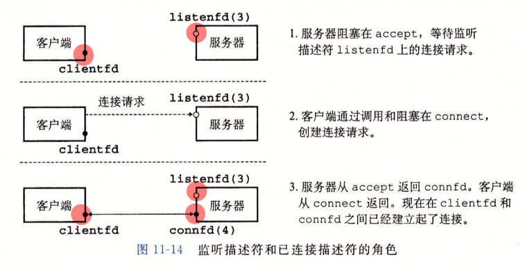{.mx-auto}

<!-- 

看 Surge

-->

---

# 套接字接口辅助函数

Socket interface helper functions

<div grid="~ cols-2 gap-8">
<div>

### `open_clientfd`

```c
int open_clientfd(char *hostname, char *port);
```

客户端调用 `open_clientfd` 函数建立与服务器的连接，该服务器运行在主机 `hostname` 上，在端口号 `port` 上监听连接请求。

等价于 `getaddrinfo` + `socket` + `connect`

</div>

<div>

### `open_listenfd`

```c
int open_listenfd(char *port);
```

服务端调用 `open_listenfd` 函数，服务器创建一个监听描述符，准备好接收连接请求。

等价于 `getaddrinfo` + `socket` + `bind` + `listen`


</div>
</div>

---

```c
int open_clientfd(char *hostname, char *port) {
    int clientfd, rc;
    struct addrinfo hints, *listp, *p;

    /* Get a list of potential server addresses */
    memset(&hints, 0, sizeof(struct addrinfo));
    hints.ai_socktype = SOCK_STREAM;  /* Open a connection */
    hints.ai_flags = AI_NUMERICSERV;  /* ... using a numeric port arg. */
    hints.ai_flags |= AI_ADDRCONFIG;  /* Recommended for connections */
    if ((rc = getaddrinfo(hostname, port, &hints, &listp)) != 0) {
        fprintf(stderr, "getaddrinfo failed (%s:%s): %s\n", hostname, port, gai_strerror(rc));
        return -2;
    }
    /* Walk the list for one that we can successfully connect to */
    for (p = listp; p; p = p->ai_next) {
        /* Create a socket descriptor */
        if ((clientfd = socket(p->ai_family, p->ai_socktype, p->ai_protocol)) < 0) 
            continue; /* Socket failed, try the next */

        /* Connect to the server */
        if (connect(clientfd, p->ai_addr, p->ai_addrlen) != -1) 
            break; /* Success */
        if (close(clientfd) < 0) { /* Connect failed, try another */  //line:netp:openclientfd:closefd
            fprintf(stderr, "open_clientfd: close failed: %s\n", strerror(errno));
            return -1;
        } 
    } 

    /* Clean up */
    freeaddrinfo(listp);
    if (!p) /* All connects failed */
        return -1;
    else    /* The last connect succeeded */
        return clientfd;
}
```

---

```c
int open_listenfd(char *port) 
{
    struct addrinfo hints, *listp, *p;
    int listenfd, rc, optval=1;

    /* Get a list of potential server addresses */
    memset(&hints, 0, sizeof(struct addrinfo));
    hints.ai_socktype = SOCK_STREAM;             /* Accept connections */
    hints.ai_flags = AI_PASSIVE | AI_ADDRCONFIG; /* ... on any IP address */
    hints.ai_flags |= AI_NUMERICSERV;            /* ... using port number */
    if ((rc = getaddrinfo(NULL, port, &hints, &listp)) != 0) {
        fprintf(stderr, "getaddrinfo failed (port %s): %s\n", port, gai_strerror(rc));
        return -2;
    }

    /* Walk the list for one that we can bind to */
    for (p = listp; p; p = p->ai_next) {
        /* Create a socket descriptor */
        if ((listenfd = socket(p->ai_family, p->ai_socktype, p->ai_protocol)) < 0) 
            continue;  /* Socket failed, try the next */

        /* Eliminates "Address already in use" error from bind */
        setsockopt(listenfd, SOL_SOCKET, SO_REUSEADDR,    //line:netp:csapp:setsockopt
                   (const void *)&optval , sizeof(int));

        /* Bind the descriptor to the address */
        if (bind(listenfd, p->ai_addr, p->ai_addrlen) == 0)
            break; /* Success */
        if (close(listenfd) < 0) { /* Bind failed, try the next */
            fprintf(stderr, "open_listenfd close failed: %s\n", strerror(errno));
            return -1;
        }
    }
```

---

```c


    /* Clean up */
    freeaddrinfo(listp);
    if (!p) /* No address worked */
        return -1;

    /* Make it a listening socket ready to accept connection requests */
    if (listen(listenfd, LISTENQ) < 0) {
        close(listenfd);
	return -1;
    }
    return listenfd;
}
```

---

# echo 客户端


```c
int main(int argc, char **argv) 
{
    int clientfd;
    char *host, *port, buf[MAXLINE];
    rio_t rio;

    if (argc != 3) {
	    fprintf(stderr, "usage: %s <host> <port>\n", argv[0]);
	    exit(0);
    }
    host = argv[1];
    port = argv[2];

    clientfd = Open_clientfd(host, port);
    Rio_readinitb(&rio, clientfd);

    while (Fgets(buf, MAXLINE, stdin) != NULL) {
	    Rio_writen(clientfd, buf, strlen(buf));
	    Rio_readlineb(&rio, buf, MAXLINE);
	    Fputs(buf, stdout);
    }
    Close(clientfd); //line:netp:echoclient:close
    exit(0);
}
```

---

# echo 服务器


```c
int main(int argc, char **argv) 
{
    int listenfd, connfd;
    socklen_t clientlen;
    struct sockaddr_storage clientaddr;  /* Enough space for any address */ 
    char client_hostname[MAXLINE], client_port[MAXLINE];

    if (argc != 2) {
	    fprintf(stderr, "usage: %s <port>\n", argv[0]);
	    exit(0);
    }

    listenfd = Open_listenfd(argv[1]);
    while (1) {
	    clientlen = sizeof(struct sockaddr_storage); 
	    connfd = Accept(listenfd, (SA *)&clientaddr, &clientlen);
      Getnameinfo((SA *) &clientaddr, clientlen, client_hostname, MAXLINE, 
                    client_port, MAXLINE, 0);
      printf("Connected to (%s, %s)\n", client_hostname, client_port);
	    echo(connfd);
	    Close(connfd);
    }
    exit(0);
}
```

---

# echo 程序

```c
#include "csapp.h"

void echo(int connfd) 
{
    size_t n; 
    char buf[MAXLINE]; 
    rio_t rio;

    Rio_readinitb(&rio, connfd);
    while((n = Rio_readlineb(&rio, buf, MAXLINE)) != 0) { //line:netp:echo:eof
	    printf("server received %d bytes\n", (int)n);
	    Rio_writen(connfd, buf, n);
    }
}
```

- 注意网络中使用rio包
- 对于网络，当一个进程关闭连接它的那一段时，会发生EOF
- 连接另一端的进程在试图读取流中最后一个字节之后的字节时会检测到EOF

---

# Web 

- 超文本传输协议：HTTP
- Web内容用HTML（超文本标记语言）语言编写
- 内容是与一个MIME（多用途的网络邮件扩充协议）类型相关的字节序列
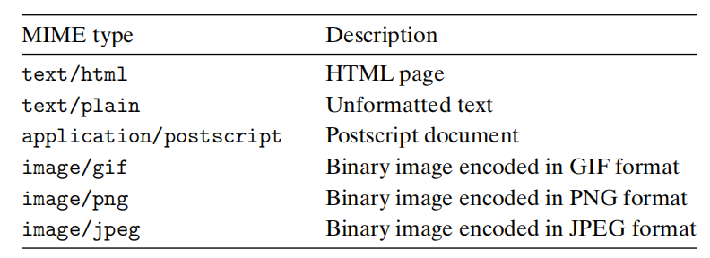{.w-180}

---

# Web 

- 服务静态内容：服务器给客户端提供静态内容（磁盘文件）
- 服务动态内容：服务器给客户端提供动态内容（执行程序返回输出）
- URL（通用资源定位符）：https://www.chinesemooc.org/student/task_exam.php?courseid=4392&termid=2992&name=计算机组成%20-%202025秋季校内课学期
- http://120.232.255.236:30637/login?next=%2F
- `?`分割文件名和参数，`&`分隔多个参数
- 前缀客户端用，后缀服务器用
- `/`代表主目录，为最小后缀，服务器自行扩展为某个主页，浏览器可以自动补`/`

---

# HTTP 事务
HTTP Transactions

- 可在终端使用TELNET

<div grid="~ cols-2 gap-8">
<div>

### http请求：请求行+请求报头+空文本行

请求行：method + URI + version

请求报头： HOST报头在 HTTP/1.1请求中是需要的，在HTTP/1.0不需要。用于指示原服务器域名，让代理判断是否已经在本地拥有副本。

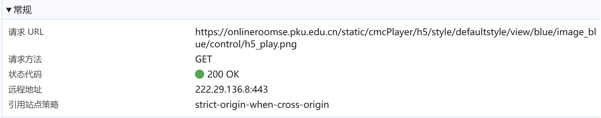{.w-180}

</div>

<div>

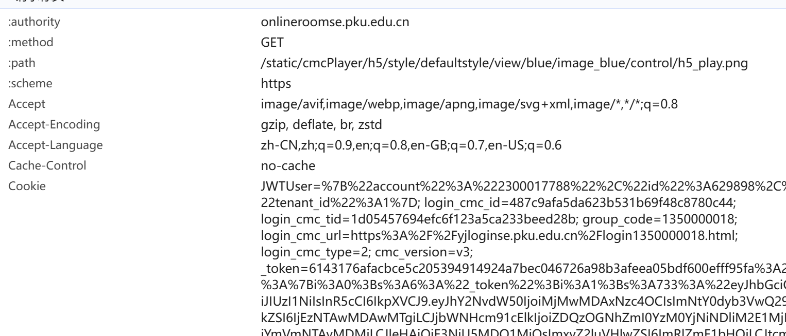{.w-180}

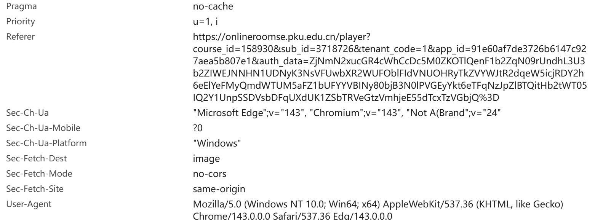{.w-180}


</div>
</div>

---

# HTTP 事务
HTTP Transactions


<div grid="~ cols-2 gap-8">
<div>

### http响应：请求行+请求报头+空行+相应主体

相应行：version + status-code + status-message

请求报头： HOST报头在 HTTP/1.1请求中是需要的，在HTTP/1.0不需要。用于指示原服务器域名，让代理判断是否已经在本地拥有副本。

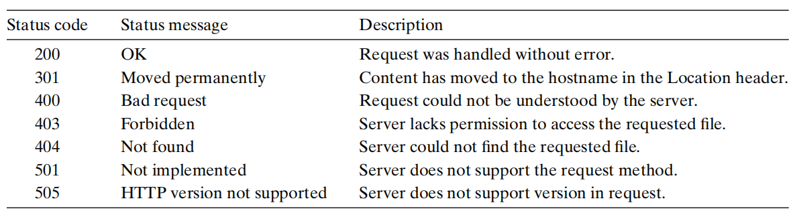{.w-180}

</div>

<div>

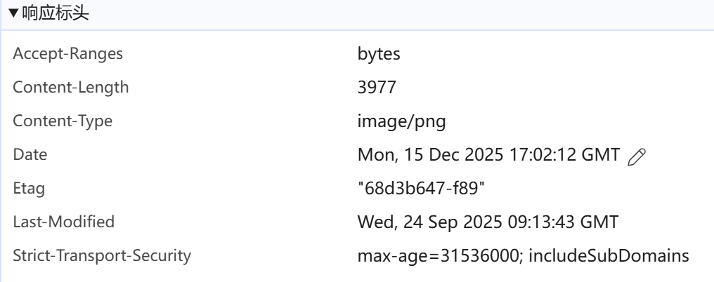{.w-80}

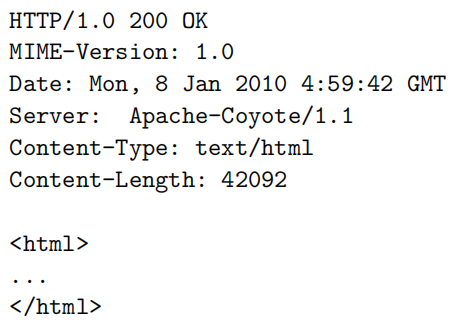{.w-60}


</div>
</div>

---

# 服务动态内容
Serving Dynamic Content

- 利用CGI（Commom Gateway Interface，通用网关接口）
- 传参方法：GET在URI中，而POST在主体中
<div grid="~ cols-2 gap-8">
<div>

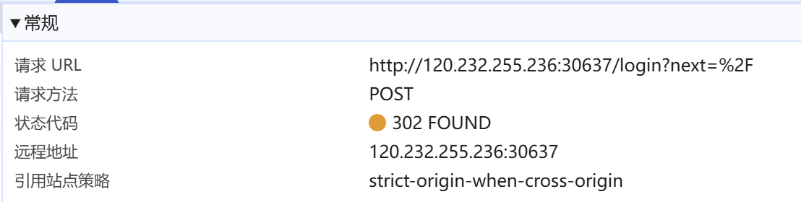{.w-180}

</div>

<div>

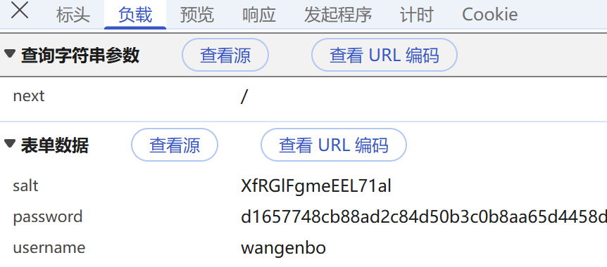{.w-60}

</div>
</div>

- 服务器收到请求后，创建子进程执行程序，会把参数设置环境变量`QUERY_STRING`
- 子进程运行前先把标准输出重定向到已连接描述符，进而将标准输出送到客户端。
- CGI程序需要生成**部分响应报头**和空行。（换行为`\r\n`）
- CGI中可以正常使用标准I/O函数


---

# CGI

```c
int main(void) {
    char *buf, *p;
    char arg1[MAXLINE], arg2[MAXLINE], content[MAXLINE];
    int n1=0, n2=0;
    if ((buf = getenv("QUERY_STRING")) != NULL) {
	    p = strchr(buf, '&');
	    *p = '\0';
	    strcpy(arg1, buf);strcpy(arg2, p+1);
	    n1 = atoi(arg1);n2 = atoi(arg2);
    }
    /* Make the response body */
    sprintf(content, "Welcome to add.com: ");
    sprintf(content, "%sTHE Internet addition portal.\r\n<p>", content);
    sprintf(content, "%sThe answer is: %d + %d = %d\r\n<p>", 
	    content, n1, n2, n1 + n2);
    sprintf(content, "%sThanks for visiting!\r\n", content);
    /* Generate the HTTP response */
    printf("Connection: close\r\n");
    printf("Content-length: %d\r\n", (int)strlen(content));
    //注意此处空行
    printf("Content-type: text/html\r\n\r\n");
    printf("%s", content);
    fflush(stdout);
    exit(0);
}
```

---

# Tiny 服务器

```c
Rio_readlineb(&rio, buf, MAXLINE)
sscanf(buf, "%s %s %s", method, uri, version);  

if (stat(filename, &sbuf) < 0) {                     //line:netp:doit:beginnotfound
	clienterror(fd, filename, "404", "Not found",
		    "Tiny couldn't find this file");
	return;
  }                                                    //line:netp:doit:endnotfound

  if (is_static) { /* Serve static content */          
	  if (!(S_ISREG(sbuf.st_mode)) || !(S_IRUSR & sbuf.st_mode)) { //line:netp:doit:readable
	    clienterror(fd, filename, "403", "Forbidden",
			"Tiny couldn't read the file");
	    return;
	}
	  serve_static(fd, filename, sbuf.st_size);        //line:netp:doit:servestatic
  }
  else { /* Serve dynamic content */
	  if (!(S_ISREG(sbuf.st_mode)) || !(S_IXUSR & sbuf.st_mode)) { //line:netp:doit:executable
	    clienterror(fd, filename, "403", "Forbidden",
			"Tiny couldn't run the CGI program");
	    return;
	}
	  serve_dynamic(fd, filename, cgiargs);            //line:netp:doit:servedynamic
  }
```

---

# Tiny 服务器

```c
int parse_uri(char *uri, char *filename, char *cgiargs) 
{
    char *ptr;

    if (!strstr(uri, "cgi-bin")) {  /* Static content */ //line:netp:parseuri:isstatic
	    strcpy(cgiargs, "");                             //line:netp:parseuri:clearcgi
	    strcpy(filename, ".");                           //line:netp:parseuri:beginconvert1
	    strcat(filename, uri);                           //line:netp:parseuri:endconvert1
	    if (uri[strlen(uri)-1] == '/')                   //line:netp:parseuri:slashcheck
	        strcat(filename, "home.html");               //line:netp:parseuri:appenddefault
	    return 1;
    }
    else {  /* Dynamic content */                        //line:netp:parseuri:isdynamic
	    ptr = index(uri, '?');                           //line:netp:parseuri:beginextract
	    if (ptr) {
	        strcpy(cgiargs, ptr+1);
	        *ptr = '\0';
	    }
	    else 
	        strcpy(cgiargs, "");                         //line:netp:parseuri:endextract
	    strcpy(filename, ".");                           //line:netp:parseuri:beginconvert2
	    strcat(filename, uri);                           //line:netp:parseuri:endconvert2
	    return 0;
    }
}
```
---

# Tiny 服务器

```c
void serve_static(int fd, char *filename, int filesize)
{
    int srcfd;
    char *srcp, filetype[MAXLINE], buf[MAXBUF];

    /* Send response headers to client */
    get_filetype(filename, filetype);    //line:netp:servestatic:getfiletype
    sprintf(buf, "HTTP/1.0 200 OK\r\n"); //line:netp:servestatic:beginserve
    Rio_writen(fd, buf, strlen(buf));
    sprintf(buf, "Server: Tiny Web Server\r\n");
    Rio_writen(fd, buf, strlen(buf));
    sprintf(buf, "Content-length: %d\r\n", filesize);
    Rio_writen(fd, buf, strlen(buf));
    sprintf(buf, "Content-type: %s\r\n\r\n", filetype);
    Rio_writen(fd, buf, strlen(buf));    //line:netp:servestatic:endserve

    /* Send response body to client */
    srcfd = Open(filename, O_RDONLY, 0); //line:netp:servestatic:open
    srcp = Mmap(0, filesize, PROT_READ, MAP_PRIVATE, srcfd, 0); //line:netp:servestatic:mmap
    Close(srcfd);                       //line:netp:servestatic:close
    Rio_writen(fd, srcp, filesize);     //line:netp:servestatic:write
    Munmap(srcp, filesize);             //line:netp:servestatic:munmap
}
```

---

# Tiny 服务器

```c
void serve_dynamic(int fd, char *filename, char *cgiargs) 
{
    char buf[MAXLINE], *emptylist[] = { NULL };

    /* Return first part of HTTP response */
    sprintf(buf, "HTTP/1.0 200 OK\r\n"); 
    Rio_writen(fd, buf, strlen(buf));
    sprintf(buf, "Server: Tiny Web Server\r\n");
    Rio_writen(fd, buf, strlen(buf));
  
    if (Fork() == 0) { /* Child */ //line:netp:servedynamic:fork
	    /* Real server would set all CGI vars here */
	    setenv("QUERY_STRING", cgiargs, 1); //line:netp:servedynamic:setenv
	    Dup2(fd, STDOUT_FILENO);         /* Redirect stdout to client */ //line:netp:servedynamic:dup2
	    Execve(filename, emptylist, environ); /* Run CGI program */ //line:netp:servedynamic:execve
    }
    Wait(NULL); /* Parent waits for and reaps child */ //line:netp:servedynamic:wait
}
```


---
layout: center
---

<div>
  <text class="text-17 font-bold gradient-text">Homework Review</text>
</div>

<style>
  .gradient-text {
    background-image: linear-gradient(45deg, #4ec5d4 10%, #146b8c 20%);
    -webkit-background-clip: text;
    color: transparent;
  }
</style>


---
layout: center
---

<div>
  <text class="text-17 font-bold gradient-text">Exercises</text>
</div>

<style>
  .gradient-text {
    background-image: linear-gradient(45deg, #4ec5d4 10%, #146b8c 20%);
    -webkit-background-clip: text;
    color: transparent;
  }
</style>

---


# E1

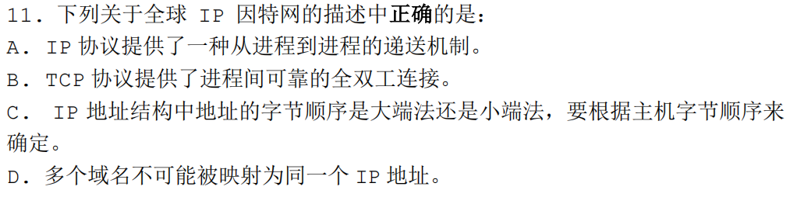{.w-180}


---


# E1

{.w-180}

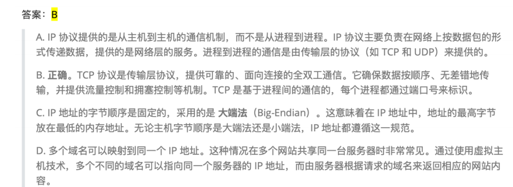{.w-180}

---


# E2

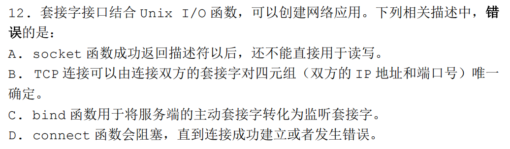{.w-180}


---


# E2

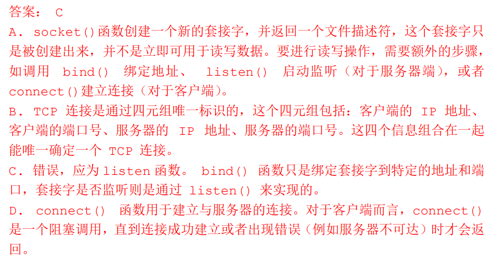{.w-180}


---


# E3

{.w-180}

<!--  -->

---


# E3

{.w-180}


---

# E4

{.w-170}

<!--  -->

---

# E4

{.w-170}

{.w-170}

---

# E5


<!-- {.w-150} -->

---

# E5


{.w-150}

---

# E6


<!-- {.w-100} -->

---

# E6


{.w-100}

---

# E7


<!--  -->


---

# E7


---

# E8


<!--  -->

---

# E8


---

# E9


<!--  -->

---

# E9


---

# E10


<!--  -->

---

# E10


---

# E11


---

# E11


---

# E12


<!--  -->

---

# E12


---

# E13


<div grid="~ cols-2 gap-2">

<div>

{.w-70}


</div>

<div>

{.w-80}


</div>
</div>

---

# E13


---

# E14

<div grid="~ cols-2 gap-2">

<div>


</div>

<div>


</div>
</div>

---
layout: center
---

<div>
  <text class="text-17 font-bold gradient-text">Notices</text>
</div>

<style>
  .gradient-text {
    background-image: linear-gradient(45deg, #4ec5d4 10%, #146b8c 20%);
    -webkit-background-clip: text;
    color: transparent;
  }
</style>

---
layout: center
---

<div>
  <text class="text-17 font-bold gradient-text">Malloclab Style</text>
</div>

<style>
  .gradient-text {
    background-image: linear-gradient(45deg, #4ec5d4 10%, #146b8c 20%);
    -webkit-background-clip: text;
    color: transparent;
  }
</style>


---
layout: center
---

<div flex="~ gap-20"  mt-2 justify-center items-center>

<div  w-fit h-fit mb-2>

# THANKS

Made by WEB-05

webrun@stu.pku.edu.cn

<p class="text-gray-40">
  <font size = '3'>
    Reference: [WalkerCH]'s and [Arthals]'s presentations.<br>
  </font>
</p>


</div>

{.w-50.rounded-md}

</div>

